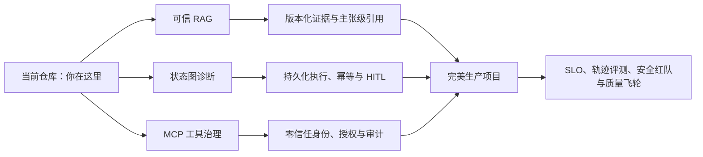

# AegisOps Agent 项目面试拷打题库

> 使用口径：每题有两个口径。“当前项目深度回答”严格以仓库、测试和评测事实为边界；“完美项目回答”假设所有生产能力均已落地，用于学习顶级答案的设计深度，不能在面试中冒充当前事实，其中出现的理想化量化数字仅为表达示范。回答结构统一为：核心矛盾 → 机制设计 → 验证指标 → 取舍或边界。标有“追问”的题目与上一题连练。

## 双口径全景图

## 一、项目定位与个人贡献

问题1：请你用一分钟介绍 AegisOps Agent。
当前项目深度回答：这是一个面向运维排障场景的可信诊断智能体。它把企业知识库检索、日志和监控工具调用、分步骤诊断以及带依据的报告串成一条闭环；我的重点不是让模型自由发挥，而是给检索、工具、上下文和失败处理都加上明确边界，让答案能追溯、过程能观察、失败能收口。
完美项目回答：我把它定义成“有证据约束的运维决策系统”，而不是聊天机器人。系统先用版本化知识和实时观测建立证据面，再由可恢复状态机完成计划、取证、反证和报告；所有工具都经过零信任授权，结论逐主张绑定证据，高风险动作必须审批。线上用首次定位时间、证据支持率、人工接管率和每次有效诊断成本衡量价值，目前已形成从离线评测、影子流量到灰度发布的完整质量闭环。

问题1-追问1：如果只能用三句话介绍，你会怎么说？
当前项目深度回答：第一，它能先查运维知识，再按计划调用日志和监控工具完成诊断。第二，每条结论尽量绑定检索证据，工具失败也不会被当成事实。第三，我用工作流、权限、超时、预算和追踪机制约束模型，让它从“能演示”走向“可治理”。
完美项目回答：它把故障诊断拆成“知识证据、实时证据、受控决策”三层，并保证每个结论可回放。它能自主完成低风险取证，但任何越权、写操作或证据冲突都会停在人工审批点。最终优化目标不是回答更像专家，而是在SLO内稳定减少定位时间，同时不增加生产变更风险。

问题2：这个项目解决的核心业务问题是什么？
当前项目深度回答：传统排障的信息散落在文档、日志和监控系统中，工程师需要反复切换工具，还很依赖个人经验。这个项目把“查知识、取证据、形成判断、输出报告”连起来，目标是缩短信息收集和初步定位时间，同时让接手的人知道结论从哪里来。
完美项目回答：核心矛盾是故障信息分散、经验不可复制、诊断过程不可审计。我先把历史Runbook、服务拓扑、告警、日志和指标统一成有权限、有版本的证据层，再把专家排障方法固化为可评测工作流；系统输出的不只是答案，还包括排除过哪些假设、缺什么证据、下一步由谁执行。业务上用MTTA、首次有效假设时间、交接耗时和误操作率做前后对照，证明它是在改善故障响应体系，而不是增加一个问答入口。

问题3：为什么它是 Agent，而不只是一个知识库问答系统？
当前项目深度回答：知识库问答只需要检索和生成，而运维诊断还要根据当前现象制定步骤、选择外部工具、观察结果并决定下一步。这个项目具备计划、执行、重新规划和结束判断，所以核心能力是受约束的行动闭环，而不仅是一次问答。
完美项目回答：区分点不在“调用了工具”，而在系统能否围绕目标持续维护状态，并让新证据改变后续行为。我的实现把计划、观察、假设、反证和终止条件建模为显式状态，每个动作都有预算、权限和幂等语义；因此它能在日志证据否定初始判断后重规划，也能在证据不足时安全结束。RAG只是它的一类只读证据工具，Agent才是负责受控决策的外层系统。

问题4：为什么强调“可信”？
当前项目深度回答：运维场景的错误结论可能放大故障，所以不能只追求回答流畅。我把可信拆成四件事：结论有来源、失败不冒充成功、工具调用受权限和预算限制、整条链路可以通过追踪信息复盘。
完美项目回答：可信不是模型自报一个置信度，而是系统可以验证的性质。我把它拆成证据完整性、行动安全性、执行可恢复性和结果可审计性：证据有版本与权限，主张必须通过蕴含校验；工具采用最小权限和审批；每个节点可幂等恢复；最终能用一次trace重放当时看到的全部事实。再用无依据主张率、越权阻断率、恢复成功率和审计还原率给“可信”建立量化口径。

问题5：你在项目中的具体贡献是什么？
当前项目深度回答：我负责从整体架构到关键链路的落地，包括可追溯的 RAG、基于状态图的诊断流程、统一工具治理、上下文预算、降级和可观测性，也补了离线评测与自动化测试。面试时我不会把模型或框架本身算成个人贡献，我的工作主要是把这些能力组织成可控的工程系统。
完美项目回答：我的核心贡献是定义并落地三份契约：证据契约规定什么能进入结论，动作契约规定模型能调用什么，运行契约规定系统如何超时、恢复和审计。围绕这三份契约，我主导了版本化RAG、持久化状态机、统一工具网关、全链路可观测和离在线评测平台，并推动SRE把真实排障流程转成测试集。框架只是执行载体，我负责的是架构边界、风险模型、指标闭环和生产结果。

问题5-追问1：哪一部分最能体现你的设计能力？
当前项目深度回答：是把“证据”贯穿检索、工具和报告三个阶段。检索结果要稳定编号，工具失败要显式标记为不可用证据，报告只消费已经通过边界检查的上下文；这样可信不是一句口号，而是数据在链路中流转时都有规则。
完美项目回答：最能体现设计能力的是证据图谱：每条事实都带来源、版本、采集时间、权限范围和可信级别，每个结论又反向引用支持或反驳它的事实。这样重规划不是读一堆文本，而是在更新假设与证据关系；报告也能逐主张展示依据、冲突和时效。它把“模型觉得对”转成“系统证明这句话在当时为什么可以说”。

问题6：项目目前到了什么成熟度？
当前项目深度回答：它已经是一个功能完整、可运行、可测试的工程原型，主要链路和治理机制都已落地。但外部日志与监控目前是模拟 MCP 服务，持久化检查点、真实身份认证、生产级多租户隔离和人工审批还没有完成，所以我会称它为“面向企业场景设计的工程原型”，不会直接说已经大规模生产验证。
完美项目回答：项目已经完成生产分级：低风险知识问答全量上线，只读取证Agent经影子验证后灰度，高风险变更仍保持人工审批。平台具备多租户身份、持久化执行、灾备、SLO、红队和审计合规，并以真实故障工单持续回灌评测；每项能力都有上线门槛和回滚策略。因此我不会用“功能完成度”描述成熟度，而用流量比例、风险等级、SLO达成和人工接管数据来描述。

问题7：简历里写“企业级”，依据是什么？
当前项目深度回答：这里的“企业级”指设计目标和治理维度，例如权限、超时、调用上限、错误标准化、追踪、评测和降级，而不是声称已经服务了多少企业客户。更严谨的表述应该是“面向企业运维场景的可信智能体原型”，并明确当前生产化缺口。
完美项目回答：企业级必须有可验证门槛：统一身份与最小权限、多租户数据隔离、可恢复执行、SLO与容量、审计合规、灰度回滚和质量评测闭环。我会逐项给出架构和运行证据，例如越权测试、灾备演练、尾延迟、恢复点目标和线上采纳率，而不是用技术栈自证。只有这些门槛都通过并承载真实生产流量，我才会在简历中无保留地使用“企业级”。

问题8：项目最有价值的三个亮点是什么？
当前项目深度回答：第一是稳定证据标识和重建索引策略，让来源可追踪；第二是计划、执行、重规划的诊断闭环；第三是统一工具治理，把权限、超时、结果裁剪和证据可用性集中处理，避免每个业务节点各自为政。
完美项目回答：第一是版本化证据链，任意结论都能回到当时的文档和观测快照；第二是可恢复诊断状态机，故障、审批和进程重启都不会重复副作用；第三是零信任工具网关，模型只能提出动作，授权、幂等和审计由系统裁决。三个亮点分别解决“凭什么这样判断”“中断后如何继续”“允许它做到哪一步”，共同构成生产Agent的核心护城河。

问题9：项目最大的技术难点是什么？
当前项目深度回答：难点不是接入模型，而是处理“不确定性叠加”：检索可能不相关、工具可能失败、模型可能选错下一步、上下文还可能超长。我采用分层边界，让每一层只对自己的输入输出负责，并在状态中保留可解释的中间结果，而不是靠一条复杂提示词承担所有责任。
完美项目回答：最大难点是把多源不确定性变成可组合的确定性协议。我为检索、工具和模型输出都定义质量状态与可信级别，状态机只在前置条件满足时推进；发生冲突时进入补证或人工节点，而不是继续生成。最终通过故障注入矩阵验证任意一个依赖失败都不会把错误升级成有把握的结论，这比单点模型调优更难也更有工程价值。

问题10：你如何衡量这个项目是否成功？
当前项目深度回答：我会分三层衡量：检索层看命中、排序和拒答；流程层看有效工具调用率、完成率、循环次数和降级率；业务层看首次定位时间、人工接管率和诊断采纳率。当前仓库有离线检索和链路测试基线，但没有真实线上业务指标，所以我不会编造节省了多少时间。
完美项目回答：我建立的是一棵指标树：北极星指标是“安全完成一次有效诊断的时间和成本”，下钻到证据支持率、正确拒答率、轨迹效率、工具成功率、人工接管率和尾延迟。离线用金标故障和对抗集做发布门禁，线上用影子、灰度和SRE盲评验证；任何效率提升都必须以误操作率和无依据主张率不恶化为前提。这样避免优化一个漂亮的检索分数，却没有改善真实故障响应。

问题11：这个项目的用户是谁？
当前项目深度回答：直接用户是值班运维、开发和 SRE，尤其适合故障初筛和交接。它更像诊断副驾驶，先汇集证据并给出有依据的建议，涉及高风险操作时仍应由人确认。
完美项目回答：我按角色设计不同工作面：一线值班人员需要快速证据和下一步建议，服务Owner需要依赖与版本解释，事故指挥官需要时间线和影响面，平台管理员需要权限与审计。系统不只按用户展示不同界面，也按角色限制数据范围和动作权限；同一次诊断可以沉淀为可交接的事件档案，减少信息在角色切换中的损耗。

问题12：它和普通聊天机器人最大的区别是什么？
当前项目深度回答：普通聊天机器人主要优化语言交互，这个项目优化的是一个有状态的业务过程。模型只是其中的推理部件，外面还有检索、工具、策略、预算、错误协议、追踪和评测共同决定系统行为。
完美项目回答：聊天机器人以“生成一段好答案”为终点，而我的系统以“在权限和SLO内完成可验证任务”为终点。它拥有持久状态、动作事务、证据图和补偿机制，模型即使超时或更换，任务语义仍然存在；系统还可以解释哪个节点、哪项证据和哪条策略导致最终结果。这种业务执行语义才是Agent平台与聊天界面的本质差异。

问题13：为什么项目周期不长，却做了这么多模块？
当前项目深度回答：我优先做了清晰边界和最短闭环，并尽量复用成熟框架提供的基础能力。模块多不等于每个模块都很重，很多模块是在把责任拆开；我也会坦诚说明，其中一部分是为生产化预留的接口，当前实现仍是轻量版本。
完美项目回答：我不是按功能清单并行堆模块，而是先定义两条端到端黄金路径，再从失败模式反推最小公共能力。每个模块必须有清晰契约、Owner、测试和可独立替换的理由；没有真实需求的抽象不会提前拆服务。短周期能覆盖广，是因为边界设计和成熟基础设施复用得当，而生产深度由压测、演练和线上数据逐步补齐。

问题14：如果让你现场演示，你会演示什么？
当前项目深度回答：我会选一个 CPU 异常场景，先展示系统生成诊断计划，再看到日志和监控工具的调用事件，最后展示带来源的报告。随后主动制造一次工具超时或知识库无结果，证明系统能明确降级，而不是只演示理想路径。
完美项目回答：我会设计一场“三幕演示”：正常场景展示从告警到逐主张报告；故障场景让监控超时，展示重规划、熔断和部分结论；攻击场景把恶意指令放入日志，展示它被当作不可信数据并阻断越权动作。最后用同一trace回放所有证据、策略和成本，让面试官看到的不只是效果，而是系统为什么值得信任。

## 二、整体架构与业务流程

问题15：请描述项目的整体架构。
当前项目深度回答：入口是 FastAPI，业务上分为知识问答和运维诊断两条主链路。底层共享模型、向量库、工具管理、上下文预算、会话、追踪和降级能力；外部知识进入 Milvus，日志和监控通过 MCP 接入，诊断状态由 LangGraph 驱动。
完美项目回答：架构分成控制面、执行面和证据面：控制面管理身份、策略、预算、模型与提示版本；执行面用持久化状态机调度检索、工具和审批；证据面统一保存版本化知识、实时观测和主张关系。入口只负责认证和创建任务，工作节点可水平扩展，事件存储支持断线续传；所有外部工具经过独立网关，观测和评测平台贯穿三层。这种分层让模型、向量库或工具平台替换时，不破坏业务任务语义。

问题16：一次知识问答请求是怎么流转的？
当前项目深度回答：请求先做输入检查并建立追踪标识，然后将问题向量化，从知识库召回候选片段，经过过滤、去重和预算打包后交给模型。模型基于这些材料回答，系统再附上稳定来源；如果没有合格证据，就返回明确的无法回答，而不是强行生成。
完美项目回答：请求经身份与意图识别后，系统生成保留实体和权限条件的检索计划，同时跑关键词、向量和结构化关系召回；候选经过版本过滤、权限裁剪、重排和证据覆盖优化，形成带可信级别的上下文。生成后再拆分事实主张，用蕴含模型和规则逐条对齐证据，无法支持的主张被删除或触发补检索。最终返回答案、行内引用、证据版本、置信区间和拒答原因，全链路进入评测采样。

问题17：一次运维诊断请求是怎么流转的？
当前项目深度回答：规划器先结合任务、知识和可用工具形成步骤；执行器逐步调用日志或监控工具并记录观察；重规划器根据已有结果决定继续、调整计划还是生成报告。整个过程有步骤上限、工具调用上限和请求截止时间，防止无限循环。
完美项目回答：告警先被归一成目标、对象、时间窗和风险级别，规划器基于服务拓扑生成带依赖和退出条件的诊断DAG。调度器并行执行无依赖的只读动作，每个结果进入证据账本并更新假设概率；信息增益不足时重规划，高风险动作进入审批。任务状态和事件都持久化，任一节点失败可从幂等边界恢复，最终报告同时给出根因、反证、影响范围、修复建议和未验证项。

问题18：为什么把知识问答和 AIOps 诊断分成两条链路？
当前项目深度回答：两者的不确定性和成本不同。知识问答适合确定性的“检索—回答”，诊断则需要多轮行动和状态判断；分开后，简单问题不会被迫经过复杂工作流，复杂任务也能拥有独立的安全边界。
完美项目回答：我按任务风险和执行语义分层，而不是按页面分功能。问答链路是无副作用、低延迟、一次性证据组合；诊断链路是长任务、有状态、可能触发审批和补偿。两者共享证据、身份和观测基础设施，但拥有独立SLO、预算和发布门禁，既避免Agent过度使用，也避免简单管线承载不了复杂任务。

问题19：为什么选择 FastAPI？
当前项目深度回答：它适合异步接口和流式响应，类型约束清晰，也便于自动生成接口文档。更重要的是它只是服务承载层，业务逻辑被放在独立服务和策略模块中，未来替换入口不会牵动核心链路。
完美项目回答：选型看中的是异步生态、类型契约和与Python模型栈的一致性，但我把它限制在适配层。请求进入后立即转成领域任务，长任务交给队列，流式事件从共享事件仓读取；身份、幂等、限流和策略不散落在路由里。这样即使未来改成gRPC或事件驱动入口，诊断状态机和证据协议无需重写。

问题20：为什么选择 LangGraph，而不是把流程写成普通顺序代码？
当前项目深度回答：诊断流程存在分支、循环、结束条件和共享状态，用显式状态图更容易看清“现在在哪、为什么往哪走”。它也为检查点、恢复和人工介入提供了自然位置；不过当前项目只用了内存检查点，跨进程恢复仍需补齐。
完美项目回答：我需要的不是一个循环库，而是可持久化的业务状态机：节点有输入输出契约，边有确定性守卫，关键动作前后有检查点和中断点。LangGraph提供了合适的执行骨架，我在外层补齐持久化存储、状态版本迁移、幂等动作、审批恢复和轨迹评测。若这些语义用普通代码实现同样可以，但框架让流程可视、可回放且更容易做故障注入。

问题21：系统里 LangChain 和 LangGraph 分别承担什么角色？
当前项目深度回答：LangChain主要提供模型、工具和向量库的通用封装，LangGraph负责把诊断节点组织成有状态流程。我没有把业务规则交给框架决定，权限、预算、失败语义和结束条件仍由项目自己的策略控制。
完美项目回答：LangChain是能力适配层，统一模型、检索器和工具接口；LangGraph是运行时，管理状态转移、检查点和中断恢复。业务真正稳定的部分是我们自定义的证据、动作和策略契约，它们不依赖某个框架；因此模型供应商、向量库甚至Agent框架都能通过适配器替换，并由契约测试保证行为不漂移。

问题22：为什么选择 Milvus？
当前项目深度回答：项目需要独立向量检索、元数据过滤和后续扩展空间，Milvus在这类场景中比较直接。这个选择并非唯一答案；如果团队已有 PostgreSQL 且规模较小，pgvector可能更省运维成本，如果关键词召回很重要，也可以考虑搜索引擎或混合架构。
完美项目回答：我用容量模型而不是偏好做选型：数据达到亿级片段、过滤维度多、查询并发高，并要求索引和计算独立扩缩，Milvus更符合目标。上线前用同一数据集对比pgvector、Elasticsearch混合检索和Milvus，综合Recall@K、P99、扩容时间、故障恢复和三年TCO；最终保留统一检索接口和双写迁移能力，避免基础设施锁定。

问题22-追问1：项目当前规模真的需要 Milvus 吗？
当前项目深度回答：当前原型的数据量并不要求必须使用 Milvus，选择它更多是验证独立向量服务和未来扩展路径。生产落地时我会根据文档规模、查询量、过滤复杂度和团队运维能力重新做选型，而不会为了技术栈而保留它。
完美项目回答：在完美项目里不是“先上Milvus再找理由”，而是通过容量与成本阈值决定迁移时点。早期用pgvector降低运维复杂度，当数据量、索引时间或P99超过门槛后，采用双写、影子查询和一致性校验平滑迁移到Milvus；这样既不过度设计，也不牺牲未来扩展。

问题23：为什么通过 MCP 接日志和监控，而不是直接写两个接口？
当前项目深度回答：直接接口适合少量固定系统，但工具变多后，描述、发现、参数和返回协议会不断重复。MCP提供统一接入边界，让智能体看到一致的工具能力；不过认证、授权和审计仍需在协议外结合企业身份系统完成，不能把“用了 MCP”误当成已经安全。
完美项目回答：MCP承担的是工具契约与发现，企业工具网关承担身份、授权、数据防泄漏和审计，两者职责分开。每个服务发布签名化工具清单和版本，平台做准入扫描、参数级授权与健康管理；调用使用受众绑定的短期令牌，绝不透传上游凭证。这样新增工具不改Agent核心，同时标准化不会成为扩大攻击面的借口。

问题24：系统有哪些核心状态？
当前项目深度回答：诊断状态包括原始任务、当前计划、已完成步骤、工具观察、最终报告以及追踪信息。状态只保留后续决策需要的事实，不把所有原始输出无限堆积；大结果会裁剪或摘要，失败结果则带明确状态。
完美项目回答：状态被分成任务状态、决策状态、证据状态和运行状态：任务保存不可变目标与授权范围，决策保存计划和假设，证据保存带血缘的事实，运行保存节点版本、租约和幂等键。原始大对象放证据仓，状态只保存引用与摘要；每次迁移都有版本和事件记录，可重放、可升级、可在人工审批后继续。这样的状态设计既控制上下文，也支撑真正的持久化执行。

问题25：为什么要设计统一的错误协议？
当前项目深度回答：如果每个模块各自抛异常，上层很难判断该重试、降级还是终止。我把错误分成可安全展示的原因和内部细节，并保留统一原因码，使接口行为、告警和统计口径一致。
完美项目回答：错误协议本质是故障决策协议，每个错误包含责任域、可重试性、幂等要求、用户可见级别、降级路径和关联证据。状态机不解析异常文本，而按错误类别执行重试、熔断、补偿或人工接管；同一原因码贯穿客户端、指标和审计。这样依赖故障不会被模型重新解释，运维也能按错误预算管理系统可靠性。

问题26：模块化拆分的原则是什么？
当前项目深度回答：我按“变化原因”拆分：检索策略、工具策略、流程状态、会话管理和观测各自独立。这样替换模型、向量库或某个工具时，不需要重写整条业务流程，也更方便针对边界做测试。
完美项目回答：我按业务不变量和故障边界拆分，而不是按技术名词拆目录。证据、动作、状态和策略是稳定领域契约，模型、向量库、MCP属于可替换适配器；只有需要独立扩缩、隔离故障或由不同团队负责时才拆成服务。每个边界用契约测试和依赖规则守住，避免“模块很多但相互穿透”。

问题27：系统中哪些部分是确定性的，哪些交给模型？
当前项目深度回答：权限、超时、预算、证据过滤、状态转移上限和错误处理是确定性的；问题理解、计划生成、工具选择和报告组织由模型辅助。原则是高风险边界用规则，开放式理解和表达才交给模型。
完美项目回答：我用风险可逆性划线：身份、授权、金额或资源范围、幂等、终止和合规由确定性系统裁决；模型只生成候选计划、语义匹配和解释。中风险决策需要独立验证器或双模型一致，高风险动作必须人审；线上持续统计模型建议被规则驳回的原因，反向优化能力而不放松边界。

问题28：如果不用大模型，这套系统还能做什么？
当前项目深度回答：知识检索、文档管理、工具调用、追踪和规则化诊断仍然成立，只是计划和报告需要模板或规则引擎完成。这说明系统不是把全部价值绑在模型上，模型主要提高了非结构化理解和流程适应性。
完美项目回答：整个系统遵循“模型可降级”原则：证据接入、权限、状态机、规则Runbook、告警关联和审计都能独立运行。模型不可用时，已知故障走规则DAG，未知故障返回结构化证据和人工工作台；恢复后再补语义总结。这样核心故障响应不会与单一模型供应商的可用性绑定。

问题29：你如何避免架构过度设计？
当前项目深度回答：我以两个可演示闭环为中心，只把会反复出现的边界抽出来，例如工具治理和上下文预算。对尚未落地的能力保留接口但不宣称完成，并通过测试和实际故障场景判断抽象是否有价值。
完美项目回答：每个架构能力都必须对应一个已验证的失败模式、业务指标或扩展阈值，并设“删除测试”：去掉它是否会破坏SLO、安全或团队效率。早期保持模块化单体，等流量、故障隔离或团队边界满足条件再服务化；抽象接口只在出现第二个实现或明确迁移计划时建立。用ADR记录取舍和退出条件，防止“未来可能需要”成为无限复杂度来源。

## 三、知识入库、切分与索引一致性

问题30：一份文档如何进入知识库？
当前项目深度回答：系统先校验文件类型、大小和路径，再解析文本并按标题与长度切分。每个片段带上文档标识、片段标识、来源和内容指纹，随后批量生成向量并写入 Milvus。
完美项目回答：文档先经过身份授权、病毒扫描、格式解析和内容分级，再产出保留页码、标题、表格结构与ACL的规范化中间格式。切分、嵌入和索引全部版本化，写入候选索引后做数量、可检索性、权限和引用回跳校验，通过后原子切换别名；全流程有任务状态、幂等键和数据血缘，失败不会污染线上版本。

问题31：为什么不能直接按固定长度切分？
当前项目深度回答：固定长度简单，但容易把一个操作步骤或因果关系从中间截断。我先利用 Markdown 标题保留章节语义，再对过长章节递归切分，并设置适当重叠，让召回片段既完整又不过大。
完美项目回答：切分目标不是字符均匀，而是让每个片段形成可独立判断的最小证据单元。我会按文档类型选择结构感知策略：Runbook保留步骤和前置条件，表格保留表头，代码保留符号边界；再用问题—证据评测搜索片段长度、重叠和父子召回参数。线上监控“命中但证据被截断”的错误类型，让切分优化由质量数据驱动。

问题32：你如何选择切分大小和重叠长度？
当前项目深度回答：我不会凭经验一次定死，而是结合文档结构、模型窗口和检索评测调参。片段太小会丢上下文，太大则降低检索定位能力并占用生成预算；重叠用于保护边界语义，但过大会制造重复召回。
完美项目回答：我把它作为多目标优化：在不同文档类型上网格搜索，比较Recall@K、证据完整率、重复率、上下文令牌和答案支持率，而不是只看召回。最终按类型动态配置，并通过父子片段实现“小块负责定位、大块负责理解”；参数与嵌入、重排版本绑定，变更必须经过固定集回归和影子流量。

问题32-追问1：当前配置有什么需要改进的地方？
当前项目深度回答：当前切分实现对配置长度做了二次放大，实际字符块比配置名直觉更大，容易造成理解偏差。我会统一配置语义，记录真实片段长度分布，再通过评测选择参数，避免“配置写的是一个值，运行含义却是另一个值”。
完美项目回答：完美实现会把配置定义成明确的度量单位，并在启动时校验模型分词器、目标长度和上限关系。每次入库记录实际字符、token、重叠和结构类型分布，异常分布自动阻断发布；配置变更通过版本化实验比较质量与成本，不允许隐式倍增这种语义漂移进入生产。

问题33：为什么要给文档和片段设计稳定 ID？
当前项目深度回答：稳定 ID 让同一来源重复入库时可以识别旧版本，也让引用、删除和问题排查能定位到具体片段。文档 ID由租户和规范化来源生成，片段 ID再叠加顺序，内容指纹用于识别内容是否变化。
完美项目回答：稳定ID是引用、幂等和数据治理的共同主键，但我会把“文档身份、版本身份、逻辑片段身份、内容身份”分开建模。路径变化不应让同一业务文档失去身份，重切分也不应伪装成同一片段；引用保存版本与内容哈希，可在审计期重放。这样更新、去重、删除和血缘都有一致语义。

问题34：content_hash 和 chunk_id 有什么区别？
当前项目深度回答：chunk_id表达“这个来源中的第几个片段”，适合定位和引用；content_hash表达“片段内容是否相同”，适合去重和变更判断。两者组合可以区分位置稳定性和内容稳定性。
完美项目回答：chunk_id是逻辑地址，回答“它在文档结构中的哪个位置”；content_hash是内容指纹，回答“这一版内容是否发生变化”。生产里还会增加version_id和parent_section_id，避免序号变化造成引用漂移；哈希只用于一致性和完全重复判断，近似重复另走语义去重。

问题35：为什么重建索引前要删除旧片段？
当前项目深度回答：如果文档缩短或重新切分，只做覆盖会残留已经不存在的片段，检索可能引用过期内容。按文档范围清理旧片段再写新版本，可以避免幽灵数据。
完美项目回答：生产系统不会直接“先删再写”，而是把新文档写入隔离版本，完成片段数、嵌入数、权限和抽样检索校验后，以元数据事务或别名原子切换当前版本。旧版本进入保留窗口，确认无活跃引用后异步回收；既消除幽灵片段，也保证更新失败时线上仍有完整旧版本。

问题35-追问1：先删后写有什么风险？
当前项目深度回答：如果生成向量或写入中途失败，旧的可用版本已经被删除，知识会短暂甚至长期缺失。当前实现存在这个问题；更稳妥的方案是先写入带版本号的临时数据，校验数量和可检索性后再原子切换当前版本，最后异步清理旧版本。
完美项目回答：除了可用性窗口，还会产生引用断裂、并发读到半版本、回滚困难和跨存储不一致。完美方案采用不可变版本、候选索引、两阶段校验与原子发布，原文、向量和元数据共享发布事务或补偿协议；上线后持续做读一致性采样，任何异常自动回切旧别名。

问题36：如何保证重复入库的幂等性？
当前项目深度回答：稳定文档 ID 和片段 ID让相同来源可被确定性识别，重建时按文档范围清理后再写入，避免无界重复。生产上还应增加内容指纹短路：内容没变就跳过，并为同一文档加锁，防止两个任务并发重建。
完美项目回答：入口以租户、文档身份和源版本生成幂等键，任务库对它做唯一约束；内容哈希未变直接复用版本，变化则创建新版本。文档级租约防并发，所有写入使用确定性ID和upsert，发布前后状态可重放；即使消息重复投递或工作节点崩溃，最终也只会得到一个可见版本。

问题37：两个用户同时更新同一文档怎么办？
当前项目深度回答：当前原型没有完整的文档级并发控制。生产上我会给每个文档建立串行任务或分布式锁，写入时带期望版本，只有版本匹配才能切换，冲突则返回明确状态而不是互相覆盖。
完美项目回答：更新采用乐观并发控制：请求携带基线版本，发布时做compare-and-swap；冲突不会后写覆盖，而是产生待合并版本和差异视图。后台任务对同一文档串行化，锁带租约防死锁；对自动同步源则由源端版本和事件顺序决定权威性。

问题38：文档更新后，已有引用会不会失效？
当前项目深度回答：如果引用只指向当前片段，重切分后可能失效。因此生产设计应让引用同时记录文档版本、片段标识和内容指纹；旧版本在审计保留期内可回溯，前端也要标明“引用基于哪个版本”。
完美项目回答：引用是不可变快照地址，包含文档版本、逻辑锚点、内容哈希和原文坐标，因此新版本发布不会改写历史引用。系统可额外计算“当前版本对应位置”，但必须区分历史证据和最新内容；旧版本按审计策略保留，删除时让受影响报告显式失效而不是静默跳转。

问题39：为什么还要保留 source 元数据？
当前项目深度回答：稳定 ID适合机器处理，source适合人理解和展示。二者不能互相替代：来源路径帮助用户判断证据背景，ID和版本帮助系统精确回溯。
完美项目回答：source不只是文件名，而是一组血缘信息：来源系统、Owner、权威级别、生效范围、更新时间、ACL和采集任务。检索用它做权限、时效和权威排序，报告用它帮助人判断证据可信度，治理系统用它完成下线和影响分析；ID负责定位，source负责解释和治理。

问题40：如何处理重复文档或高度相似片段？
当前项目深度回答：入库侧用内容指纹识别完全相同内容，检索侧再按片段 ID和内容指纹去重。对近似重复，后续可以加入相似度聚类或来源优先级，避免同一事实占满候选位。
完美项目回答：完全重复按标准化内容哈希去重，近似重复通过语义指纹和局部敏感哈希聚类，但不会简单删除，因为不同来源可能代表不同权限或版本。检索阶段采用最大边际相关性和每来源配额保留信息多样性，冲突版本则进入冲突组；去重效果用上下文重复率和多证据覆盖率评估。

问题41：如何处理表格、图片和 PDF？
当前项目深度回答：当前主链路主要支持文本和 Markdown，不应声称已经完整处理复杂版式。扩展时我会把解析做成独立层，表格保留行列语义，图片走文字识别或多模态解析，同时保存页码和坐标，保证引用还能回到原位置。
完美项目回答：解析层先识别版面元素并生成统一文档对象：段落保留层级，表格同时保存结构化单元格与可检索描述，图片保存OCR、视觉摘要和区域坐标，公式保留可编辑表达。每个证据能回跳到页码与边界框，解析质量有字段完整率和人工抽检；低置信页面进入复核队列，不把错误OCR直接升级为事实。

问题42：如果文档里包含恶意提示词怎么办？
当前项目深度回答：检索材料在提示中会被明确标记为“数据而非指令”，但这只能降低风险，不能彻底解决。生产上还要对入库来源做权限与可信级别管理，检测可疑指令模式，限制工具权限，并让高风险动作经过人工确认。
完美项目回答：我不把提示注入当成文本分类问题，而按“内容可能完全恶意”设计。文档进入隔离数据通道，模型输出只能形成候选事实，不能改变系统指令、工具白名单和目标范围；动作还需独立策略引擎授权。入库有来源签名和风险扫描，运行中做污点追踪，高风险主张要求第二证据或人工确认，并以红队集持续验证。

问题43：如何做租户隔离？
当前项目深度回答：正确做法是身份认证后得到可信租户信息，入库和检索都强制带租户过滤，向量数据、原文和审计日志遵循同一隔离边界。当前项目虽然预留了租户字段和工具策略，但请求头还不能算真实身份，默认检索链路也未形成完备的强制隔离，所以这仍是生产化缺口。
完美项目回答：租户来自验证后的令牌且不可由业务参数覆盖，入口生成不可变安全上下文；原文、向量、缓存、会话、事件和工具调用都强制消费它。高等级租户使用物理集合或账户隔离，普通租户采用行级策略与加密键隔离；越权查询、缓存串租和日志泄露进入自动化安全测试，审计可证明每次证据访问的授权依据。

问题44：向量维度为什么是 1024？
当前项目深度回答：它与当前选用的嵌入模型输出一致。维度不是越大越好，切换嵌入模型时必须新建或迁移索引，并重新评测召回、延迟和存储成本，不能在同一集合中混用不同向量空间。
完美项目回答：维度由经过业务数据评测的嵌入模型决定，不单独追求更高。每个向量记录embedding_model_id，索引按模型版本隔离；升级走双索引、影子查询和质量—延迟—存储对照，达到门槛后原子切换。系统绝不把不同向量空间写进同一索引，也能在回滚时恢复旧模型与旧索引组合。

问题45：为什么向量库使用 L2 距离？
当前项目深度回答：这是当前嵌入模型和索引配置下的选择，关键是入库和查询保持一致，并用真实数据验证排序效果。距离类型本身不是业务分数，后面把距离转成可读分数仍需校准，不能直接解释成置信概率。
完美项目回答：我先遵循模型推荐的归一化和距离度量，再用业务验证集比较L2、内积和余弦对排序及阈值稳定性的影响。底层距离只用于候选排序，拒答分数由标注数据做校准，并按问题类型监控漂移；前端展示的是“证据充分性”而不是伪装成概率的向量分数。

问题46：索引参数怎么选？
当前项目深度回答：我会在召回率、延迟、内存和构建成本之间做实验，而不是只看默认值。当前使用的是适合中等规模验证的近似索引配置；生产前应在目标数据量和并发下，对候选数和搜索范围做压测与离线评测。
完美项目回答：用生产规模数据建立召回—P99—内存—构建时间的Pareto曲线，按交互查询和批量任务设不同搜索预算。参数随集合规模和硬件基准版本化，发布门禁要求关键切片Recall不降且P99在SLO内；线上通过查询采样与精确搜索对照监控近似索引漂移。

问题47：为什么不直接把整篇文档放进模型？
当前项目深度回答：整篇输入成本高、噪声大，而且文档多时无法扩展。检索的价值是先缩小证据范围，让模型围绕少量相关材料回答，也便于给出具体引用和拒答。
完美项目回答：大窗口解决容量，不解决权限、噪声、版本冲突和证据归因。系统先按身份与问题定位最小充分证据，再按父子结构补齐局部上下文，并给每段材料标注来源和可信度；只有需要全局比较的任务才启用长文模式。这样既降低成本，也让拒答和逐主张引用成为可能。

问题48：如何删除一份文档并确保不残留？
当前项目深度回答：按租户、文档 ID和版本删除向量片段，同时清理原文、缓存和索引任务记录，并通过数量校验确认完成。删除动作要进入审计日志；如果有备份或合规保留要求，还要区分逻辑删除和物理删除。
完美项目回答：数据目录维护从原文到片段、向量、缓存、摘要、报告引用和备份的血缘图，删除请求生成可审计工作流。先阻断新召回，再清理所有在线派生物并做反向查询证明不可访问；备份按加密擦除或保留期处理，法律留置则单独标记。最终出具包含对象数、存储域和验证结果的删除证明。

问题49：入库失败如何恢复？
当前项目深度回答：当前可以从错误处重新触发，但更完整的做法是把解析、切分、向量化、写入和切换版本做成可观察的任务阶段。每阶段保存状态和幂等键，失败后从安全边界重试，而不是重新做所有工作或留下半成品。
完美项目回答：入库是持久化DAG，每个阶段输出不可变制品并记录校验和，节点以幂等键提交。短暂错误按分类重试，毒文档进入隔离队列，系统重启后从最后确认制品继续；只有全部校验通过才发布。运维面能看到失败阶段、影响文档和可操作原因，并支持单文档重放而非全量重建。

## 四、RAG 检索、排序、引用与拒答

问题50：完整的检索链路是什么？
当前项目深度回答：先把问题转成向量召回较多候选，再把距离转成统一排序分数，随后做低分过滤和重复片段清理；如果配置了重排器，就对候选重新排序，最后根据上下文预算选出少量证据交给模型。
完美项目回答：先做意图、实体、时间与权限解析，再并行执行BM25、向量、结构化拓扑和历史案例召回；通过倒数排名融合得到候选，做ACL与版本硬过滤，再由跨编码器重排。证据选择使用覆盖优化，兼顾相关性、多样性、权威性和时效；生成后主张校验失败会定向补检索。每个阶段都有独立离线指标和线上trace，能准确归因质量问题。

问题51：为什么候选数量大于最终数量？
当前项目深度回答：第一阶段追求不漏掉相关材料，第二阶段再追求精度和上下文成本。如果一开始只取很少片段，去重或过滤后可能没有足够证据，也失去了重排空间。
完美项目回答：召回阶段优化覆盖，精排和上下文阶段优化决策价值，因此需要漏斗结构。候选数不是固定拍脑袋，而按问题复杂度、召回器数量和延迟预算动态分配；系统用候选边际命中和重排增益曲线找到拐点，避免多取无收益地增加成本。

问题52：最低分阈值是怎么来的？
当前项目深度回答：阈值应从带有正例和无答案例的验证集上选择，观察命中率与误召回的权衡。当前阈值是工程基线，距离到分数的转换也是启发式，因此不能把它当成通用置信度，换模型或数据后必须重新标定。
完美项目回答：我用有答案、无答案和困难负例建立校准集，按风险场景优化选择性准确率，而不是单一F1；高风险诊断宁可多拒答，普通问答可适度放宽。阈值按模型、文档类型和问题意图版本化，线上监控分数分布与拒答反馈，漂移超限自动回滚或重校准。

问题53：为什么要做拒答？
当前项目深度回答：运维场景里，“不知道”比编出一个看似专业的结论更安全。当没有片段通过相关性和预算检查时，系统明确说明证据不足，并建议补充信息或转人工。
完美项目回答：拒答是风险控制能力，不是失败兜底。系统先判断“问题是否在授权范围、证据是否充分、证据是否一致、动作是否可逆”，任何关键条件不满足都给结构化拒答，并说明缺哪项证据和如何补齐；用选择性准确率、错误接受率和有效拒答率共同评测，防止通过大量拒答虚增正确率。

问题53-追问1：有检索结果就一定能回答吗？
当前项目深度回答：不一定。向量库总能返回最近的内容，但“最近”不等于“足够相关”；还要经过阈值、覆盖性和冲突检查。生产上还应让回答阶段判断证据是否真正支持具体结论，而不是只看有没有候选。
完美项目回答：不一定，候选存在只证明“数据库找到了相对最近的文本”。完美系统还会检查关键实体、环境和时间是否匹配，证据是否覆盖问题的全部子条件，以及不同来源是否冲突；生成后再做主张蕴含校验。只有这两道充分性检查都通过才回答，否则定向补证或拒答。

问题54：当前无答案能力验证得怎么样？
当前项目深度回答：当前离线报告在可比较的有答案用例上命中很好，但无答案例仍可能召回无关文档，而且汇总指标没有充分体现这部分。因此我只能说有拒答机制，不能说拒答能力已经被完整验证；下一步要加入无答精确率、误答率和阈值曲线。
完美项目回答：完美项目会有独立的开放域拒答基准，覆盖库外问题、相似术语陷阱、过期版本、权限不可见和证据冲突。我们报告coverage-risk曲线、错误接受率、错误拒绝率和拒答后的用户补充成功率，并按业务风险分层设门槛；线上每个错误回答都回灌为困难负例。

问题55：你如何避免重复证据占满上下文？
当前项目深度回答：先按片段标识和内容指纹去重，再限制同一来源的占比，并优先保留信息增量大的片段。当前已经做了基础去重，来源多样性和近似语义去重可以继续增强。
完美项目回答：先做完全与近似去重，再用最大边际相关性选择既相关又互补的证据，并对同一文档、同一事实簇设置配额。证据选择目标同时考虑子问题覆盖、来源权威和时间新鲜度，最后用上下文重复率与答案支持增益验证，确保每增加一个片段都带来可测信息价值。

问题56：为什么需要重排器？
当前项目深度回答：向量召回擅长扩大候选范围，但对细粒度相关性和问题条件的判断有限。重排器可以用更强的语义匹配对少量候选重新排序，以较小额外成本提升前几条证据质量。
完美项目回答：召回模型追求便宜地“不漏”，重排模型负责昂贵地“看懂条件”。跨编码器同时读取问题与片段，能区分同一错误码在不同版本、否定条件或环境下的差异；上线以NDCG、首个正确证据排名、答案支持率和P99增量做A/B，只有质量收益覆盖延迟成本才启用。

问题56-追问1：项目当前真的用了有效重排吗？
当前项目深度回答：当前有可插拔的重排接口和失败回退，但默认实现并没有改变排序，本质上还是占位能力。我会如实说明“完成了重排治理接口”，而不是声称已经获得重排收益；要证明收益必须接入真实模型并做对照评测。
完美项目回答：完美项目接入领域微调的跨编码重排器，并用困难负例和线上盲评证明对前排证据有稳定增益。服务具备批处理、缓存、超时回退和版本灰度，重排分数经过校准；每次模型升级都必须展示相对向量基线的质量、延迟和成本收益。

问题57：重排服务挂了怎么办？
当前项目深度回答：重排属于增强能力，不应拖垮主链路。系统记录失败并回退到向量排序，同时打上降级标记；如果向量结果本身也不满足阈值，仍然拒答。
完美项目回答：重排有独立超时、熔断和隔离舱，失败后按场景退回融合排序并使用更严格阈值，高风险任务则直接拒答。降级结果带能力版本，指标单独统计质量与流量；恢复通过探测流量逐步放开，避免服务刚恢复就被请求洪峰再次击穿。

问题58：项目支持查询改写吗？
当前项目深度回答：配置和扩展点已经存在，但当前默认检索器的自动改写实际上没有生效，多查询也主要依赖显式传入的变体。因此面试时我会把它列为待完成项：先生成少量语义互补问题，再合并、去重和统一排序，并用评测证明不是只增加成本。
完美项目回答：查询规划器先锁定不可丢失的实体、错误码、否定词和时间条件，再生成语义扩展、缩写展开和子问题，原查询始终保留。不同查询分配独立预算，结果做融合与来源去重；我们按问题类型评估召回增益、噪声和延迟，只有在预判收益高的复杂查询上启用。

问题59：什么时候查询改写反而有害？
当前项目深度回答：当原问题包含精确错误码、主机名或版本号时，改写可能丢失关键约束；生成过多变体还会引入噪声和延迟。所以我会保留原查询，限制变体数量，并对实体和否定条件做保护。
完美项目回答：精确标识、否定条件、版本和时间窗口被改写时最危险，还可能扩大用户原本无权访问的查询范围。系统先做约束抽取并把它们设为不可变槽位，改写结果通过语义等价与权限校验；线上计算每次改写的边际命中，连续无增益就自动关闭对应策略。

问题60：为什么没有做关键词与向量混合检索？
当前项目深度回答：当前知识规模和用例先验证了向量主链路，混合检索尚未落地。运维文档有大量错误码和精确名称，生产上混合检索很有价值；我会分别得到关键词和语义候选，再做分数融合，并以错误码类问题单独评测。
完美项目回答：生产版本已并行运行BM25、稠密向量和服务拓扑召回，错误码、主机名等精确词由关键词通道保底，口语化症状由向量通道覆盖，依赖关系由图通道补充。不同分数不直接相加，而用倒数排名融合或学习排序；按查询类型动态赋权，并用消融实验说明每条通道的真实贡献。

问题61：如何把向量距离转换成分数？
当前项目深度回答：当前用单调函数把距离映射到零到一之间，主要为了统一过滤接口。这个分数只代表相对排序信号，不是统计意义上的正确概率；更稳妥的做法是用标注数据做分桶校准，或者直接基于距离分布选阈值。
完美项目回答：底层距离保留原值用于排序，业务层用带标签数据训练单调校准器，把距离、查询类型、文档权威和重排分数组合成“证据相关概率”。校准质量用可靠性图和期望校准误差验证，数据漂移时自动失效；对外仍不把单一分数宣称为答案正确率。

问题62：上下文构建器做了什么？
当前项目深度回答：它不是简单拼接文本，而是按照预算、顺序和安全格式选择证据。每段材料带来源边界，超过预算就停止或压缩，避免检索内容挤掉问题、指令和输出空间。
完美项目回答：它把证据选择建模为受约束优化：在token、权限、时效和来源配额下最大化子问题覆盖与信息增量。每段证据带可信标签、引用锚点和不可执行边界，冲突材料并列呈现；构建结果先过完整性检查，再供模型使用。上下文版本被写入trace，可重放某次回答究竟看到了什么。

问题63：如何分配上下文预算？
当前项目深度回答：我先为系统指令、用户问题、检索证据、工具结果和最终回答划分份额，再根据场景动态调整。知识问答偏向证据，诊断场景还要给工具观察和过程状态留空间；任何一块都不能无限增长。
完美项目回答：先从模型窗口反向预留最大输出、安全指令和结构开销，剩余预算由任务规划器按证据价值分配给历史、检索和工具。大结果先在源端聚合，低价值历史使用结构化摘要；运行中估算每个新增token的质量收益，超过边际阈值停止扩充。不同场景的预算策略通过离线质量—成本曲线自动选择。

问题64：证据太多但彼此冲突怎么办？
当前项目深度回答：系统不应默默挑一条迎合结论，而要保留来源和版本，优先选择更权威、更新且与问题条件一致的材料。无法消解时，回答应显式指出冲突和缺少的判断信息，并建议人工确认。
完美项目回答：先把冲突归因到对象、时间、版本、环境或统计口径，能消解的通过元数据过滤；不能消解的进入证据图的支持/反驳边，并触发定向补证。决策器按权威、时效和独立来源计算可信度，但高风险结论要求冲突清零或人工裁决；报告必须展示少数意见，不能用摘要把冲突抹掉。

问题65：引用是怎么生成的？
当前项目深度回答：每个进入上下文的片段都带稳定文档和片段信息，回答完成后将这些来源整理为引用列表。这样至少能追到“模型看过哪些证据”，而不是让模型凭记忆编来源。
完美项目回答：生成结果先被拆成原子主张，引用服务从本次授权证据集中为每个主张寻找支持、反驳或无关关系，并用蕴含模型加规则复核。只有支持关系超过门槛才挂行内引用，引用包含版本、页码、坐标、采集时间和内容哈希；无支持主张被删除、降格或触发补检索。

问题65-追问1：当前引用能证明每句话都被支持吗？
当前项目深度回答：还不能完全证明。当前实现更接近“上下文来源列表”，并没有把答案中的每个主张逐句对齐到具体片段；下一步要做主张拆分、证据蕴含检查和行内引用，只展示真正支持该主张的材料。
完美项目回答：完美项目可以给出主张级可验证映射，但仍不会宣称数学意义上的绝对证明。系统展示支持强度、反证和证据版本，对数值、因果和操作建议使用更严格规则；抽样由专家核验引用忠实度，并将错误引用作为发布阻断指标。

问题66：如何防止模型伪造引用？
当前项目深度回答：引用标识不让模型自由生成，而由系统根据实际选入的片段创建，并校验只能引用本次上下文中的 ID。即便模型正文写了不存在的编号，后处理也应删除或判为失败。
完美项目回答：模型只输出主张占位符，不拥有引用ID生成权；引用服务从服务器端证据账本分配签名引用，并校验权限、版本和蕴含关系。正文中任何未解析编号都会使响应验证失败，前端只能通过受权引用接口取原文，从机制上消除“语言看起来像引用”的伪造空间。

问题67：为什么最终只保留少量片段？
当前项目深度回答：更多上下文不一定更好，噪声会稀释关键信息，也增加延迟和费用。最终数量由覆盖问题所需证据和预算共同决定，不追求把所有候选都塞进去。
完美项目回答：目标是最小充分证据集，而不是固定Top K。选择器确保每个子问题至少有支持证据，同时惩罚重复、低权威和过期片段；当新增片段不再提高覆盖或反而增加冲突时停止。我们用答案支持率、上下文利用率和单位有效回答token评估这一策略。

问题68：如何评估 RAG 是检索错了还是生成错了？
当前项目深度回答：先单独检查候选中是否包含正确证据；没有就是检索问题，有但排序太后是排序问题，证据已经进入上下文却答错才主要是生成问题。把每阶段的输入输出记录下来，才能避免只看最终答案猜原因。
完美项目回答：评测按漏斗拆解：召回集合是否有金证据、重排后是否进上下文、上下文是否完整、答案主张是否被证据支持。每层有独立标签和反事实实验，例如强制注入金证据测试生成上限、使用固定生成器比较检索版本；线上失败trace自动归因并进入对应团队队列。

问题69：为什么不用微调模型替代 RAG？
当前项目深度回答：运维知识更新频繁，还需要明确来源，微调不适合承担实时知识库职责。微调可以改善格式、意图识别或工具选择，但事实知识仍更适合通过可更新、可删除、可审计的检索系统提供。
完美项目回答：事实层要求分钟级更新、权限过滤、可删除和引用，这些是RAG职责；行为层要求稳定格式、领域术语和工具策略，可用微调增强。我们把两者分离：微调模型学习“怎么工作”，版本化证据系统提供“当前事实是什么”，并通过评测防止模型参数中的旧知识压过新证据。

问题70：如何处理多轮追问中的省略信息？
当前项目深度回答：应把经过裁剪的近期对话和稳定摘要加入问题理解，再生成独立可检索的问题，同时保留用户原话用于审计。当前默认直连 RAG 链路的会话上下文尚未完全贯通，所以这是一个已识别的缺口，不能把聊天记录落库等同于已经支持可靠多轮检索。
完美项目回答：对话解析器维护实体、时间窗、环境和未解决目标的结构化会话状态，追问先绑定指代，再生成带完整约束的独立查询。任何继承条件都向用户可见并可纠正，跨会话只读取经授权的长期事实；检索trace同时保存原话和解析查询，便于发现错误指代，而不是让摘要悄悄改变问题。

问题71：为什么不让 Agent 自己决定检索多少次？
当前项目深度回答：知识问答链路追求稳定延迟和可重复性，所以检索次数由策略控制。复杂诊断可以由工作流触发补充检索，但仍要受步骤和预算上限约束，避免模型反复搜索却没有信息增量。
完美项目回答：模型可以提出补检索意图，但调度器根据剩余预算、历史查询相似度和预计信息增益批准。每轮必须明确要验证的假设，结果没有新增证据就终止；高风险任务允许更多补证但要求严格SLO。自主性被包在最优停止策略里，而不是把次数控制交给语言模型自觉。

问题72：知识库为空时系统怎么表现？
当前项目深度回答：它应返回明确的证据不足状态，并提示先导入文档或补充信息，不调用模型去猜答案。接口层仍保留追踪标识，方便区分“库为空”和“检索服务异常”。
完美项目回答：系统在检索前就通过租户索引目录识别“无授权文档、索引构建中、索引故障、确实无匹配”四种状态，并给出不同可行动提示。不会调用生成模型制造答案；如果有实时工具证据，则明确切换到工具限定模式。该状态进入产品漏斗，帮助区分用户需求缺口与平台故障。

问题73：如何处理时效性知识？
当前项目深度回答：元数据中加入生效时间、更新时间和版本，检索时按业务场景过滤或加权，并在回答中展示证据日期。对过期运行手册要有审核和下线流程，不能仅靠相似度决定它是否可信。
完美项目回答：每条知识带有效区间、适用版本、Owner和复审期限，发布流水线自动失效过期内容；检索先按目标环境做硬过滤，再对新鲜度加权。实时事实有TTL，过期即重新采集；报告展示“知识版本”和“观测时间”，并对即将过期但高频命中的文档主动通知Owner。

问题74：如何验证引用指向的确实是原文？
当前项目深度回答：引用应保存内容指纹和版本，展示时从原始存储重新读取并校验指纹，而不是完全相信生成阶段缓存。这样即使文档更新，也能发现引用版本不一致并给出提示。
完美项目回答：引用是签名化内容地址，读取时从不可变原文仓按版本和坐标取证，重新计算哈希并验证租户权限；缓存只作为加速，不是事实来源。哈希不一致会阻断展示并触发完整性告警，审计还能证明生成和查看时使用的是同一份内容。

问题75：如果召回的文档和用户权限不一致怎么办？
当前项目深度回答：权限过滤必须发生在召回阶段，并由服务端可信身份强制注入，不能交给模型或用户参数决定。即使模型最终没有输出敏感内容，未经授权的片段进入上下文本身也已经构成泄露。
完美项目回答：ACL在所有召回器的查询计划中作为不可移除的服务端谓词，候选合并后再做第二次策略校验，生成上下文前还有最终防泄漏扫描。缓存键、重排服务和日志也携带同一安全上下文；任何越权候选即使被后续丢弃也记录安全事件，通过持续越权测试证明隔离有效。

## 五、Agent 工作流与决策治理

问题76：为什么采用 Plan-Execute-Replan，而不是一次生成完整答案？
当前项目深度回答：运维诊断的信息通常不是一开始就齐全，必须根据工具结果逐步缩小范围。先计划能让目标清晰，逐步执行便于控制风险，重规划则允许新证据推翻原假设；同时每一步都能留下可审计记录。
完美项目回答：一次生成假设证据齐全，实际诊断是部分可观察决策过程。我把计划定义为带假设、所需证据、成本和退出条件的可修订DAG；执行后证据账本更新，重规划只允许根据新增证据修改未执行部分。这样既能适应不确定性，又能用计划偏差、信息增益和无效步骤率评价Agent是否真的会诊断。

问题77：规划器的输入和输出是什么？
当前项目深度回答：输入包括用户任务、相关运行手册摘要和当前可用工具描述，输出是有顺序、可执行且数量受限的诊断步骤。它只负责提出计划，不直接执行工具，也不能突破系统给定的权限。
完美项目回答：输入是不可变目标、资源与时间范围、风险等级、服务拓扑、已有证据、可授权工具能力和剩余预算；输出不是自然语言清单，而是带依赖、预期证据、成功判据、成本、风险和退出条件的结构化计划。计划先过可执行性、权限和循环检查，再进入调度器，规划器本身永远没有执行权。

问题78：如何保证计划不是空泛的“检查一下系统”？
当前项目深度回答：提示中要求每一步包含明确目标、所需证据和预期工具类型，并使用结构化结果校验。更进一步可以在执行前做计划质量检查，发现步骤不可执行、重复或缺少结束条件时要求重写。
完美项目回答：计划模式强制每步回答“验证哪个假设、调用哪个能力、参数从哪里来、什么结果算完成、失败后去哪”。静态验证器检查不可执行步骤、重复证据、缺失依赖和无终止路径，领域规则再校验典型Runbook约束；线上以计划可执行率、首次计划保留率和单位步骤信息增益衡量质量。

问题79：执行器如何选择工具？
当前项目深度回答：执行器只看到当前授权且健康的工具描述，再结合当前步骤和已有观察选择最合适的一个。选择之后仍要经过工具管理层的权限、参数、超时和次数检查，模型的选择不是最终授权。
完美项目回答：工具候选先由策略引擎按身份、资源、风险、健康和预算裁剪，模型只在这个最小集合中排序并生成参数草案。独立参数解析器从可信状态填充主机、租户和时间范围，策略引擎二次授权后才执行；选择质量用正确工具率、参数有效率、信息增益/成本和被策略驳回率持续评估。

问题80：重规划器依据什么决定继续还是结束？
当前项目深度回答：它检查原目标、剩余计划、已完成步骤和证据缺口。如果现有信息足以形成有依据的结论就结束；如果方向仍对就继续；如果新证据推翻假设则生成受限的新计划。
完美项目回答：重规划器读取假设—证据图，计算每个候选根因的支持、反证与未覆盖关键条件，再比较下一动作的预计信息增益和剩余预算。结束必须同时满足证据充分、关键冲突已处理和风险门槛；继续要求有高价值动作；否则转人工或输出有限结论。模型给语义判断，最终状态迁移由确定性守卫裁决。

问题81：如何防止 Agent 无限循环？
当前项目深度回答：我设置了业务步骤上限、图递归上限、工具调用上限和整请求截止时间，并限制多次重规划。达到上限后不再让模型自由决定，而是基于已有证据输出部分报告或明确失败原因。
完美项目回答：除了硬上限，我还做语义循环检测：对计划、工具与参数、证据增量和假设状态生成指纹，重复且无新信息就提前终止。预算是分层的，步骤、调用、token、时间和费用共享任务级账户；达到软阈值进入收敛模式，硬阈值强制结束。循环样本自动进入轨迹评测，避免只靠放大上限掩盖规划缺陷。

问题81-追问1：为什么需要多个上限，只有一个不行吗？
当前项目深度回答：它们防的是不同问题：步骤上限约束业务循环，递归上限防图配置错误，工具上限控制外部成本，请求截止时间覆盖所有路径。多层保险能避免某一层失效后请求失控。
完美项目回答：不同资源的耗尽速度和风险不同：少量步骤也可能产生巨额token，一个工具调用也可能跑很久，图错误还可能不经过业务计数。因此必须有正交预算和统一截止时间，再由任务级预算控制它们的总和；监控哪个上限先触发，还能反推出具体退化类型。

问题82：最大步骤数是怎么定的？
当前项目深度回答：当前值是根据常见诊断路径设置的安全基线，不是普适最优值。生产上要观察任务完成率、信息增益和延迟分布，如果大量任务在上限附近才完成，应先检查计划质量，而不是简单放大上限。
完美项目回答：从历史故障轨迹统计“有效诊断所需步骤”分布，按场景风险和SLO设上限，并用完成率—成本曲线找拐点。接近上限时系统进入收敛节点，只允许验证最高价值假设；若某类任务长期触顶，优先改Runbook、工具或规划器，而不是全局放宽。

问题83：步骤失败后为什么不直接终止？
当前项目深度回答：有些证据源失败并不代表整个诊断无法进行，例如日志暂时不可用时，监控指标仍可能提供方向。执行器会记录失败和原因，重规划器再判断是否换工具、跳过或输出受限结论；关键是失败不能被伪装成成功观察。
完美项目回答：我把失败按证据关键性、可替代性和可恢复性分类。非关键源失败可切换独立证据，关键源失败则禁止形成确定结论；重试、替代和终止策略由错误协议决定，不交给模型猜。报告明确区分“未发现异常”和“没有成功观察”，避免缺失证据被解释成反证。

问题84：如果模型一直选择同一个失败工具怎么办？
当前项目深度回答：状态中应记录工具、参数、失败类型和重试次数，并把“相同条件下已失败”作为下一步约束。确定性策略可禁止无变化的重复调用，超过阈值后熔断该工具并要求改用其他证据或结束。
完美项目回答：动作去重层对工具、规范化参数、依赖版本和时间窗生成指纹，相同前提下失败后进入冷却；只有参数或依赖状态发生实质变化才允许再次调用。工具健康熔断与Agent轨迹检测双层阻断，重复选择被记为规划缺陷并进入训练/评测集。

问题85：规划器本身调用模型失败怎么办？
当前项目深度回答：当前实现会回退到一个通用的收集、分析、报告计划，使链路有机会继续。但通用计划可能掩盖真实失败，生产上应该同时标记降级状态，并判断任务是否真的有安全可执行的默认路径，没有就明确停止。
完美项目回答：已知故障类型有经过审批的确定性Runbook模板，可在模型不可用时执行只读步骤；未知任务则返回证据工作台并转人工，不生成虚假通用计划。备用模型只在通过同级轨迹评测后接管，降级能力、模型版本和质量风险全程可见。

问题86：为什么用结构化输出？
当前项目深度回答：计划、动作和结束决策会驱动后续程序，不能依赖从自然语言里猜格式。结构化输出让字段、枚举和数量可以校验，失败时也能明确重试或降级；自然语言留给解释，不承担流程控制。
完美项目回答：任何驱动状态或动作的模型输出都必须落在版本化Schema内，字段有类型、枚举、范围和跨字段约束。解析通过不代表语义正确，后面还有权限、可执行性和业务不变量校验；Schema升级采用兼容迁移和契约测试。自然语言只作为说明，永不成为授权或分支条件。

问题87：模型输出不符合结构怎么办？
当前项目深度回答：先做有限次数的格式修复或重新生成，并把校验错误反馈给模型；仍失败则走安全默认或终止。不能无限重试，也不能把半解析结果直接投入执行。
完美项目回答：优先使用模型原生约束解码减少无效输出，失败后只允许一次带精确校验错误的修复；仍失败即按节点风险回退模板或转人工。所有非法结构按模型、提示和Schema版本统计，超过阈值自动停止灰度，不让格式重试悄悄吞掉延迟与费用。

问题88：如何判断 Agent 的一步是否有信息增益？
当前项目深度回答：比较调用前后的证据集合，看是否新增了与当前假设相关的事实、缩小了候选原因或排除了某条路径。连续步骤没有信息增益时，应触发重规划或结束，而不是只用“还没到最大步数”作为继续理由。
完美项目回答：每步执行前声明目标假设和预期可区分结果，执行后比较假设分布、证据覆盖和不确定性变化。信息增益可以用排除候选数、关键字段新增、证据新鲜度和熵下降近似，并除以时间与费用形成效用；低效用动作不调度，连续低效用直接收敛。

问题89：为什么不做多 Agent？
当前项目深度回答：当前任务可以由一个受控工作流清晰表达，多 Agent会增加通信、状态一致性、成本和调试难度。只有当任务能自然拆成相对独立的专家域，并且并行收益大于协调成本时，我才会引入多个 Agent。
完美项目回答：我们用消融实验比较单Agent、确定性专家节点和多Agent，只有日志、指标、拓扑三个子任务在并行性和领域模型上产生明确收益时才拆分。多Agent共享结构化证据账本而非互传自由文本，协调器控制全局目标、权限和预算；收益以完成时间、冲突率、成本和故障隔离验证，不以Agent数量作为先进性。

问题89-追问1：如果要扩展成多 Agent，你会怎么做？
当前项目深度回答：我会让一个协调器只负责分解和汇总，把日志、指标、知识检索分别交给权限受限的专家节点。共享的是结构化证据而非整段思考过程，并设置全局预算、冲突解决规则和统一追踪标识。
完美项目回答：协调器生成依赖图并分配能力令牌，专家Agent使用各自最小工具和独立上下文，并只向证据总线提交带Schema、来源和置信度的结果。冲突由确定性仲裁规则或人工节点处理，消息有签名、重放保护和版本；全局预算、取消和trace贯穿所有分支，防止局部最优拖垮整体。

问题90：Agent 的状态为什么不能只放在提示词里？
当前项目深度回答：提示词中的状态难以精确更新、校验和恢复，也容易随着轮次膨胀。显式状态对象能区分计划、观察、失败和最终报告，让程序可以执行确定性检查，并支持检查点和审计。
完美项目回答：提示词是某次推理视图，不是事实存储。权威状态放在带版本、事件和事务语义的数据库中，模型每次只看到由策略构建的最小投影；节点提交时做乐观并发检查，失败可重试，历史可回放。这样模型无法通过生成文本篡改任务目标或伪造已执行动作。

问题91：当前状态可以在服务重启后恢复吗？
当前项目深度回答：不能完整恢复，当前检查点主要是进程内存，重启或换实例后会丢失。这是原型和生产系统的重要差距；生产上要换成持久化检查点，并保证状态版本、幂等执行和敏感数据加密。
完美项目回答：每个确定性节点结束后把状态版本、事件序号、待执行动作和幂等键写入高可用检查点库，原始证据放对象存储并以引用关联。实例重启、扩缩容或跨可用区切换后，工作节点通过租约接管，从最后提交边界继续；定期灾备演练验证RPO、RTO和无重复副作用。

问题92：什么是持久化执行，为什么 Agent 需要它？
当前项目深度回答：持久化执行是把每个安全节点的状态保存下来，进程中断后可以从确定边界继续，而不是整条任务重跑。长耗时诊断、人工审批和外部系统抖动都需要它，否则会重复调用工具，甚至重复产生副作用。
完美项目回答：持久化执行把Agent从一次进程调用提升为有生命周期的业务事务：状态、事件和动作承诺独立于工作节点存在。系统遵循at-least-once调度加业务幂等，关键副作用使用事务外盒和补偿；人工审批可以暂停数天后恢复，模型或提示升级也有状态迁移策略。可靠性用恢复成功率、重复副作用为零和演练RTO验证。

问题93：恢复执行时如何避免重复调用工具？
当前项目深度回答：每个动作要有幂等键和明确状态，检查点记录“准备执行、已执行、结果已提交”等阶段。恢复时先查询动作是否已经完成；对不能天然幂等的操作，要用事务外盒、业务去重或人工确认。
完美项目回答：调度器先持久化动作意图和幂等键，再调用工具；工具服务用该键做唯一约束并返回已有结果，完成事件通过事务外盒提交。对于无法幂等的外部动作，采用预留—确认协议或人工审批，失败走显式补偿；恢复逻辑从动作账本判断状态，绝不依赖模型回忆。

问题94：项目支持人工介入吗？
当前项目深度回答：当前没有完整的审批、编辑和恢复界面，主要工具又是只读模拟工具，所以没有把 HITL 做成主链路。生产上对变更、重启、封禁等高风险动作，必须在调用前暂停，让授权人查看参数并批准、修改或拒绝。
完美项目回答：HITL是状态机一等节点，支持批准、修改、拒绝、补充证据和转交，审批令牌绑定用户、动作哈希、有效期和影响范围。任务暂停期间不占工作线程，恢复时重新校验环境和权限，参数变化则使旧审批失效；审批时长、驳回原因和人工改动率反向用于优化自动化边界。

问题95：哪些动作必须人工确认？
当前项目深度回答：凡是可能改变生产状态、影响多个用户、扩大权限或不可逆的操作都应默认确认，例如发布、重启、删数据、改访问策略。只读查询也不是天然无风险，涉及敏感数据或大范围扫描时同样需要额外审批和范围限制。
完美项目回答：动作按可逆性、爆炸半径、数据敏感度和权限提升四维分级，策略引擎据此决定自动、双重验证或多人审批。即使同一工具，小范围测试环境重启可自动，生产集群批量重启则要求变更单、影响预估和双人复核；策略可审计并通过事故数据定期校准。

问题96：模型的推理过程要不要全部保存？
当前项目深度回答：不需要，也不应依赖完整的内部推理文本。系统保存的是可审计的业务事实：输入、计划摘要、工具参数、结果状态、证据来源和决策理由；这样既能复盘，也减少敏感信息和无用数据的存储。
完美项目回答：不保存不可控的长思维链，而保存可验证决策记录：目标、候选动作、选择理由摘要、策略判定、证据引用和状态迁移。敏感字段脱敏，访问分级，保留期按合规设置；这些记录足以审计“做了什么、依据什么、谁授权”，又不把模型内部文本当作真实解释。

问题97：如何处理规划和执行之间的竞态？
当前项目深度回答：执行前要基于当前状态版本校验计划仍然有效，外部资源也要重新确认。如果状态已被其他请求更新，就拒绝旧步骤或重新规划；共享任务不能只依赖内存中的旧快照。
完美项目回答：每个计划步骤携带任务状态版本和资源前置条件，调度时compare-and-swap领取租约，执行前再次读取关键外部状态。版本或前置条件变化就取消旧动作并重规划；写动作还使用资源级并发控制和幂等键，防止两个合法计划相互覆盖。

问题98：多个独立工具可以并行调用吗？
当前项目深度回答：可以，但前提是步骤之间没有依赖，权限和总预算仍受全局控制。并行能降低延迟，却会增加并发压力和结果合并复杂度；当前流程偏顺序执行，后续可由计划依赖图决定并行批次。
完美项目回答：规划输出DAG，调度器只并行无数据和资源冲突的只读节点，并受租户、工具和任务三级并发配额约束。任何分支命中充分证据可取消低价值分支，结果通过证据账本确定性合并；用关键路径时长、下游负载和取消收益判断并行度，而非越多越好。

问题99：如何设计 Agent 的结束条件？
当前项目深度回答：结束不只是“模型说完成了”，还要满足确定性条件，例如已覆盖关键证据、没有必须执行的剩余步骤、未出现不可忽略的失败，或者已经触发上限。模型负责判断语义充分性，程序负责强制安全边界。
完美项目回答：结束分为成功、有限成功、拒答、转人工和失败五类，每类有机器可检验的不变量。成功要求关键主张有证据、冲突已解决、必须步骤完成且无高风险失败；成本最优停止则比较下一步信息增益。最终类型由守卫函数裁决，模型只能提交建议，避免自信文本决定任务完成。

问题100：如果两个证据给出相反结论，Agent 怎么办？
当前项目深度回答：先检查时间范围、对象、采样口径和来源可信度是否一致，再决定能否消解。无法消解时不强行选边，而是在报告中列出冲突、当前最可能解释和需要补充的验证步骤。
完美项目回答：证据标准化后进入冲突检测，先按对象、时间、版本、采样窗口和权限域做对齐；可解释差异转成条件化结论，不可解释冲突触发独立第三证据。高风险结论在冲突未消解前不能自动执行，报告展示支持与反驳关系及决策阈值，避免模型用措辞掩盖不确定性。

问题101：工具结果应该直接拼给模型吗？
当前项目深度回答：不应该。结果先经过状态检查、大小限制、敏感字段处理和结构整理，失败结果与成功数据分开表达；模型只接收完成当前决策所需的最小信息。
完美项目回答：工具结果进入不可信数据管道，先验证Schema、来源签名、状态、时效和资源范围，再做脱敏、聚合、异常检测与污点标记；原文存证据仓，模型只得到带引用的最小视图。任何结果中的指令文本不能改变策略，失败与空结果拥有独立语义，防止“数据通道”变成“控制通道”。

问题102：如何降低 Agent 行为的随机性？
当前项目深度回答：把能确定的部分固定下来，包括工具白名单、状态转移、结构校验、预算和终止规则，并对模型使用稳定提示和较低随机性。评测时固定模型版本和数据快照，重要决策可用规则或二次校验确认。
完美项目回答：先缩小模型决策面：候选工具、状态边、参数和终止由系统限定，模型只做语义排序。关键节点使用约束解码、低随机性、固定版本和独立验证器；发布评测做多次重复运行，报告轨迹一致率和结果方差。生产trace可确定性重放外部结果，区分模型随机和环境变化。

问题103：为什么不让模型直接生成诊断命令并执行？
当前项目深度回答：自由命令的能力范围过大，难以预先判断权限和副作用。我只暴露参数受限、用途明确的业务工具，并在服务端验证参数；需要命令执行时也应经过沙箱、白名单和人工审批。
完美项目回答：自由Shell把语义建议直接升级成无限能力执行，无法可靠做权限、幂等和影响分析。完美系统把运维动作封装成窄接口，参数有Schema、资源范围和dry-run，策略引擎审批后由隔离执行器使用短期凭证运行；确需代码时进入无网络、无持久密钥的沙箱，产物审核后才能影响生产。

问题104：你如何定义 Agent 的“自主性”？
当前项目深度回答：自主性不是权限越大越好，而是在明确目标、工具集合、预算和审批边界内选择下一步。企业场景更需要“最小必要自主”，让它在低风险范围内灵活，高风险边界处停下来交给人。
完美项目回答：自主性是一个可配置风险预算，而不是开关。系统按动作风险赋予观察、建议、受限执行或审批执行四级权限，并用历史正确率、环境和用户角色动态收缩，绝不由模型自我提升权限；目标是最大化在安全约束下完成的工作量，而非最大化自动调用次数。

问题105：Replan 会不会让过程不可预测？
当前项目深度回答：会增加路径变化，所以必须限制可修改的范围和次数，并记录“为什么改计划”。重规划只基于新增证据，不能绕过权限或扩大任务目标；这样灵活性有边界，过程也能复盘。
完美项目回答：重规划被限制在原目标、授权资源和剩余预算内，只能修改未执行节点；每次变更必须引用触发证据并生成计划差异。策略验证器检查权限、循环和风险不变量，轨迹系统记录版本；我们用重规划率、有效变更率和计划震荡率监控可预测性，异常时退回确定性Runbook。

## 六、MCP、工具调用与权限治理

问题106：MCP 在这个项目里解决了什么问题？
当前项目深度回答：它统一描述日志和监控工具的名称、参数和调用方式，使智能体不必为每个系统写一套专用适配逻辑。工具仍通过统一管理层进入业务，所以协议接入和治理职责是分开的。
完美项目回答：MCP解决“工具如何被标准发现和调用”，而企业工具网关解决“谁能在什么范围调用”。所有MCP服务通过签名注册表发布版本化能力，平台做Schema校验、健康检查、策略绑定和兼容测试；Agent只消费经过准入的工具快照。这样工具生态可扩展，但身份、审计和风险不会随动态发现失控。

问题107：MCP 和普通函数调用有什么区别？
当前项目深度回答：函数调用通常是应用内部提前注册好的能力，MCP更强调客户端与外部工具服务之间的标准化发现和调用。MCP适合跨服务复用，但也引入网络、认证、版本和供应链风险，不能因为标准化就放松治理。
完美项目回答：函数调用是模型输出协议，MCP是工具客户端与远程能力服务之间的互操作协议，二者可叠加。MCP带来动态发现、独立部署和跨应用复用，也把故障、OAuth、会话安全和供应链纳入系统；因此我们把MCP工具视为不可信远程依赖，用零信任网关隔离，而不是直接暴露给模型。

问题108：当前接入了哪些 MCP 工具？
当前项目深度回答：当前主要是日志查询和 CPU、内存等监控查询，并有一些辅助参数能力。它们由本地模拟服务提供，用于验证协议和诊断闭环，不是已经连接真实生产日志平台。
完美项目回答：生产项目已接入日志、指标、链路、CMDB、服务拓扑、变更记录和事件平台，全部先从只读能力开始。每类工具有Owner、SLO、数据分级和参数级权限，返回统一证据Schema；写操作被拆成独立高风险域，默认不出现在普通诊断Agent的工具快照中。

问题108-追问1：模拟工具会不会让项目价值打折？
当前项目深度回答：它限制了生产证明，但不否定架构验证。我的边界是：可以证明工具发现、调用、失败处理和状态流转已经跑通，不能证明真实平台的吞吐、权限和数据质量；接真实系统后还要补契约测试、压测和安全评审。
完美项目回答：完美项目通过分层验证避免“模拟全绿、真实失效”：单元测试用确定性模拟，预发用供应商沙箱和脱敏流量，生产用影子调用比较真实结果，最后小流量灰度。每个工具上线要通过Schema契约、权限、P99、限流、错误语义和数据质量门禁，模拟只承担可重复测试，不承担生产证明。

问题109：ToolManager 的职责是什么？
当前项目深度回答：它是所有工具的统一闸门，负责工具注册、权限判断、调用计数、超时、结果裁剪、错误标准化和观测。这样无论工具来自本地还是 MCP，上层都看到一致的结果语义。
完美项目回答：它演进为工具控制平面与数据平面的组合：控制面管理注册、版本、策略、健康和配额，数据面执行认证、参数级授权、幂等、超时、熔断、DLP与审计。模型提交的是动作提案，ToolManager生成不可篡改执行决策和证据记录；任何本地、MCP或HTTP工具都不能绕过这条路径。

问题110：为什么要把失败结果标成“不可用证据”？
当前项目深度回答：模型很容易把错误消息里的关键词当成业务事实，例如“连接超时”被误读成目标服务超时。显式状态让报告生成阶段只消费成功且通过检查的数据，失败只用于说明证据缺口和降级原因。
完美项目回答：证据对象采用状态机：成功且通过完整性、时效和权限校验才进入事实集合；超时、拒绝、空结果和部分结果各有独立语义。生成器只能读取可用证据视图，错误对象只影响流程决策和报告限制；通过对抗测试验证错误文本永远不能被引用为业务结论。

问题111：权限模型是怎么设计的？
当前项目深度回答：策略按租户、用户和会话决定工具白名单，未知工具默认拒绝，模型无权修改策略。当前身份来源还是演示级请求信息，生产上必须由网关或身份服务验证后签发，工具服务端也要再次授权。
完美项目回答：采用RBAC提供基础角色、ABAC结合租户、环境、资源、时间和风险做细粒度决策，默认拒绝。身份来自短期令牌，策略在调用前后双重执行，工具服务端独立验证受众与作用域；所有决策记录策略版本和理由。高风险权限通过即时授权临时提升，到期自动回收。

问题112：为什么客户端授权后，工具服务端还要再授权？
当前项目深度回答：客户端可能被绕过、配置错误或遭到提示注入，单点检查不足以保护真实资源。服务端必须根据可信令牌校验调用者、目标受众、作用域和资源范围，形成纵深防御。
完美项目回答：客户端检查的是“Agent是否可以提出这个动作”，服务端检查的是“当前凭证是否可以访问这项资源”，两者威胁模型不同。服务端不信任客户端传来的用户字段，只信验证后的受众绑定令牌和自身策略；即使Agent或网关被攻破，也只能触及令牌最小范围内的资源。

问题113：什么是令牌透传风险？
当前项目深度回答：把上游拿到的令牌原样转发给下游，会让令牌到达并非其目标的服务，扩大泄露和滥用范围。正确做法是验证令牌受众，并为具体工具或资源获取范围最小、目标明确的凭证。
完美项目回答：透传会形成混淆代理：下游误把为别的受众签发的高权限令牌当成合法凭证，任一中间服务泄露都会扩大攻击面。MCP服务验证audience，调用上游API时用令牌交换获得独立短期令牌，凭证不写日志、不进入模型上下文，并以密钥硬件或受控存储保护。

问题114：为什么要限制每个请求的工具调用次数？
当前项目深度回答：它可以控制成本、防止循环，也能降低被诱导进行批量扫描的风险。超过上限时系统明确结束并保留已有证据，不能悄悄重置计数继续调用。
完美项目回答：调用预算按任务、用户、租户和工具四层记账，不只是次数，还包含并发、数据量、时间和费用权重。规划器看到剩余预算，策略引擎原子扣减，所有子Agent共享同一账户；软阈值触发收敛，硬阈值阻断，预算耗尽原因进入报告和容量分析。

问题114-追问1：当前项目的计数有什么问题？
当前项目深度回答：知识问答的管理器可以持续按请求计数，但 AIOps 执行器目前会在每一步重新创建工具管理器，导致全流程的“每请求上限”可能被分段重置。生产修复应把同一个管理器或共享计数器贯穿整次诊断，并在请求结束后精准清理。
完美项目回答：完美实现把预算放在持久化任务账户中，用原子操作扣减，Manager只是无状态执行端；重试、重规划、恢复和多Agent都消费同一任务余额。任务完成后按保留策略归档，而不是依赖进程内字典清理，从架构上消除重建对象导致的计数绕过。

问题115：如何实现工具超时？
当前项目深度回答：异步网络调用可以用请求截止时间和任务取消包裹，超时后返回统一状态并记录耗时。同步阻塞工具必须放到受控线程或独立进程，否则它会阻塞事件循环，外层异步超时也未必能及时生效；当前本地同步工具路径需要做这一改进。
完美项目回答：入口分配绝对截止时间，逐跳传播到MCP、数据库和真实后端，服务端主动停止超过deadline的工作。异步调用可取消，同步和不可信工具运行在隔离工作池或容器，超时由外部监督进程终止；迟到结果通过动作版本丢弃。指标区分排队、连接、处理和取消耗时，定位超时发生在哪一层。

问题116：超时后任务真的停止了吗？
当前项目深度回答：不一定，取消等待不等于底层工作已终止。工具协议应支持取消或设置服务端截止时间；对不能取消的任务，要隔离资源、忽略迟到结果，并用幂等键防止后续重试造成重复副作用。
完美项目回答：完美链路采用协作取消加服务端deadline：客户端发取消，网关标记动作失效，工具服务中断查询；无法取消的外部调用在隔离池运行并受到资源配额。任何结果提交都校验动作代次，旧代次即使完成也不能改变状态；写操作再用幂等和补偿保证安全。

问题117：什么情况下可以自动重试工具？
当前项目深度回答：只对短暂网络错误、限流或明确的服务端暂时不可用做有限重试，并加入指数退避和随机抖动。参数错误、权限拒绝和业务不存在不应重试；有副作用的调用还必须先证明幂等。
完美项目回答：错误协议明确标注可重试性、建议等待时间和幂等条件，调用端只对暂态错误在全局预算内重试。读取可自动重试，写入必须有服务端幂等键或状态查询；限流尊重Retry-After，大故障时熔断而非叠加重试。用重试成功收益与放大系数持续校准策略。

问题118：项目的 MCP 重试策略是什么？
当前项目深度回答：客户端对可恢复的连接失败做少量指数退避重试，最终失败会返回结构化错误而不是伪装数据。还要注意避免客户端和上层同时多层重试，否则重试次数会相乘，造成故障放大。
完美项目回答：重试责任被集中到工具网关，上层状态机不做隐式重复；端到端携带attempt和幂等键，所有层共享重试预算。策略按错误分类，带退避、抖动、熔断和限流反馈，并通过故障注入验证最坏调用放大倍数，避免多层3次重试演变成指数风暴。

问题119：工具返回很大的日志怎么办？
当前项目深度回答：先在工具端通过时间范围、关键词和条数限制减少数据，再在管理层保留摘要、关键字段和样本，原始结果存到受控位置供追溯。当前实现主要做长度截断，超长结构可能变成字符串，生产上应做结构化压缩而不是简单砍尾。
完美项目回答：查询API强制时间、服务和条数范围，优先在日志平台聚合、聚类与异常采样，避免原始洪流离开数据域。结果以对象引用加结构化摘要返回，模型按需分页钻取；DLP、字节配额和流式背压贯穿链路。摘要保存代表样本与统计口径，可回到原始证据但不会把几十万行塞进上下文。

问题120：如何防止日志中的内容注入 Agent？
当前项目深度回答：日志和工具结果都被视为不可信数据，放在明确隔离的上下文区域，不允许其中的“指令”改变系统策略。再结合输出字段约束、最小工具权限和高风险审批，避免模型被一行恶意日志诱导去调用其他工具。
完美项目回答：日志经过内容通道进入带污点标签的证据对象，任何源自它的文本都不能影响工具白名单、目标或审批策略。模型只能提取受Schema约束的事实，动作授权器看不到自由文本指令；可疑模式触发隔离和二次验证。红队持续投放间接注入样本，指标关注目标偏移和越权阻断，而非仅检测关键词。

问题121：工具参数如何校验？
当前项目深度回答：工具定义提供明确类型、必填项和范围，服务端再次检查时间跨度、资源范围、枚举值和特殊字符。不能只依赖模型生成合法参数，也不能把自由文本直接拼成查询命令。
完美项目回答：参数经过Schema、业务约束、资源所有权和风险四层校验，主机与租户等安全字段由服务端状态注入，模型不可覆盖。查询使用参数化API，时间窗和返回量有硬上限；校验后的规范化动作生成哈希，用于审批、幂等和审计，执行端再次验证防止中途篡改。

问题122：如何防止 SSRF？
当前项目深度回答：Agent不能自由指定任意网址，网络工具只能访问允许的域名和协议，解析后的实际地址也要检查，禁止内网保留地址、重定向绕过和云元数据端点。出站网络最好经过代理和审计。
完美项目回答：模型从不直接提供URL，只选择注册资源；工具运行在默认无出站网络的隔离域，需要访问的域名、端口和协议通过代理白名单开放。代理在每次DNS解析和重定向后检查实际IP，阻断私网、回环、元数据与DNS重绑定，并记录出站审计；响应大小和类型也受限。

问题123：如何处理工具版本升级？
当前项目深度回答：工具契约要版本化，新增字段尽量向后兼容，破坏性变更走新版本。调用前记录工具版本，客户端做契约测试和灰度；旧版本只有在没有活跃任务依赖后才能下线。
完美项目回答：工具清单使用语义版本和能力指纹，状态机把计划绑定到具体版本；新版本先过Schema、语义、权限和回放契约测试，再以影子调用比较旧版结果。灰度期间双版本共存，持久任务继续使用原版，迁移器处理兼容状态；指标异常可立即从注册表撤回。

问题124：MCP 服务发现失败怎么办？
当前项目深度回答：系统应把该工具标记为不可用，规划器只看到健康工具，避免生成无法执行的计划。已有任务可以重规划或输出受限报告，同时告警区分“工具不存在”和“工具暂时不可达”。
完美项目回答：工具注册表缓存最后一次签名且未过期的能力快照，发现面故障不会影响已验证工具，但新能力停止接入；健康状态与发现状态分离。规划器收到带可用性和版本的工具快照，关键工具缺失会在计划前失败或转人工；恢复后先探测再放量，防止错误清单污染执行。

问题125：工具描述为什么也需要安全审核？
当前项目深度回答：模型会依据描述决定何时调用，恶意或错误描述可能诱导越权行为。工具来源、名称、描述和参数契约都应进入准入与版本审核，不能动态发现后就无条件信任。
完美项目回答：描述属于模型控制面输入，供应链攻击可以通过它改变工具选择。注册时验证发布者签名、扫描提示注入和夸大权限描述，由Owner审核用途与风险；平台生成标准化描述供模型使用，原始描述不直通。描述变更和代码升级同级灰度，并有轨迹回归证明选择行为未异常。

问题126：如何审计一次工具调用？
当前项目深度回答：记录谁在什么任务下、基于哪个计划、调用了哪个版本的工具、参数范围、权限决策、耗时和结果状态。敏感参数只存哈希或脱敏值，审计记录应防篡改并有保留期限。
完美项目回答：审计事件包含主体、租户、任务、原始目标、动作哈希、工具与版本、策略版本、授权理由、审批人、幂等键、结果摘要和证据引用。事件追加写入防篡改存储并带时间戳签名，敏感值令牌化；审计查询本身也受权限与审计，能完成一次动作的端到端责任还原。

问题127：如果 MCP 服务返回 isError，但内容里有数据怎么办？
当前项目深度回答：状态优先于内容，整次结果不作为可用证据。可以把内容作为内部诊断线索，但若要使用其中数据，必须通过另一次明确成功的调用或人工验证获得。
完美项目回答：协议状态是证据准入的硬条件，error响应整体进入失败域，正文无论多像数据都不能进入事实集合。若工具支持部分成功，必须使用明确的typed partial状态，逐项标记完整性和可用范围；否则重查或转人工，杜绝模型从错误文本中“捞事实”。

问题128：如何防止一个被攻陷的工具横向影响其他工具？
当前项目深度回答：每个工具服务使用独立身份、最小网络访问和最小数据权限，凭证不共享，结果也先经过统一边界。即使一个服务被攻陷，也不能让它修改全局策略或代表 Agent调用其他工具。
完美项目回答：工具按安全域运行在独立账户、网络段和工作负载身份中，默认不能互访，凭证受众绑定且短期。它只能向证据入口返回受限Schema，不能调用注册表、策略面或其他工具；异常出站、描述变更和结果模式触发隔离。通过攻击演练验证单工具失陷的爆炸半径被限制在其资源范围。

问题129：为什么当前工具适合自动调用？
当前项目深度回答：它们主要是只读、参数范围明确的日志和监控查询，风险相对可控。即便如此仍限制调用次数、范围和结果大小；未来增加写操作时，治理等级必须上升，不能沿用相同自动化权限。
完美项目回答：自动化准入不是只看“只读”，还要满足可审计、范围可界定、成本可预测、数据敏感度可控和失败无副作用。每个工具有风险评分与自动化等级，真实运行数据持续验证；一旦查询范围、敏感级别或后端负载超过阈值，即使只读也进入审批。

问题130：如果让你接入 Kubernetes 操作工具，会怎么做？
当前项目深度回答：我会先只开放只读查询，把命名空间、资源类型和时间范围固定在授权范围内。重启、扩缩容等操作独立成高风险工具，展示影响预估和参数，经过人工批准后才执行，并保留回滚和审计信息。
完美项目回答：先把集群能力拆成观察、建议、dry-run和执行四层，工作负载身份只绑定指定命名空间与资源；Agent默认只拥有前两层。变更动作通过策略引擎、维护窗口、影响分析和双人审批，执行使用一次性凭证并验证期望资源版本；完成后自动验证健康，异常触发预定义补偿或回滚。

问题131：MCP 的认证应该如何设计？
当前项目深度回答：远程服务通过企业身份体系获取短期令牌，客户端验证服务身份，服务端校验令牌签发者、受众、作用域和资源范围；传输使用加密通道。用户授权与应用自身权限要区分，不能用一个长期万能密钥覆盖所有调用。
完美项目回答：HTTP MCP按OAuth 2.1执行授权码+PKCE或工作负载身份流程，客户端通过受保护资源元数据发现授权端，令牌绑定具体resource和最小scope。服务端验证签发者、受众、过期与主体，禁止令牌透传；调用上游用令牌交换，mTLS保护服务身份，密钥存储、轮换和撤销全程可审计。

问题132：工具调用如何做成本控制？
当前项目深度回答：为请求设置总次数、并发数、时间和数据量预算，不同工具还可以有独立费用权重。规划器看到剩余预算，达到阈值时优先选择信息增益高的动作，并把成本和收益纳入离线评测。
完美项目回答：每个工具定义货币、延迟、下游负载和数据风险四类成本，规划器按预计信息增益/综合成本排序，调度器使用任务级账户原子扣减。预算按租户和优先级分配，故障期间可动态收紧；线上看“每次安全有效诊断成本”而非单次调用价格，并用反事实回放找出可省略动作。

## 七、上下文、会话与记忆

问题133：上下文工程和提示词工程有什么区别？
当前项目深度回答：提示词工程关注怎样下指令，上下文工程关注在有限窗口里给模型哪些信息、以什么顺序和可信级别提供。这个项目更关注后者，因为检索片段、工具观察、历史对话和系统规则会共同竞争窗口。
完美项目回答：提示词是控制语言，上下文是模型在当前决策时能看到的世界。完美系统有上下文编译器：从权限过滤后的状态、证据和记忆中选择最小充分视图，标注来源、时效和可信级别，再按任务Schema组装；通过上下文利用率、证据覆盖、污染率和单位token质量衡量，而不是靠人工反复润色一句提示。

问题134：TokenBudget 解决了什么问题？
当前项目深度回答：它为问题、证据、工具结果、历史和输出分别预留空间，提前裁剪而不是等模型报超长错误。不同场景使用不同配额，裁剪行为也被记录，便于发现哪一类内容长期挤占窗口。
完美项目回答：TokenBudget是任务级资源调度器，不仅防超窗，还优化质量、延迟和费用。它从窗口反向预留输出与协议空间，为各证据源分配动态配额，对新增内容计算边际价值；裁剪不是截字符串，而是结构化摘要、引用原文和保留关键约束。预算决策进入trace，可解释为什么某段材料未被模型看到。

问题135：令牌预算是精确计算吗？
当前项目深度回答：当前更多是工程估算，用于提前控制风险，不等同于模型服务端的精确计费。生产上可接模型对应的分词器，并保留安全余量，因为系统模板和结构化协议也会占用窗口。
完美项目回答：每个模型适配器提供真实分词器和协议开销估算，构建上下文前精确计算，流式生成时再依据实际usage校正。保留按模型与结构化输出类型校准的安全余量，并监控估算误差；模型切换时预算器同步切换规则，避免用字符数跨模型猜测。

问题136：历史消息越来越多怎么办？
当前项目深度回答：保留少量近期原文，把更早对话压成结构化摘要，并单独保存长期事实。摘要要能更新和校验，关键约束不能只存在于一次不可追溯的模型总结里。
完美项目回答：历史分成近期原文、任务状态、稳定实体和长期记忆四层，按当前问题检索相关部分，而非线性携带全部消息。摘要带覆盖区间、来源消息ID和置信度，关键约束结构化保存；压缩前后用问答一致性测试验证信息未丢，用户可查看和纠正长期事实。

问题137：短期记忆和长期记忆有什么区别？
当前项目深度回答：短期记忆服务当前任务，例如最近对话和执行状态；长期记忆是跨任务仍有价值的稳定偏好或业务事实。长期写入必须更谨慎，需要用户授权、来源、过期时间和删除机制，不能把所有聊天自动永久保存。
完美项目回答：短期记忆是任务事务的一部分，随任务结束归档；长期记忆是独立治理的数据产品，只存经授权、可验证且有复用价值的事实。写入经过候选提取、用户确认或权威源验证，带作用域、TTL、来源和敏感级别；读取受当前身份与目的限制，支持纠错、遗忘和审计。

问题138：当前项目如何保存会话？
当前项目深度回答：可见聊天记录会写入 SQLite，工作流上下文还有内存检查点和近期消息管理。它们目前是两套路径，默认 RAG回答并没有完整消费已落库历史，所以“记录保存了”和“多轮理解生效了”是两回事。
完美项目回答：统一会话服务是唯一事实来源，保存消息事件、结构化实体、摘要版本和任务关联；工作流检查点只保存执行状态并引用会话游标。RAG、Agent和前端从同一快照构建上下文，使用乐观并发保证顺序；共享数据库支持多实例、加密、归档和租户隔离，消除双存储语义分裂。

问题138-追问1：你会如何修复两套记忆不一致？
当前项目深度回答：建立统一的会话上下文服务，以持久化会话库为事实来源，按请求构建近期消息和摘要，再把同一份上下文交给 RAG 与工作流。检查点只保存执行状态，并通过会话版本与消息游标关联，避免两边各自维护历史。
完美项目回答：先定义会话事件模型和迁移契约，将SQLite记录回填为有序事件，检查点关联不可变message_cursor；所有上下文读取改走统一服务，并通过双读比对验证一致性。切换期保持旧路径只读，差异为零后下线；再补并发、重放、删除和跨租户测试，保证不是简单换数据库。

问题139：SQLite 能用于生产吗？
当前项目深度回答：单实例、低并发的轻量场景可以，但横向扩展、并发写入、备份和高可用能力有限。生产上通常迁移到共享数据库，并设计索引、归档、加密和数据保留策略。
完美项目回答：我们按写并发、持久化SLO和部署拓扑做选择：边缘单机可保留SQLite并用WAL与备份，中心服务使用高可用关系库，事件量大再分冷热存储。迁移有双写校验、在线回填和回滚，数据库只是载体，会话事件和幂等契约保持不变。

问题140：摘要会不会丢失关键信息？
当前项目深度回答：会，所以摘要不能是唯一事实来源。关键实体、用户约束、已确认结论和未解决问题应结构化保存，摘要附带所覆盖的消息范围；需要时可以回读原始消息重新构建。
完美项目回答：摘要是有损缓存，不是事实源。系统将目标、权限、实体、否定条件、承诺和未解决项结构化抽取并单独校验，摘要保存来源游标；用一组“基于摘要能否回答关键问题”的一致性测试决定是否接受压缩。低置信摘要回退原文，用户更正会触发后续版本重建。

问题141：如何防止记忆污染？
当前项目深度回答：长期记忆只接受经过来源验证、类型校验和权限判断的信息，用户输入、工具结果和模型推断要标明不同可信级别。可疑内容先隔离，写入要审计，使用时还要检查过期和作用域。
完美项目回答：记忆采用写入网关与污点追踪：模型推断只能进入候选区，权威工具事实或用户确认后才能晋升；每条记忆有来源、作用域、TTL、可信级别和写入策略版本。读取时按任务目的和权限过滤，可疑记忆不能驱动动作；红队验证恶意会话无法跨任务持久影响系统。

问题142：不同会话之间如何隔离？
当前项目深度回答：服务端根据可信用户和租户生成会话归属，每次读写同时校验所有权，不能只凭一个可猜测的 session_id。缓存、检查点、日志和向量过滤都要使用同一隔离键。
完美项目回答：session_id只是随机定位符，访问必须由令牌主体、租户和会话ACL共同授权；安全上下文服务端生成且贯穿数据库行策略、缓存键、事件流和检查点。分享会话使用短期能力令牌并可撤销，自动化测试覆盖ID枚举、重放、缓存串会话和断线重连越权。

问题143：用户要求删除记忆怎么办？
当前项目深度回答：系统要能定位该用户的原始消息、摘要、长期记忆、缓存和派生索引，执行可审计删除。备份中的数据按合规策略到期清除，并向用户说明立即删除与备份清理的时间差。
完美项目回答：数据血缘目录能从主体定位消息、摘要、嵌入、缓存、评测样本和派生报告，删除工作流先撤销在线访问，再逐存储域清除并验证反查为空。不可立即改写的备份通过加密密钥擦除或到期策略处理，法律留置明确例外；系统向用户提供可审计完成状态。

问题144：上下文里不同来源的优先级如何确定？
当前项目深度回答：系统安全规则最高，其次是经过授权的业务规则和当前用户目标，再是可信知识与工具事实，最后才是模型推断和不可信文本。来源优先级由程序表达，不能让模型根据措辞强弱自行判断。
完美项目回答：采用显式信任层级和冲突矩阵：系统与策略是控制面，用户目标受授权范围约束，权威实时工具和版本化知识是事实面，模型推断只是候选。上下文编译器按层隔离并标注来源，低层文本不能覆盖高层约束；冲突交给规则或审批，而不是让措辞更强的一方获胜。

问题145：如何处理上下文中的过期工具结果？
当前项目深度回答：工具结果带采集时间、时间范围和资源对象，后续决策前检查新鲜度。超过场景允许的时效就重新查询或明确标注过期，不能让一次旧的 CPU采样长期影响新诊断。
完美项目回答：每类证据有业务TTL和事件时间，状态机在消费前做freshness guard；过期结果保留审计价值但退出当前事实视图。长任务对关键指标设置自动刷新和版本比较，审批恢复后重新验证所有前置证据，防止基于数小时前状态执行动作。

问题146：为什么不保存所有工具原始输出到提示上下文？
当前项目深度回答：原始输出通常大、重复且可能含敏感信息，会淹没真正证据。系统保留可追溯原件，但只把结构化摘要和代表性样本给模型；需要深入时再按计划获取特定片段。
完美项目回答：原始输出进入加密证据仓并受原权限控制，上下文只拿经验证的统计、异常簇和样本引用。摘要过程保留聚合口径、覆盖范围和回跳地址，模型可按证据缺口申请进一步钻取；这同时优化注意力、隐私与成本，而不是用简单截断牺牲可解释性。

问题147：模型窗口变大后还需要上下文治理吗？
当前项目深度回答：仍然需要。更大窗口只缓解容量，不解决噪声、冲突、权限、时效和成本问题；输入越多，模型越可能忽略关键信息，也越难解释答案依据。
完美项目回答：窗口是容量上限，治理解决的是信息质量和安全。即使百万token，也要做ACL、时效、冲突、证据最小化和数据防泄漏；我们用长上下文压力集测“中间信息遗失”和无关内容干扰，并以最小充分上下文降低成本与重放难度。

## 八、API、SSE 与前端交互

问题148：为什么使用 SSE？
当前项目深度回答：诊断是单向、耗时的服务端事件流，SSE实现简单、浏览器支持好，还能自然表达计划、步骤、报告和结束事件。它比一次长连接等待更能反馈进度，也比双向协议更符合当前需求。
完美项目回答：交互模式是服务端单向、多阶段、可重连事件，SSE比WebSocket拥有更简单的HTTP基础设施和代理兼容性。任务执行与连接解耦，事件持久化并带序号，SSE只是消费通道；断线可从Last-Event-ID续传，长任务不因浏览器关闭而丢失。

问题149：SSE 里有哪些事件？
当前项目深度回答：知识问答包括开始、阶段、内容、引用、完成和错误；诊断还会发送计划、执行步骤、报告和结束。每个事件都带追踪标识，前端按类型渲染，而不是解析一大段混合文本。
完美项目回答：事件采用版本化信封，包含task_id、trace_id、sequence、event_type、schema_version、timestamp和payload。业务事件覆盖任务状态、计划差异、动作提案、审批、证据、内容增量、降级与唯一终态；敏感字段按订阅者权限裁剪。契约测试保证任何客户端都能忽略未知事件并正确恢复顺序。

问题150：当前是逐 token 流式输出吗？
当前项目深度回答：不是完全意义上的逐 token 流式。当前主 RAG 链路先等待完整回答，再通过 SSE发送内容事件；它解决了事件协议和阶段反馈，但首字延迟仍受完整生成影响，后续应接入模型原生流并增量发送。
完美项目回答：完美实现同时流式模型delta和结构化业务事件，但不会把未验证事实直接展示为最终答案。内容先进入小缓冲区做敏感检查和引用占位验证，再增量发送；完成后发布签名终态与最终引用映射。我们分别监控首事件、首安全内容、首有用结论和完整时间。

问题151：SSE 连接中途断开怎么办？
当前项目深度回答：服务端要感知断连并取消不再需要的下游任务，避免继续消耗模型和工具资源。若任务值得保留，则用任务 ID持久化执行，客户端重连后从事件序号继续，而不是简单重放可能有副作用的流程。
完美项目回答：连接与任务生命周期由请求模式决定：交互问答断连传播取消，后台诊断继续持久执行。事件先写日志再推送，客户端携带Last-Event-ID重连，从确认序号补发；动作幂等确保补发事件不会重执行工具，事件保留期和最终状态明确可查询。

问题152：如何保证事件顺序和幂等？
当前项目深度回答：每个事件带任务 ID和单调递增序号，客户端只接受比已处理序号新的事件。重连时服务端从持久化事件日志补发，完成事件只能有一个最终状态。
完美项目回答：任务聚合根为事件分配单调序号并以唯一event_id追加写入，发布采用outbox保证状态与事件一致。客户端按序去重，发现间隙主动补拉；分支事件携带父序号，汇总后再进入全局序列。终态通过状态机唯一约束提交，任何迟到事件只能作为审计而不能改写结果。

问题153：SSE 如何处理错误？
当前项目深度回答：连接建立前的错误用合适 HTTP 状态返回，建立后的错误发送结构化 error事件，包含安全原因码和是否可重试，随后明确结束。不能只断开连接让客户端猜测发生了什么。
完美项目回答：错误事件包含作用域、阶段、原因码、可重试性、降级状态和关联动作，不暴露内部秘密；局部错误不一定结束任务，只有状态机提交终态才关闭。客户端根据契约展示重试、补充信息或转人工，指标以最终业务状态统计，避免HTTP 200掩盖失败。

问题154：为什么流式接口可能返回 HTTP 200，但任务实际失败？
当前项目深度回答：一旦流已经建立，HTTP 状态通常不能再修改，只能在事件中表达失败。因此可用性监控不能只看 HTTP 200率，还要统计最终事件状态、降级率和未正常结束的连接。
完美项目回答：HTTP 200只表示事件通道建立成功，业务成功由唯一终态事件定义。网关、客户端和监控都以task outcome为准，分别统计通道可用性与任务有效成功率；缺少终态的连接由看门狗标记为异常并可恢复，避免“全是200但用户没有结果”。

问题155：如何处理慢客户端和背压？
当前项目深度回答：为每个连接设置有限缓冲区和发送超时，客户端过慢时降采样非关键进度事件或断开，而不能无限占用内存。工具和模型产生速度也应受任务队列控制。
完美项目回答：事件先落持久日志，实时连接只维护有界游标缓冲；慢客户端先合并可压缩进度事件，仍落后则断开并要求按游标补拉，关键状态永不丢失。生产者通过队列水位和信号量受控，模型token可批量合并，监控连接滞后、缓冲水位和丢弃类型。

问题156：需要心跳吗？
当前项目深度回答：需要，长时间没有业务事件时发送轻量心跳，防止代理误判空闲并帮助客户端识别连接状态。心跳不应被当成业务进度，也要控制频率。
完美项目回答：心跳频率根据最短代理空闲超时设置并加入抖动，包含连接时间和最后业务序号但不携带敏感状态。客户端区分心跳、业务停滞和任务完成；服务端也用ACK或断连信号清理资源，心跳指标帮助定位网络层而非业务层故障。

问题157：SSE 当前测试暴露了什么问题？
当前项目深度回答：当前有几条 AIOps 流式集成测试在事件分隔解析上失败，表现为多个 JSON事件被测试客户端连在一起。无论是换行兼容还是测试解析器问题，CI红灯都说明协议契约还没锁稳；应先统一 CRLF/LF、事件结束空行和客户端解析测试，再谈流式稳定性。
完美项目回答：完美项目把SSE当公开协议而非字符串拼接：以RFC语义定义帧、换行、多行data、注释心跳与UTF-8，使用独立解析器做字节级金标测试。还覆盖代理分块、粘包、断点、重连和多语言客户端，并在契约破坏时阻断发布；生产指标监控无终态和序号间隙。

问题158：为什么不用 WebSocket？
当前项目深度回答：当前主要是服务端持续推送，用户输入仍可通过普通请求完成，SSE更轻量。只有需要高频双向控制、在线协作或在同一连接中发送人工审批操作时，WebSocket的收益才更明显。
完美项目回答：协议选型以交互方向和基础设施成本为依据：服务端单向事件用SSE，审批和控制仍走幂等HTTP；只有高频双向、低延迟控制才引入WebSocket。即使更换传输，底层共享事件日志和任务状态不变，避免业务语义绑死在连接协议上。

问题159：如何设计 API 的幂等性？
当前项目深度回答：客户端为诊断任务提供幂等键，服务端把它与用户、任务内容和当前状态绑定。重复请求返回已有任务或结果，不重新触发工具；文件入库也使用文档指纹和版本避免重复写入。
完美项目回答：写接口要求幂等键，服务端将主体、规范化请求哈希、接口版本和键做唯一约束；相同键不同内容直接冲突，相同内容返回原任务与终态。幂等记录覆盖最长重试窗口并关联动作账本，跨服务通过outbox传递，确保网络重试、客户端重连和工作节点恢复都不会重复副作用。

问题160：如何兼容前端版本升级？
当前项目深度回答：事件类型和字段采用可扩展契约，新字段默认可忽略，破坏性变更走新接口版本。用契约测试覆盖常用前端解析器，并保留一段灰度兼容期。
完美项目回答：API和事件Schema采用向后兼容演进，消费者声明支持版本，服务端按能力协商投影字段；新增可选、枚举有unknown、破坏性变更并行新版本。契约注册表运行生产消费者测试，灰度观察解析错误和旧版占比，只有活跃任务与客户端迁移完成后才下线旧版。

## 九、稳定性、降级与故障处理

问题161：系统的降级策略是什么？
当前项目深度回答：降级按场景和错误类型决定，而不是所有异常都返回同一句话。检索增强失败时可以在有可靠证据的前提下给部分回答，增强能力失败可以退回基础排序，关键证据不可用时则明确拒答；所有降级都记录原因码。
完美项目回答：我先定义能力依赖图和安全等级，每个节点预先声明可替代能力、质量损失和禁止降级条件。故障时策略引擎根据证据完整性和任务风险选择完整、有限、只展示证据、转人工或拒绝五种模式；结果携带降级水印和能力版本。线上同时监控降级成功率与降级后质量，防止“可用率变好、正确性变差”。

问题162：重试、降级和熔断分别解决什么问题？
当前项目深度回答：重试处理短暂且可恢复的失败，降级在部分能力不可用时保住核心服务，熔断防止持续故障拖垮资源。顺序通常是少量重试，确认持续失败后快速熔断，再按业务安全性选择降级或终止。
完美项目回答：三者由统一韧性策略编排：错误分类先判断是否暂态且幂等，允许时消耗共享重试预算；失败率和延迟超阈触发熔断，阻止级联；业务再按最小安全能力选择降级。策略通过故障注入验证调用放大、恢复时间和质量损失，不让每层各自重试形成乘法效应。

问题163：哪些错误绝不能降级成模型自由回答？
当前项目深度回答：身份认证失败、权限拒绝、输入非法、敏感数据边界错误以及没有可靠证据的高风险诊断都不能绕过。降级不能改变安全边界，也不能把“服务不可用”包装成一个猜测答案。
完美项目回答：所有控制面失败——身份、授权、租户、策略完整性、证据ACL、写动作审批——都必须fail closed；高风险事实没有最小证据集也必须拒答。策略表将“可降级能力”和“安全不变量”分开，任何fallback都重新通过相同不变量校验，备用模型不拥有更宽松权限。

问题164：Milvus 不可用时怎么办？
当前项目深度回答：短时故障先做受限重试，仍失败则返回“知识检索不可用”，诊断链路可在用户知情的情况下只使用工具证据。若有经过验证的只读缓存可以临时使用，但必须标明版本和时效，不能无声切到旧数据。
完美项目回答：向量检索跨可用区部署并有熔断，故障时路由到只读副本或经过版本验证的关键词索引；缓存只返回带版本和TTL的证据。高风险任务若缺知识证据则转人工，低风险问答显示降级；恢复后先影子比对一致性再切回，避免损坏索引重新进入流量。

问题165：模型服务不可用时怎么办？
当前项目深度回答：确定性的检索和工具采集仍可继续，但没有可靠模板就不应伪装成智能诊断。可以返回结构化证据、固定故障说明或切换经过验证的备用模型，同时监控切换后的质量和成本。
完美项目回答：模型路由层有多供应商和自托管备选，每个候选按任务等级通过结构、工具、拒答和安全评测；切换时缩小到其认证能力范围。所有模型不可用时，已知场景走确定性Runbook，其他任务返回证据包和人工工作台。可用性SLO与质量SLO分开，不能靠低质备用模型粉饰可用率。

问题166：备用模型如何保证行为一致？
当前项目深度回答：统一结构契约、工具权限和评测集，在上线前验证计划格式、拒答、工具选择和长上下文表现。切换时带上模型版本标记，若能力差异过大就缩小功能范围，而不是假设所有模型完全兼容。
完美项目回答：我们维护能力矩阵而非假设等价：每个模型在意图、检索生成、规划、工具参数和安全集上有认证等级。统一契约和策略包住模型差异，切换前做影子流量与轨迹对照；只有通过对应风险门槛的模型能接管，高风险能力可自动关闭而非勉强兼容。

问题167：MCP 服务不可用时怎么办？
当前项目深度回答：将对应工具从可用列表移除，已有计划进入重规划，并在报告中说明缺少哪类证据。对只依赖该工具的任务应终止，不能拿知识库常识冒充实时监控结果。
完美项目回答：健康注册表实时更新工具快照，规划器只看到可用能力；已执行任务收到能力撤销事件，按证据关键性切换冗余源、重规划或转人工。工具恢复后用探针和影子调用验证数据语义，不仅检查端口存活；报告明确区分实时证据缺失与系统无异常。

问题168：如何设置整请求超时？
当前项目深度回答：入口计算统一截止时间并向下游传递，每个阶段只能使用剩余时间，不能各自重新获得一份完整超时。接近截止时间时停止发起新动作，整理已有证据并发送明确终态。
完美项目回答：客户端SLO转换成绝对deadline并逐跳传播，调度器为检索、模型和工具分配子预算且保留收尾时间。每个依赖在服务端遵守deadline，软阈值停止探索、进入报告节点，硬阈值取消剩余动作并提交有限终态；trace记录预算消耗，优化真正的关键路径。

问题169：为什么每层都自己设置 60 秒会有问题？
当前项目深度回答：多个串行阶段各等 60 秒，用户可能实际等待数分钟。统一截止时间把总延迟变成硬预算，也让重试和重规划知道还能花多少时间。
完美项目回答：独立相对超时会串行累加，重试还会放大，并且下游无法感知用户已经离开。统一绝对deadline让所有节点共享剩余时间，排队、重试和报告都受同一预算；尾延迟因此可预测，取消也能真正传播到资源消耗端。

问题170：如何避免重试风暴？
当前项目深度回答：限制次数，采用指数退避和随机抖动，并设置全局重试预算。大面积故障时熔断快速失败，任务队列按优先级削峰，不能让每个实例独立猛烈重试。
完美项目回答：重试由单一责任层管理，使用token bucket全局预算、指数退避、全抖动和Retry-After；服务错误率升高时自适应降低并发并熔断。队列按优先级和租户公平调度，恢复阶段逐步放量；混沌演练测最坏请求放大倍数和下游恢复曲线。

问题171：什么是优雅降级？
当前项目深度回答：用户仍能得到明确、有用且不越过证据边界的结果，同时知道哪些能力不可用、结论受到什么限制。只返回一段模糊道歉或静默给出低质量答案都不算优雅。
完美项目回答：优雅降级保持核心安全不变量并最大化剩余价值：告诉用户缺失能力、已验证事实、结论范围和下一步，同时系统在后台可恢复。降级方案事前设计、评测和演练，拥有独立SLO与质量门槛；用户不会把受限结果误认为完整诊断。

问题172：当前降级实现有什么不足？
当前项目深度回答：统一策略已经存在，但部分调用点没有把已有证据传给降级模块，因此理论上的“部分回答”不一定真正可用。还需要让各节点以统一证据对象交接，并为每条降级路径做故障注入测试。
完美项目回答：完美实现让证据账本成为所有节点和fallback的唯一输入，任何失败时都能准确计算最小可用证据集。每条降级边都有契约、质量标签和测试场景，故障注入覆盖依赖组合；降级报告逐主张标注限制，线上能看到哪条路径实际被使用及其用户效果。

问题173：如何处理部分成功？
当前项目深度回答：把每个证据源的成功、失败和时效分别记录，报告只基于成功部分形成有限结论，并列出未完成项。部分成功不是整体成功，接口和指标都要有独立状态。
完美项目回答：任务结果采用组合状态，逐证据和逐子目标记录完成度、可信度与缺口；成功部分可提交，但依赖失败的主张被阻断。接口返回有限成功及机器可读缺口，SLO单独统计，后续依赖恢复可从检查点补齐并发布新报告版本。

问题174：如何做熔断恢复？
当前项目深度回答：熔断后经过冷却期允许少量探测请求，连续成功才逐步恢复流量。恢复过程要防抖，探测不应由普通用户请求承担全部代价。
完美项目回答：熔断器从open进入half-open时使用独立合成探针和少量影子流量，验证成功率、P99和结果语义；达到连续门槛后按比例渐进恢复。任何回退立即重新打开并延长冷却，状态跨实例共享，避免各节点同时试探冲击后端。

问题175：如何设计健康检查？
当前项目深度回答：存活检查只判断进程是否运行，就绪检查确认关键依赖和初始化是否满足接流量条件，深度诊断再单独提供。不能在每次健康检查里执行昂贵模型调用，也不能依赖全绿才允许所有降级功能运行。
完美项目回答：liveness只检测进程死锁，readiness根据当前可提供的能力等级决定路由，dependency health异步探测并缓存，深度synthetic交易验证端到端语义。健康接口返回能力矩阵而非简单绿灯，调度器可把只具备问答能力的实例从诊断流量中摘除。

问题176：如何处理服务关闭时仍在运行的诊断任务？
当前项目深度回答：先停止接收新任务，给短任务一个完成窗口，长任务保存检查点并释放资源。没有持久化执行能力的当前版本只能尽量取消并通知客户端，这也是上线前需要补强的地方。
完美项目回答：实例收到终止信号后先撤销就绪，停止领取任务，正在执行节点在租约内提交检查点或安全取消；未完成任务由其他工作节点接管。流式客户端通过共享事件仓无感续传，写动作依靠幂等账本避免重复；发布演练验证零丢任务和排空时长。

问题177：错误信息为什么要分用户视图和内部视图？
当前项目深度回答：用户需要可行动、不会泄密的原因，开发人员需要堆栈、依赖和上下文。两者通过同一个错误 ID关联，外部不暴露密钥、内部地址或完整工具响应。
完美项目回答：统一错误对象在边界处投影为三种视图：用户看到可行动原因和追踪号，运维看到依赖、重试与影响面，安全审计看到受控原始上下文。敏感信息在产生事件前就分类和令牌化，不靠前端遮盖；访问每种视图都受权限和审计。

问题178：如果降级结果也失败怎么办？
当前项目深度回答：停止继续叠加 fallback，返回统一的最终失败事件并保留追踪标识。降级链必须有深度上限，否则容易形成难以观察的二次循环。
完美项目回答：fallback图在设计期验证无环且有最大深度，每次降级消费独立预算并降低能力等级，绝不回跳。最终安全失败节点只依赖本地最小组件，提交唯一终态和恢复入口；看门狗监控无终态任务，确保连兜底都失败时仍可被发现和人工接管。

## 十、可观测性、评测与测试

问题179：一次请求如何被追踪？
当前项目深度回答：入口生成 trace_id 和 request_id，并传到检索、模型、工具、工作流和 SSE事件。每个阶段记录开始、结束、耗时、状态和原因，最终可以按同一标识还原整条链路。
完美项目回答：采用标准分布式追踪，业务task_id串联多次请求，trace覆盖一次执行，span覆盖检索、模型、策略、工具和事件发布；异步队列通过trace context延续。每个span带模型、提示、索引、工具和策略版本及安全脱敏属性，能够从最终主张反查证据和动作，同时通过采样控制成本。

问题180：trace_id 和 request_id 为什么要区分？
当前项目深度回答：request_id标识一次入口请求，trace_id可以串联一个更长的业务任务及其子调用。重试、异步任务或重连可能产生多个请求，但仍属于同一诊断轨迹。
完美项目回答：request_id用于网络幂等与单次入口排障，trace_id描述一次执行因果链，task_id则跨重试、暂停、重连和多次执行保持业务身份。三者层次分离后，既能定位一次HTTP问题，也能还原跨天审批任务；日志、指标和审计通过这些ID关联但保持不同保留与权限策略。

问题181：你会监控哪些核心指标？
当前项目深度回答：服务层看吞吐、错误、尾延迟和资源；RAG看召回、拒答和引用支持度；Agent看完成率、平均步骤、重复调用和人工接管；工具看成功率、超时和熔断；成本看令牌与外部调用消耗。
完美项目回答：指标树从“安全有效诊断率”向下拆成质量、效率、可靠性、安全和成本五域：主张支持率、正确拒答、轨迹效率、P99、恢复率、越权阻断、每次有效任务成本等。所有指标按任务类型、租户、模型、版本和风险切片，并配错误预算；任何优化必须同时满足质量和安全护栏。

问题182：什么是这套系统最重要的 SLI？
当前项目深度回答：不是单一响应时间，而是“在时限内得到有证据且安全的有效结果”的比例。它可以拆成任务完成率、证据支持率、关键工具可用率和端到端尾延迟，再为不同场景设不同目标。
完美项目回答：核心SLI是Good Diagnostic Event：在场景SLO内结束、关键主张有证据、无越权或未审批动作、结果被用户或专家接受。分母排除明确无效输入但包含依赖降级，防止刷指标；再以证据支持、人工推翻和尾延迟分解根因，SLO按只读问答与高风险诊断分别设定。

问题183：日志中能不能记录用户问题和模型输出？
当前项目深度回答：只在明确目的、权限和保留期下记录最小必要内容，默认做脱敏或只存摘要与哈希。当前按字段名脱敏还不够，秘密可能藏在普通字符串里，生产上需要内容级检测、采样和访问审计。
完美项目回答：默认遥测只存结构、长度、哈希、分类标签和引用ID，原文进入独立加密证据域且需按目的授权访问。写入前经过字段与内容双层DLP，生产调试使用限时审批和采样，导出自动水印；保留期、删除和访问日志满足合规，模型输出同样被视为可能含敏感信息。

问题184：如何观测模型成本？
当前项目深度回答：记录模型名称、版本、输入输出令牌、缓存命中、重试和场景，再按供应商价格快照估算成本。价格会变化，所以费用和令牌都要保留，不能只存一个以后无法复算的金额。
完美项目回答：每次调用记录真实usage、缓存读写、推理档位、重试、供应商账单ID和价格版本，并将成本归属到任务、租户和功能。看板关注单位安全有效任务成本及P95，而非总token；预算异常自动下钻到上下文、步骤或路由变化，月度与供应商账单对账校准。

问题185：如何定位一次错误回答？
当前项目深度回答：按追踪标识依次检查问题改写、候选召回、过滤排序、最终上下文、模型版本和输出，再看是否存在工具失败或历史污染。定位结果归因到具体阶段，才能选择补数据、调阈值、改流程还是改模型。
完美项目回答：使用可重放trace和故障分类器做漏斗归因：意图、召回、精排、上下文、工具、主张生成、引用验证逐层检查。通过反事实重放替换单一组件，例如注入金证据或固定工具结果，判断充分与必要原因；修复样本进入相应切片回归，并监控同类错误率而非只修一例。

问题186：离线 RAG 评测用了哪些指标？
当前项目深度回答：当前主要有 Hit@K、Recall@K 和 MRR，用于判断预期文档是否出现以及排序位置。它们只评价检索，不等于答案正确，所以还需要拒答、引用支持度和最终答案质量指标。
完美项目回答：检索层用Recall、NDCG、MRR、权限正确率和多证据覆盖；回答层用主张正确、完整、忠实、引用精确和有用性；选择性系统再看coverage-risk与错误接受率。指标按错误码、版本、无答案、冲突和多跳问题切片，质量、延迟和成本一起进入发布门禁。

问题187：Hit@K、Recall@K 和 MRR 分别代表什么？
当前项目深度回答：Hit@K看前 K条是否至少出现一个正确结果，Recall@K看应召回的相关结果覆盖了多少，MRR更关注第一个正确结果排得有多靠前。只有一个预期文档时 Hit和Recall可能非常接近，所以数据集还要覆盖多证据问题。
完美项目回答：Hit回答“有没有至少一个”，Recall回答“应该有的找回多少”，MRR回答“第一个正确结果离前面多近”；三者视角不同但都不能衡量权限、时效和最终忠实度。我们增加NDCG处理多级相关、多证据覆盖处理组合问题，并用主张级评测连接检索与答案。

问题188：当前评测结果能说明什么？
当前项目深度回答：最新报告中，15个可比较用例的 Hit@K、Recall@K 和 MRR都是1.0，说明这组小型运行手册数据上的预期文档能被排到前面。它不能证明生产泛化，因为数据集很小、无模型裁判，两个无答案例也没有被完整纳入质量结论。
完美项目回答：完美项目不会只报一个总分，而会给数千条真实脱敏工单的时间外测试、困难负例、无答案和对抗切片，附置信区间与旧版对照。检索、答案、轨迹、安全和成本都有门槛，线上影子结果与专家盲评一致后才灰度；任何1.0都要解释样本规模、难度和潜在泄漏。

问题188-追问1：面试官质疑“1.0太假”怎么回答？
当前项目深度回答：我会同意这个质疑，并解释它只是回归基线，不是宣传指标。接下来要扩大真实问题、加入困难负例、跨版本文档和多证据问题，锁定数据快照并观察不同配置的相对变化。
完美项目回答：我会直接展示数据卡：来源、规模、切片、标注一致性、泄漏检查和置信区间，并把1.0定位为某个封闭切片的饱和，而非系统准确率。真正决策依据是隐藏时间外集、无答案错误接受率和线上盲评；饱和切片继续作为回归哨兵，同时提高难度。

问题189：如何构建高质量评测集？
当前项目深度回答：从真实工单、值班问法和文档变更中采样，覆盖常见、长尾、歧义、无答案、越权和对抗问题。每条标注期望证据、可接受答案要点和拒答条件，并由领域人员复核，避免只由开发者按照自己系统的偏好出题。
完美项目回答：按生产流量与风险双重分层采样，真实工单为主，合成样本只补长尾；每例保存任务、环境、金证据、可接受主张、禁止主张、参考轨迹和拒答条件。双人标注加仲裁，计算一致性，训练/调参/隐藏测试按时间和事件隔离；失败线上trace自动候选化但经专家审核后入库。

问题190：为什么需要困难负例？
当前项目深度回答：普通负例差异太大，系统很容易得到虚高分。困难负例在术语上相似但环境、版本或结论不同，能真正检验过滤、版本判断和拒答能力。
完美项目回答：生产误答通常不是把CPU问题检索成数据库，而是选到“几乎相同但版本、区域、否定条件不同”的材料。困难负例通过相邻版本、相似错误码、同服务不同环境和冲突文档构造，专门测边界；我们报告它们的错误接受率，并用它训练重排与校准而非只扩普通正例。

问题191：如何评估最终答案？
当前项目深度回答：至少检查事实正确、证据支持、问题覆盖、无依据内容、安全性和表达可行动性。可以用规则、模型裁判和人工抽检结合，模型裁判要固定版本、提供评分标准，并用人工样本校准偏差。
完美项目回答：先把答案拆成原子主张，规则验证数值、引用与格式，蕴含模型评估证据支持，领域专家抽检正确性、完整性和可行动性；安全策略独立检查敏感与越权。模型裁判只处理语义维度，经过人类一致性校准且版本冻结；总分使用硬门槛而非平均掩盖严重错误。

问题192：模型裁判有什么风险？
当前项目深度回答：它可能偏好更长或更像自己的表达，也可能被被评答案中的指令干扰。要盲化来源、限制输入格式、用多维评分和人工一致性检查，关键质量不能只靠一个裁判分数。
完美项目回答：风险包括同源偏好、长度偏好、位置偏差、提示注入、版本漂移和对专业事实无知。我们盲化与随机顺序、隔离被评文本为数据、使用规则和多裁判交叉验证，并定期与专家金标计算相关性；高风险发布指标永不由单一LLM裁判决定。

问题193：如何评估 Agent 而不只评估最终答案？
当前项目深度回答：检查任务是否完成、计划是否合理、工具选择和参数是否正确、是否有无效重复、是否遵守权限和预算，以及证据如何支撑最终结论。轨迹级评测能发现“答案碰巧对了，但过程危险”的情况。
完美项目回答：采用三层评测：单步看工具和参数，轨迹看必要动作、顺序约束、重复、成本与安全，终局看任务完成和证据支持。允许多条正确轨迹，不做僵硬字符串匹配，而用约束、集合和专家判定；故障注入验证重规划与恢复，确保“碰巧答对但越权调用”仍判失败。

问题194：工具调用如何做单元测试？
当前项目深度回答：用固定的成功、超时、权限拒绝、超大结果和格式错误假工具，验证统一状态、裁剪和计数。真正 MCP 服务再用契约测试验证描述、参数和错误语义，端到端测试不替代边界单测。
完美项目回答：工具网关用确定性假实现覆盖成功、部分成功、空、超时、迟到、取消、限流、越权、注入、超大和副作用幂等；属性测试生成参数边界。每个真实MCP服务必须通过提供者—消费者契约、回放和沙箱集成，生产再用合成探针验证语义而非只测200。

问题195：为什么要做故障注入？
当前项目深度回答：正常路径无法证明超时、降级、熔断和恢复真的有效。主动让模型、向量库、MCP和 SSE在不同阶段失败，检查系统是否在预算内结束、是否泄露信息、是否把失败当证据。
完美项目回答：可靠性承诺必须在依赖超时、半失败、数据损坏、重复消息、进程重启和网络分区下验证。我们建立故障矩阵与稳态假设，预发自动运行、生产小范围混沌演练，检查SLO、无重复副作用、证据边界和恢复RTO；发现项直接转成永久回归。

问题196：当前自动化测试基线如何？
当前项目深度回答：我本次按当前环境实际运行了267个测试，结果是261通过、5失败、1跳过，覆盖率约80.10%。其中4个失败集中在 AIOps SSE事件解析契约，另1个是重排默认配置语义不一致；还有一个 Windows符号链接权限用例跳过，因此当前不能说“测试全绿”。
完美项目回答：完美项目发布分支要求单元、契约、集成、轨迹、安全、故障注入和端到端全部通过，关键风险代码分支覆盖与变异测试达标，而非只看行覆盖。测试在Linux生产同构环境运行，SSE跨客户端契约、真实依赖沙箱和Windows特例均有独立结果；任何跳过都必须有Owner、原因和到期时间。

问题197：面对这5个失败，你会先修哪个？
当前项目深度回答：先修 SSE契约，因为它影响客户端能否正确消费整个诊断过程，属于接口级问题。随后统一重排默认开关和测试预期，确认产品语义后再改配置或测试，不能为了绿灯盲目改断言。
完美项目回答：用影响面×风险×阻断程度排序：SSE契约影响所有流式用户且可能丢终态，先冻结协议并做字节级修复；重排语义属于质量配置，再由ADR明确默认行为并跑回归。修复不止让旧测试绿，还补根因测试、跨客户端矩阵和配置不变量，防止同类问题换形式复发。

问题198：80%覆盖率意味着质量好吗？
当前项目深度回答：不一定，覆盖率只说明哪些代码被执行过，不代表断言有效，也不覆盖真实数据和分布变化。更重要的是关键风险路径、错误分支和契约是否被有意义地验证。
完美项目回答：覆盖率是盲区提示，不是质量证书。我们按风险设差异化门槛，权限、幂等、降级和状态迁移要求分支与变异测试，适配器可低些；再结合契约、故障注入、评测和线上哨兵。若删除关键判断测试仍通过，哪怕100%覆盖也没有价值。

问题199：为什么需要回归门禁？
当前项目深度回答：RAG和 Agent的改变常常让平均结果看似变好，却破坏某类问题。每次修改都应跑固定数据集，比较检索、答案、轨迹、延迟和成本，关键安全用例任何退化都阻止发布。
完美项目回答：非确定系统的提示、模型、索引或工具任一变化都会影响行为，因此组合版本必须通过多维门禁。安全与越权是零容忍硬门槛，关键质量切片不可退化，整体收益需达到置信区间，P99与成本在预算内；失败案例自动生成对比报告和最小复现，不能用总体平均覆盖长尾回归。

问题200：如何做线上评测？
当前项目深度回答：先影子运行收集新旧系统在同一请求上的结果，不影响用户；通过审核后小流量灰度，观察采纳、纠错、接管和投诉。高风险诊断不能直接用全自动 A/B试验，以人工确认和安全阈值为前提。
完美项目回答：发布路径是离线门禁→影子同流量对比→SRE盲评→低风险租户灰度→分层放量。线上结合规则安全检查、抽样模型评审、用户反馈和人工复核，指标含主张支持、任务完成、接管、延迟与成本；高风险动作只比较建议质量，不让实验直接改变生产。

问题201：如何避免评测数据泄漏？
当前项目深度回答：评测集和开发示例分离，保留隐藏测试集，模型提示与索引调参人员不能反复看到全部答案。真实工单要脱敏，并记录数据版本和生成过程，防止把测试答案直接写入知识库。
完美项目回答：数据按事件和时间切分，隐藏集由独立评测服务保管，开发者只看到聚合结果和失败样本的受控子集。检查评测问题与训练、提示示例、知识库及合成源的近似重复，所有访问有审计；定期滚动时间外集，防止团队对固定基准过拟合。

问题202：如何评估延迟？
当前项目深度回答：同时看首事件、首内容、完整结果和各阶段耗时的中位数及尾分位。平均值会掩盖工具超时和长回答，诊断流程还要按步骤数和是否降级分组观察。
完美项目回答：定义用户感知的首状态、首安全内容、首可行动结论和最终完成四个时点，再用分布式trace拆排队、检索、模型、工具、审批和传输。报告P50/P95/P99并按场景、步骤、模型和降级切片，使用关键路径分析而非相加平均；SLO违约触发错误预算策略。

问题203：为什么要记录版本信息？
当前项目深度回答：模型、提示、嵌入、索引、工具和评测集任何一个变化都可能改变结果。追踪中记录版本，才能复现一次错误并判断回归来自哪里。
完美项目回答：每次任务绑定不可变运行清单：应用、模型、参数、提示、Schema、嵌入、索引、文档快照、工具、策略和评测版本。清单可签名重放，发布系统把组合视为单一制品；因此能精确回滚并做单变量反事实对比，而不是在漂移环境中猜根因。

问题204：本地 JSONL 观测有什么局限？
当前项目深度回答：它适合原型审查，但多进程写入、轮转、检索、告警和长期分析能力不足。生产上应输出标准化追踪、指标和日志到集中平台，并设置采样、脱敏和保留策略。
完美项目回答：生产采用开放标准遥测协议，将trace、metrics和logs送到集中后端，具备缓冲、重试、采样、索引、告警和跨服务关联；审计事件走独立防篡改通道。边缘收集器先脱敏和限流，后端按热冷分层保留，观测系统故障不能反向阻塞诊断主链路。

问题205：如何判断一次工具调用是模型选错还是工具故障？
当前项目深度回答：先看工具是否符合当前步骤和参数契约，选择不匹配属于决策问题；选择合理但返回超时或服务错误属于工具问题。轨迹中分别记录选择理由和调用状态，避免所有失败都归咎于模型。
完美项目回答：工具选择器先有参考约束：当前假设下允许哪些工具与参数，离线可判选择正确性；执行层独立记录网关、网络和后端状态。用固定工具回放测试模型决策，用固定动作直调测试服务，二者交叉隔离根因；仪表盘分别归属规划质量和工具SLO，避免责任混淆。

## 十一、安全、隐私与 Agentic 风险

问题206：这个系统最大的安全风险是什么？
当前项目深度回答：不是模型回答不好看，而是模型被不可信输入影响后使用了真实工具和数据权限。核心风险包括目标劫持、工具误用、身份与权限滥用、上下文污染、敏感数据泄露和不安全的外部依赖。
完美项目回答：最大风险是“非确定决策器连接确定性权限后放大错误”。因此我们假设用户、文档、日志、工具描述和模型都可能被攻陷，用零信任身份、最小工具、目标锁定、参数级授权、污点追踪、审批和网络隔离形成纵深防御；安全红队持续验证单点失陷不会导致跨租户泄露或生产副作用。

问题207：什么是提示注入？
当前项目深度回答：攻击者把看似指令的内容放进用户问题、文档、日志或工具结果，试图让模型忽略原目标或泄露信息。它不能只靠关键词屏蔽解决，需要权限隔离、数据与指令分层、输出约束和人工审批共同防护。
完美项目回答：提示注入是利用模型无法天然区分数据与指令，操纵其目标或动作。我们不把“检测到恶意句子”当唯一防线，而是让外部文本永远没有授权能力：目标与策略在模型外固化，工具网关独立裁决，敏感数据最小可见，高风险动作审批；检测器只用于提早隔离和增强审计。

问题208：直接提示注入和间接提示注入有什么区别？
当前项目深度回答：直接注入来自用户当前输入，间接注入藏在模型检索或工具读取的外部内容中。后者更隐蔽，因为来源可能看似是可信文档或日志，所以所有外部内容都要按不可信数据处理。
完美项目回答：直接注入与当前用户身份绑定，通常能在入口限域；间接注入借助文档、网页、日志或MCP结果跨越数据供应链，甚至长期潜伏。系统对所有来源做污点标记和血缘追踪，任何由不可信内容诱发的动作都需要更高验证等级，并用跨轮、跨工具攻击链做红队测试。

问题209：当前 InputGuard 能防住提示注入吗？
当前项目深度回答：它能识别部分可疑模式并限制输入大小，但检测到的风险目前没有完整地改变后续策略，因此不能称为有效防线。应把风险级别传到策略层，触发缩小工具范围、拒绝高风险任务或人工复核。
完美项目回答：完美项目中InputGuard只是风险传感器，它输出来源、类型和置信度，策略引擎据此减少可见数据、禁用写工具或转人工。真正安全来自模型外的不变量：身份、ACL、目标、参数范围和审批永不受输入改变；检测漏报也不能导致越权，误报则通过挑战或人工复核降低业务损失。

问题210：什么是 excessive agency？
当前项目深度回答：就是给 Agent过多功能、权限或自主决策空间，使一次错误判断产生过大影响。解决思路是最小工具集、最小权限、参数范围、调用预算和高风险人工确认，而不是只要求模型“谨慎”。
完美项目回答：我从功能、权限和自主性三轴控制过度代理：只暴露当前任务必要能力，凭证限制资源与时间，动作按风险决定建议、dry-run、自动或审批执行。权限动态收缩且不可由模型升级，用爆炸半径、越权阻断和人工驳回数据校准；目标是最小必要自主而非全自动。

问题211：什么是目标劫持？
当前项目深度回答：攻击输入让 Agent从用户授权的目标转向攻击者目标，例如从“诊断 CPU”变成“导出所有日志”。系统要把原始任务和允许范围固化在状态中，每次重规划都校验没有扩大目标。
完美项目回答：任务创建时将目标、资源、时间窗和允许动作签名成不可变授权包，任何计划和工具调用都必须证明与它相关。重规划只修改实现路径，扩大目标需新的用户授权；语义目标比较器与规则共同检测偏移，异常轨迹立即冻结并保全证据。

问题212：什么是工具滥用？
当前项目深度回答：工具本身可能合法，但调用的时机、范围或组合造成风险，例如用宽时间范围批量抓取敏感日志。治理重点是参数级授权、调用频率、数据最小化和跨工具组合审计。
完美项目回答：工具风险来自“合法原语的危险组合”，所以策略不仅看工具名，还看参数、序列、数据流和累计范围。查询结果带污点标签，禁止未经审批流向导出或外部通信工具；任务级配额和行为检测识别慢速批量枚举，组合策略通过攻击图和红队验证。

问题213：什么是记忆污染？
当前项目深度回答：攻击者把恶意或错误信息写入长期记忆，使后续无关任务持续受影响。长期写入必须有来源、作用域、可信级别和过期机制，模型推断不能未经确认就成为永久事实。
完美项目回答：长期记忆采用候选—验证—晋升生命周期，用户文本和模型推断默认隔离，只有权威源或用户确认才能进入受信区。每条记忆有租户、用途、TTL、血缘和撤销链，读取时仍重新授权；定期扫描异常影响范围，支持一键回滚某次污染写入及其派生结果。

问题214：什么是 RAG 数据投毒？
当前项目深度回答：恶意内容进入知识库并在相关查询中被优先召回，可能传播错误结论或间接指令。需要控制入库来源、审核与签名，记录版本和责任人，并监控异常更新和召回分布。
完美项目回答：知识供应链要求来源身份、签名、Owner审批和双人发布，高风险文档进入隔离索引并通过内容与行为扫描。召回时综合权威度，不让新文档仅凭相似度压过可信手册；监控突增命中、异常指令和冲突，发现投毒可按版本血缘瞬时下线并回放受影响回答。

问题215：如何防止跨租户数据泄露？
当前项目深度回答：可信身份建立后，在原文存储、向量检索、缓存、会话、工具和观测每一层强制同一租户边界，并用越权测试验证。只在提示词里告诉模型“不要泄露”完全不够。
完美项目回答：使用服务端安全上下文和策略即代码，在数据库行策略、向量分区、缓存命名空间、对象密钥、事件和MCP凭证中一致执行；高敏租户物理隔离并使用独立加密键。持续用合成租户做差分越权测试，任何跨租户候选即使未输出也视为安全事件，审计能还原授权链。

问题216：请求头里的 user_id 能作为权限依据吗？
当前项目深度回答：不能，客户端可以自行伪造。当前项目用它演示策略链路，生产上必须由认证网关验证用户，再传递签名身份或短期令牌，服务还要校验受众和作用域。
完美项目回答：用户身份来自经过MFA或企业SSO的令牌，服务验证签名、签发者、受众、过期和会话风险，user_id只从声明读取。网关到服务使用工作负载身份与签名上下文防伪造，敏感动作还要求step-up认证；测试覆盖头注入和代理绕过。

问题217：如何保护 API 密钥？
当前项目深度回答：密钥放在密钥管理服务或受控环境变量中，按服务和环境分离、定期轮换、最小权限，绝不写入仓库、提示或普通日志。发生泄露时先吊销和轮换，再根据审计判断影响范围。
完美项目回答：优先使用工作负载身份和短期动态凭证，无法避免的静态密钥存入KMS/Vault，由运行时按需注入内存，按服务、环境和受众隔离。密钥自动轮换、使用审计和异常访问告警，代码与日志有秘密扫描；事件响应支持即时吊销、影响查询和无停机轮换。

问题218：如果模型输出了密钥怎么办？
当前项目深度回答：输出层应检测常见凭证模式并阻断或掩码，同时记录安全事件但不再复制密钥。随后追踪密钥从哪个输入、工具或日志进入上下文，修复源头并轮换凭证。
完美项目回答：出口DLP在流式发送前的小缓冲区检测并阻断，事件只记录密钥指纹而不复制原文；立即吊销与轮换，冻结相关trace的普通访问。通过数据血缘定位进入上下文的源与所有下游暴露，完成影响通知和根因修复，再将样本加入秘密泄露红队门禁。

问题219：日志脱敏怎么做？
当前项目深度回答：字段级规则处理明确的密码、令牌和身份信息，内容级检测覆盖嵌在自由文本里的秘密与个人信息，最后再做采样和访问控制。脱敏前后的处理过程也不能把原文写到另一个不受控日志里。
完美项目回答：在采集端先按Schema分类和令牌化，内容DLP识别自由文本中的凭证、PII与业务秘密，确定性token保持可关联但不可逆；原文只在受控证据域短期保留。规则版本可回放，抽样人工校验漏报和误报，日志导出与查询同样受最小权限和水印审计。

问题220：上传文件有哪些风险？
当前项目深度回答：包括路径穿越、符号链接、伪造扩展名、超大文件、编码炸弹、恶意解析内容和敏感数据。当前已限制目录、扩展名、大小和文本编码，生产上还应隔离解析进程、扫描内容并做租户配额。
完美项目回答：上传入口只接收流式对象，按真实魔数、压缩比、页数和租户配额验证，文件名不参与路径；病毒与内容扫描后在无网络、只读、限CPU内存的沙箱解析。产物经过Schema与DLP检查才进入候选知识库，低置信或敏感内容转审批，原文件有隔离、保留和删除策略。

问题221：如何防止路径穿越？
当前项目深度回答：服务端在固定根目录下解析规范化绝对路径，验证最终目标仍在允许范围内，并拒绝符号链接逃逸。不能只检查字符串里有没有“..”，也不能信任用户提供的文件名。
完美项目回答：生产实现不让用户控制文件系统路径，上传生成随机对象ID并写对象存储；必须落盘时使用安全目录句柄、禁止跟随符号链接、规范化后验证真实路径和设备边界。并发替换与符号链接竞态通过原子打开标志防护，测试覆盖编码、UNC、压缩解包和TOCTOU攻击。

问题222：CORS 配置有什么问题？
当前项目深度回答：当前默认允许任意来源并同时允许凭证，不适合作为生产配置，而且浏览器对这种组合也有限制。应列出明确前端域名，按环境配置方法、头和凭证策略，并由网关补充 CSRF防护。
完美项目回答：生产只允许配置注册的HTTPS源，凭证模式下绝不使用通配符，预检方法和头最小化并设置合理缓存。Cookie采用SameSite、Secure和CSRF token，API令牌校验受众；配置在启动与CI中自动检查，新增源需安全审批和到期时间。

问题223：为什么还需要限流？
当前项目深度回答：模型、向量检索和工具调用都昂贵，攻击者或异常客户端可快速耗尽资源。限流要按用户、租户、接口和成本权重实施，并结合并发上限、队列和配额，而不仅是简单每秒请求数。
完美项目回答：采用分层配额：边缘防DDoS，用户与租户控制公平性，任务按token、工具和数据量加权，依赖侧限制并发。优先级队列保留事故响应容量，超限返回明确重试时间；配额可根据合同和风险动态调整，监控拒绝率、队列时长与下游饱和度。

问题224：如何防止数据外传？
当前项目深度回答：限制 Agent可访问的数据范围和出站网络，输出前做敏感信息策略检查，工具之间不能任意传递结果。高敏查询和大批量导出要单独审批，所有外传路径进入审计。
完美项目回答：数据带分类和污点标签，从证据进入上下文、工具参数到输出全程追踪，策略阻止高敏数据流向低信任模型、外部URL或导出工具。执行环境默认无出站网络，出口代理和DLP双控；大批量与跨域传输要求目的绑定审批，审计可还原数据从何处流向何处。

问题225：模型供应商会看到什么数据？
当前项目深度回答：它只应接收完成任务所需的最小上下文，并根据企业协议确认存储、训练、地域和保留政策。敏感字段先脱敏或本地处理，对不能离开边界的数据选择私有部署或不调用外部模型。
完美项目回答：数据分类器在路由前决定可用模型域：公开数据可走外部，内部数据需零保留企业端点，受限数据只走私有模型。上下文最小化、字段令牌化，供应商合同和技术配置限制训练、留存与地域；发送记录进入数据处理审计，可按主体和事件查询暴露范围。

问题226：如何应对供应链风险？
当前项目深度回答：锁定依赖和镜像版本，扫描漏洞与许可证，验证工具服务和模型来源，更新先在隔离环境跑安全与回归评测。动态发现的 MCP服务、提示模板和模型版本都应视为供应链的一部分。
完美项目回答：生成SBOM并签名制品，依赖、镜像、模型、提示、MCP服务与数据源都通过来源验证、漏洞/许可证扫描和准入策略；部署只接受可验证签名。升级先在隔离环境做行为、轨迹和红队回归，再影子灰度；运行时监控能力清单漂移，出现撤销或异常可快速隔离。

问题227：Agent 可以执行代码吗？
当前项目深度回答：当前项目没有向模型开放任意代码执行，这是刻意的安全边界。若未来确实需要，必须在无长期凭证、受限网络和资源配额的短生命周期沙箱中执行，产物经过扫描后再导出。
完美项目回答：代码执行是独立高风险产品能力，默认禁用。启用时每次任务创建短生命周期微虚机，非root、只读基础镜像、无宿主挂载、默认断网、无持久凭证并限制CPU内存时间；输入输出经过DLP和恶意扫描，执行审计完整，任何生产动作仍需走受控工具而非沙箱直连。

问题228：为什么只读工具也可能危险？
当前项目深度回答：读取敏感日志本身可能泄密，大范围查询也会压垮后端，多个只读结果组合后还能推断高敏信息。所以只读只代表没有直接修改副作用，不代表无需权限、范围和审计。
完美项目回答：只读风险包含机密性、可用性和推断攻击，因此策略按数据分类、查询范围、频率和组合结果授权。后端实施行列过滤与查询成本上限，结果污点不能流向低信任域；异常枚举和跨工具聚合触发行为告警，大范围读取同样需要审批。

问题229：如何做安全测试？
当前项目深度回答：建立直接和间接注入、越权、工具描述投毒、记忆污染、超大结果、敏感输出和目标劫持用例，验证系统是否保持权限和任务边界。还要做人工红队，因为固定规则无法覆盖所有组合攻击。
完美项目回答：安全测试分单元策略、端到端攻击链、持续自动红队和定期人工演练，覆盖目标劫持、工具滥用、身份滥用、投毒、RCE、跨Agent通信与级联故障。关键断言是“即使模型被完全操纵也无法越过系统边界”；结果映射到威胁模型、修复SLA和永久回归集。

问题230：发生安全事件时第一步是什么？
当前项目深度回答：先限制影响面：暂停相关工具或租户、吊销凭证、保全审计记录，并保证用户安全。随后按追踪链定位入口和外传范围，修复后用同类对抗用例回归，不能只改一条提示词就恢复。
完美项目回答：按预案先隔离能力、撤销短期与长期凭证、冻结恶意版本并切到安全模式，同时保全防篡改证据；影响分析利用数据血缘和动作账本确定主体、资源与外传范围。完成通知、根因和补救后，只有威胁模型、策略、红队回归和恢复演练全部通过才逐步恢复流量。

## 十二、性能、成本、并发与部署

问题231：系统的主要延迟来自哪里？
当前项目深度回答：通常是模型生成、嵌入与向量查询、远程工具调用和多步骤串行执行。要通过阶段追踪看真实占比，再决定流式、缓存、并行或减少步骤，不能先入为主只优化接口代码。
完美项目回答：用分布式trace和关键路径分析把排队、检索、重排、模型首token、工具网络/处理、事件传输分开，按场景看P95/P99贡献。优化优先级由“对关键路径的可减少时间×发生频率”决定：无依赖证据并行、模型真正流式、查询前推聚合和减少无效步骤；每项优化都同时检查质量与下游负载。

问题232：如何降低首字延迟？
当前项目深度回答：请求检查后立即发送开始和计划事件，检索与无依赖初始化可以并行，模型使用原生流式输出。当前 RAG要等完整回答后才发内容，所以接入真正增量生成是最直接改进。
完美项目回答：先区分“首事件”和“首有用且安全内容”。认证后立即推任务状态，检索通道并行，命中高置信证据后启动流式生成；输出经过小窗口DLP和引用占位验证再发送，慢通道可后补。使用预测性缓存只缓存权限安全的中间结果，并以首安全token和首可行动结论为指标。

问题233：哪些内容适合缓存？
当前项目深度回答：稳定文档的嵌入、工具描述、短期相同检索结果和不含用户敏感信息的公共回答可以缓存。实时监控、权限相关结果和带会话状态的诊断不应盲目缓存，所有缓存都要包含版本、租户和过期时间。
完美项目回答：按确定性、敏感性、时效和复用率分层：内容哈希对应的嵌入可长期复用，版本化检索和工具清单短期缓存，实时证据按业务TTL，最终答案只在权限与上下文完全等价时缓存。键包含租户、ACL摘要、模型、提示、索引和数据版本，血缘变更主动失效；缓存命中仍执行授权与输出DLP。

问题234：如何避免缓存污染或串租户？
当前项目深度回答：缓存键包含租户、权限范围、模型、索引和提示版本，值带来源和失效时间。写入和读取都做服务端身份校验，公共缓存与私有缓存物理或逻辑隔离。
完美项目回答：服务端从可信安全上下文生成规范化键，用户不能传入租户片段；私有、租户共享和公共缓存使用独立命名空间与加密键。值保存ACL摘要、来源版本和完整性签名，读时重新授权；差分安全测试用多个合成租户持续尝试碰撞，任何跨域命中立即告警并全链失效。

问题235：嵌入如何批处理？
当前项目深度回答：入库任务按模型限制把片段组成批次，控制并发和速率，失败只重试安全批次并记录文档进度。批次太小吞吐差，太大容易超限或使单次失败影响更多片段，需要通过压测选择。
完美项目回答：调度器按token而非条数动态组批，结合供应商吞吐、最大请求和延迟目标自适应批大小；全局限流、租户公平和幂等键贯穿。每批输出校验数量、维度与模型版本，局部失败拆批重试，毒片段隔离；以吞吐、P95、失败放大和单位token成本选择运行点。

问题236：高并发下最先可能出现什么瓶颈？
当前项目深度回答：外部模型限流、同步本地工具阻塞事件循环、向量连接数和内存中的工作流状态都可能先出问题。当前还在导入阶段创建全局嵌入服务，也使启动和配置耦合较强，应改成受控初始化和连接复用。
完美项目回答：先用排队论和压测验证四个共享瓶颈：模型配额、事件循环/线程池、向量连接池、状态与SSE连接内存。服务启动通过生命周期容器惰性初始化并复用连接，阻塞工作隔离，长任务进队列；每个依赖有独立并发门和自适应背压，容量看饱和度而非只看CPU。

问题237：同步工具为什么会阻塞异步服务？
当前项目深度回答：如果同步调用直接运行在事件循环线程中，它完成前其他请求也难以推进，外层异步超时还不一定能及时抢占。应放到受限线程池或独立执行服务，并设置队列与并发上限。
完美项目回答：事件循环负责调度大量连接，任何同步I/O或CPU任务占住它都会放大所有请求尾延迟。同步可信I/O进入有界线程池，CPU或不可信任务进独立进程/服务，队列满时快速背压；通过event-loop lag、池饱和和取消成功率监控，超时由外部监督而不是仅包装await。

问题238：如何做背压和削峰？
当前项目深度回答：入口按租户控制并发和队列长度，任务超过容量就快速返回可重试状态，后台按优先级消费。下游模型和工具各有独立信号量，不能把所有请求同时放大到外部依赖。
完美项目回答：入口令牌桶控制速率，任务队列以租户公平和事故优先级调度，队列有最大长度与等待SLO；各下游采用基于实时延迟和错误率的自适应并发。事件流可降采样非关键进度，超载时先拒低优先级而非拖死全部请求；容量信号反馈给客户端明确重试时间。

问题239：如何水平扩展？
当前项目深度回答：API实例尽量无状态，会话、检查点、任务和限流状态放到共享服务；流式连接通过任务 ID从任一实例读取事件。当前内存检查点和本地 SQLite限制了横向扩展，必须先外置。
完美项目回答：API、调度和执行工作节点无本地权威状态，任务、检查点、事件、幂等与预算外置；节点通过租约领取工作，崩溃可接管。SSE从共享事件日志按游标读取，无需粘性会话；不同工具和模型工作池按资源特征独立扩缩，跨可用区演练验证状态一致与任务无重复。

问题240：Milvus 如何扩展和调优？
当前项目深度回答：先根据数据量、查询并发和过滤条件观察召回与延迟，再调整索引、搜索范围、副本和分片。扩展不是只加分片，过多分片会增加协调成本，元数据过滤和冷热数据布局也会影响性能。
完美项目回答：按租户、数据生命周期和查询局部性设计集合/分区，副本服务读并发，分片服务容量，索引与search参数由召回—P99曲线选择。监控段加载、过滤选择性、热点、compaction和查询扇出，热点租户独立资源组；扩容与索引升级使用影子查询和一致性对照，避免只看QPS牺牲召回。

问题241：如何控制模型费用？
当前项目深度回答：按场景选择合适模型，减少无效上下文和重复步骤，利用安全缓存，并给每个请求设置令牌和工具预算。质量关键节点可以用强模型，格式化、摘要等低风险任务用更轻模型，但路由策略必须经过评测。
完美项目回答：成本优化从单位有效任务出发：上下文编译减少低价值token，语义缓存复用稳定中间结果，规划器控制步骤，模型路由按风险与复杂度选择已认证的最小模型。预算到租户与任务，异常实时阻断；每项降本都通过质量和安全护栏，账单与trace可归因到具体节点。

问题242：为什么不能只选最便宜的模型？
当前项目深度回答：低价模型如果导致更多重试、错误工具调用或人工返工，总成本可能更高。应比较完成一个有效任务的成本，而不是单次调用单价。
完美项目回答：真实成本包含调用、重试、额外工具、延迟、人工接管和错误风险。我们在同一任务集上比较“安全有效完成率/总成本”，并给严重错误赋风险成本；便宜模型只承接其认证能力内的节点，复杂或高风险任务用强模型反而可能更省总成本。

问题243：如何做模型路由？
当前项目深度回答：先根据任务风险、复杂度、上下文长度和是否需要工具分级，再选择已通过该级别评测的模型。路由规则可确定性为主，模型辅助分类；高风险任务不能因费用压力自动降到未经验证的模型。
完美项目回答：路由器读取任务风险、能力需求、数据地域、上下文、延迟和预算，从模型能力矩阵中筛选，再用在线多臂策略在安全候选内优化成本。分类错路由有规则兜底和执行中升级机制，所有选择记录原因；新模型先影子认证，不能绕过数据与安全策略。

问题244：Docker 化解决了什么？
当前项目深度回答：它统一运行环境、依赖和启动方式，便于本地与部署一致。它不自动解决高可用、安全和状态管理，镜像还需最小化、非 root运行、漏洞扫描和只读文件系统。
完美项目回答：容器将应用、系统依赖和启动契约固化为可签名制品，配合SBOM保证可复现；运行时使用最小基础镜像、非root、只读根、seccomp、能力剥离和资源限制。状态、密钥与配置外置，镜像扫描、签名验证和准入策略贯穿供应链，容器只是部署单元而非可靠性方案。

问题245：配置和密钥怎么管理？
当前项目深度回答：普通配置按环境注入并做启动校验，密钥来自专门的秘密管理系统，不进入镜像和仓库。配置变更要版本化、可审计，危险开关通过灰度而不是随意热改。
完美项目回答：配置有类型Schema、默认值、环境覆盖和启动不变量，存入版本化配置中心并通过GitOps审核；动态配置带灰度、回滚和生效审计。密钥来自工作负载身份或Vault短期注入，永不进入配置对象；每次任务记录配置版本，便于重放与归因。

问题246：如何做零停机发布？
当前项目深度回答：新实例先完成启动和就绪检查，再逐步接流量，旧实例停止接新任务并排空连接。状态和事件已经外置后，长任务可以跨实例继续；数据库和工具契约变更采用向后兼容的分阶段迁移。
完美项目回答：使用金丝雀或蓝绿发布，新版本先跑合成诊断与影子流量，再按租户分批；旧实例撤销就绪后提交检查点、排空节点，SSE从共享事件仓续传。Schema采用expand-migrate-contract，状态有版本迁移，模型/提示/索引作为组合制品；质量、P99或安全指标越界自动回滚。

问题247：如何回滚？
当前项目深度回答：应用、提示、模型、索引和配置都要独立版本化，发布时记录组合版本。回滚应用前确认数据结构向后兼容，索引则通过版本别名切换，不在故障时临时重建全部知识。
完美项目回答：每次发布生成运行清单和可逆计划，应用、配置、提示、策略、模型和索引都以不可变版本部署；数据迁移保持前后兼容。触发条件自动冻结新任务，别名与流量回切旧组合，活跃任务按原版本继续或迁移；回滚演练定期验证时间和数据完整性。

问题248：如何做容量规划？
当前项目深度回答：用目标并发和任务步骤分布估算模型请求、工具调用、向量查询、连接数和事件流数量，再用压测验证尾延迟。还要为重试和依赖抖动留余量，不能按平均流量刚好配满。
完美项目回答：从业务到达率、并发任务、步骤与token分布构建容量模型，分别计算模型配额、向量QPS、工具扇出、队列、状态写入和SSE连接；用生产形态负载和故障场景压测校准。按P99与N+1故障保留余量，预测增长提前扩容，错误预算决定是否降级或限流。

问题249：如何压测 Agent 系统？
当前项目深度回答：分别压入口、检索、模型代理、工具和完整工作流，用可控假服务模拟延迟、限流和失败。观察吞吐之外，还要看队列、取消、超时、重复调用、成本和结果质量是否随负载退化。
完美项目回答：建立分层与端到端压测：可控依赖复现延迟分布、限流、半失败和大结果，真实沙箱验证协议；负载混合不同步骤、token、SSE时长和租户。除QPS/P99，还检查任务完成、轨迹变化、错误放大、背压、取消、成本与质量，找到安全饱和点并形成容量门禁。

问题250：如果日请求量扩大100倍，你先改什么？
当前项目深度回答：先用观测找到真实瓶颈，然后把会话和检查点外置、修复同步阻塞、增加分层限流与队列，并按依赖容量做连接复用和缓存。不会一开始就盲目拆微服务，因为架构复杂度也会成为新瓶颈。
完美项目回答：先做流量与任务成本画像，确认100倍是QPS、并发长任务还是数据量，再压测找首个饱和资源。优先外置状态、隔离阻塞工作、引入队列与背压、扩展模型配额和检索副本，并用安全缓存降低重复；只有独立扩缩或故障隔离有数据证明时才拆服务，整个迁移以SLO和单位任务成本验证。

## 十三、现场故障推演

问题251：用户说答案完全不相关，你怎么排查？
当前项目深度回答：先用追踪标识重放请求，检查问题是否被正确理解、候选证据是否相关、低分过滤是否生效，以及最终上下文是否包含正确材料。如果召回阶段已错就调数据与检索；证据正确但回答错，再检查提示、模型和引用约束。
完美项目回答：用trace按意图→召回→重排→上下文→主张拆解逐层定位，并做反事实重放：注入金证据看生成是否恢复，固定生成器看检索是否有问题。根因被标到具体质量切片，短期回滚版本或收紧拒答，长期修复数据、策略或模型；该样本进入时间外回归，验证不是只修个案。

问题252：检索突然从很准变得很差，你首先看什么？
当前项目深度回答：先确认嵌入模型、向量维度、索引版本和距离配置是否变化，再看文档是否被批量重建或元数据过滤是否失效。对比变更前后的固定评测集和候选分布，避免直接靠调阈值掩盖根因。
完美项目回答：先检查运行清单和数据漂移：模型/索引是否匹配、发布别名、ACL过滤、文档版本和查询分布，再用旧快照影子查询做二分。平台持续监控金查询、分数分布与索引完整性，异常自动回切；只有定位分布变化后才重校准，绝不先拍阈值。

问题253：知识库出现大量重复结果，你怎么处理？
当前项目深度回答：检查稳定 ID生成是否因路径规范化变化而改变、重建时旧版本是否清理、并发任务是否重复写入。修复后按文档和内容指纹做审计清理，再增加幂等和并发锁测试。
完美项目回答：从数据血缘定位是源重复、ID语义漂移、并发发布还是旧版本可见条件错误；先关闭问题版本的别名，按version与content hash离线修复。入库唯一约束、文档租约和原子版本切换防复发，检索端近似去重作为最后防线；监控每查询重复率与每文档可见版本数。

问题254：更新文档后短时间完全搜不到，你判断原因是什么？
当前项目深度回答：很可能是当前“先删后写”的窗口遇到向量化或写入失败。应先恢复上一稳定版本，再把发布流程改成版本化写入、校验后切换，避免在线数据直接原地替换。
完美项目回答：完美系统中这种现象会由“当前版本存在性”哨兵立即发现并自动回切旧别名。排查发布事务、候选索引校验、ACL与加载状态，使用事件账本还原切换时序；修复后增加不变量：任一时刻每个已发布文档必须恰有一个可检索当前版本。

问题255：引用能打开，但内容和答案对不上怎么办？
当前项目深度回答：先检查引用版本、片段 ID和内容指纹是否一致，再确认引用构建器是否把所有上下文来源都当成了支持证据。当前实现确有“来源列表不等于逐句支持”的局限，应加入主张—证据对齐而不是只调整展示。
完美项目回答：先校验内容地址与生成快照一致，再检查主张—证据蕴含记录；若引用只是同主题但不支持结论，立即判为忠实度事故而非UI问题。短期隐藏无效主张并回滚模型/引用版本，长期加强主张拆分、蕴含阈值和专家抽检，将错误引用率设为发布硬门槛。

问题256：无关问题也总能得到答案，怎么修？
当前项目深度回答：加入足够多的无答案和困难负例，分析距离分布并重新标定阈值，同时在生成前后分别做证据充分性判断。不能只把温度调低，因为根因是系统没有可靠识别“证据不足”。
完美项目回答：先测错误接受发生在意图域、召回校准还是生成越界；用困难负例重做coverage-risk曲线，并增加问题范围、证据充分性和主张支持三道守卫。按风险设阈值，拒答提供补充路径；线上监控错误接受率和用户成功补问，避免通过全拒答伪造安全。

问题257：提高阈值后正确问题也经常拒答，怎么办？
当前项目深度回答：这是精度和召回的权衡。可以改善切分、混合检索和重排，让正负样本更可分，再按问题类型设置经过评测的策略；不应只在一个全局阈值上来回摆动。
完美项目回答：阈值问题反映分数不可分，先通过混合召回、领域重排、版本过滤和校准提升分离度，再按问题类型与风险分层。以coverage-risk和成本曲线选择工作点，高价值问题可触发补检索或人工，而不是用单一全局阈值牺牲所有场景。

问题258：Agent 一直重复查 CPU 指标，你怎么定位？
当前项目深度回答：看轨迹中计划是否重复、工具结果是否正确写入状态、重规划器是否看到已完成步骤，以及全局调用计数是否贯穿整个任务。修复时加入相同工具与参数的去重和信息增益判断。
完美项目回答：用动作指纹查看是状态丢失、结果未提交、重规划提示错误还是全局预算失效；固定工具结果重放可隔离模型与状态机。运行时重复无增益动作会被确定性守卫阻断并熔断该轨迹，根因样本加入轨迹回归，监控重复调用率而非只修CPU工具。

问题259：Agent 第三步开始偏离用户目标，你怎么办？
当前项目深度回答：把每次重规划的目标与原始授权目标做结构化对比，发现范围扩大就拒绝该计划并回到安全节点。报告中保留偏离原因，用对抗样本验证来自用户输入、文档还是工具结果的注入。
完美项目回答：原始目标和资源范围是签名不变量，每个计划与动作都要通过语义相关和策略校验；偏离立刻冻结执行、撤销待处理动作并进入安全审查。通过污点血缘定位诱因，修复检测或上下文隔离，攻击样本进入红队集；模型无法自行恢复或扩大授权。

问题260：日志工具返回成功，但内容为空，算成功吗？
当前项目深度回答：协议层是成功，证据层不一定有用。结果应标记“调用成功但无匹配数据”，重规划器可调整时间范围或关键词；最终报告不能把“没查到”直接等同于“故障不存在”。
完美项目回答：状态拆为执行成功、查询覆盖有效、证据为空三维；只有确认时间窗、索引延迟、权限和查询条件都正确时，空结果才是有限负证据。系统可用对照查询验证数据源活性，报告说明搜索范围与局限，绝不把不可观察误判为不存在。

问题261：工具调用耗时突然增加，你怎么排查？
当前项目深度回答：分解连接、排队、服务端处理和结果传输耗时，查看查询范围、结果大小和重试是否变化。短期收紧范围并限并发，长期与工具服务建立延迟目标和慢查询治理。
完美项目回答：trace拆DNS/TLS、网关排队、后端扫描、序列化与重试，对比工具版本、参数分布和后端饱和。立即启用自适应并发、收紧非关键查询和熔断保护，必要时切冗余源；根因修复后用真实慢查询回放，建立每类参数的成本预算和SLO。

问题262：模型经常生成非法工具参数，你怎么处理？
当前项目深度回答：检查工具描述是否清晰、参数是否过于自由和示例是否覆盖边界，再看模型版本变化。用强类型和范围校验拒绝非法调用，对常见字段从上下文确定性填充，减少让模型猜测的部分。
完美项目回答：先从模型决策面移除安全关键参数，由服务端状态填充；剩余参数使用约束解码与版本化Schema，失败只做一次针对性修复。按字段统计错误并做模型/描述消融，若某工具长期高错则重设契约而非无限加示例；非法参数永远到不了真实后端。

问题263：上线后模型费用翻倍，你会看哪些数据？
当前项目深度回答：按场景比较输入输出令牌、平均步骤、重试、上下文长度、模型路由和缓存命中，找出是请求变复杂还是流程退化。若是无效重复，先修循环；若是证据冗余，压缩上下文；不能只粗暴截短答案。
完美项目回答：从单位有效任务成本拆分价格、模型路由、输入、输出、重试、轨迹和流量组合效应，用版本与任务切片找到贡献。先用预算阀防继续放大，再针对根因回滚路由、修重复、提升缓存或压缩上下文；任何降本通过质量护栏和反事实账单验证。

问题264：首事件很快，但用户仍觉得慢，为什么？
当前项目深度回答：进度事件改善感知，不等于内容真正更早到达。当前主链路完整生成后才发正文，所以要看首内容和完成延迟，并接入真正模型流式输出或减少生成前串行步骤。
完美项目回答：用用户旅程指标区分首连接、首状态、首有用结论和可操作完成，并结合交互回放找空转阶段。真正优化关键路径：高置信证据先行、原生安全流式、并行无依赖取证；进度事件必须表达真实阶段，不用动画掩盖等待。

问题265：SSE 客户端偶尔把两个 JSON 拼在一起，怎么解决？
当前项目深度回答：先统一协议为每个 event/data块以空行结束，明确使用的换行规则，再用字节级契约测试覆盖代理和真实客户端。客户端也应按 SSE帧解析而不是按网络包或单行假设解析。
完美项目回答：抓取原始字节确认帧边界、换行和代理分块，服务端使用标准库序列化，客户端按SSE语法而非TCP包解析。建立包含CRLF/LF、多行data、粘包、拆包和重连的跨语言金标测试，协议版本变化阻断发布；事件序号让异常客户端仍能检测缺口。

问题266：用户断开连接后，模型调用还在计费怎么办？
当前项目深度回答：入口监测断连并传播取消信号，下游调用支持取消时立即终止，不支持时停止后续步骤并丢弃迟到结果。长任务如果要后台继续，必须事先采用任务模式，而不是默认偷偷运行。
完美项目回答：请求创建时明确绑定型或后台型生命周期，绑定型断连触发取消令牌和服务端deadline，模型网关调用供应商取消并停止流消费；迟到结果因动作代次失效。监控断连后token和工具成本，供应商不支持取消时设置更小分块与预算，确保浪费可量化并受限。

问题267：一个租户的请求拖慢所有租户，怎么处理？
当前项目深度回答：按租户设置并发、队列和成本配额，昂贵工具使用独立资源池，调度时保证公平性。再检查共享连接池和全局锁，防止一个大查询占满所有工作线程。
完美项目回答：调度采用加权公平队列和租户级并发、token、工具与数据量配额，热点租户可分配独立资源组；共享池保留系统与事故流量。实时检测noisy neighbor并动态限速，SLO按租户切片；高等级隔离可升级为独立集合、密钥和工作池。

问题268：Milvus 查询正常，但 API 超时，怎么查？
当前项目深度回答：用同一追踪看向量查询之后的重排、上下文、模型和序列化耗时，并检查同步工具或日志写入是否阻塞事件循环。依赖单点健康不代表端到端链路健康。
完美项目回答：从端到端trace查看查询前排队和查询后关键路径，尤其重排、模型首token、连接池等待、同步阻塞和客户端背压；用分段deadline定位预算耗尽点。故障时可绕过非关键增强，根因修复后增加相应SLO和合成交易，避免只监控Milvus端口。

问题269：模型输出了知识库里没有的结论，如何处理？
当前项目深度回答：把回答拆成事实主张，逐条检查是否有证据支持；不支持的删除、改成不确定表述或触发拒答。将这个样本加入回归集，同时判断是提示约束弱、上下文冲突还是模型行为变化。
完美项目回答：输出进入主张验证门，事实、数值、因果和操作建议必须有授权证据或明确标记为假设；无支持主张不能发布。根据trace判断是模型忽略、证据缺失还是校验器漏报，立即收紧策略或回滚版本；该主张形成困难回归并统计无依据主张率。

问题270：知识库中两份手册版本冲突，如何修？
当前项目深度回答：先按生效时间、系统版本和责任人确定权威版本，旧版本标记适用范围或下线。检索强制带环境与版本条件，回答中展示所依据版本；不能靠相似度碰运气。
完美项目回答：文档治理系统按服务、环境、版本和生效区间维护唯一权威关系，冲突发布会被校验阻断；历史版本仍可审计但不进入不匹配环境。对存量冲突触发Owner仲裁并回放受影响查询，检索硬过滤适用范围，报告展示版本与冲突状态。

问题271：部署新嵌入模型后全部召回异常，怎么办？
当前项目深度回答：立即切回旧索引别名，因为不同嵌入模型的向量空间不能混用。新模型必须建立独立索引，完成全量重嵌入和对照评测后再灰度切换。
完美项目回答：发布系统本应通过模型—索引兼容指纹阻断这种组合；事故时自动回切旧运行清单，冻结新索引。新模型使用独立版本全量构建，做完整性、离线、影子和灰度对照，引用与缓存同步版本化；兼容性成为启动不变量和永久回归。

问题272：模型供应商限流，系统如何保护自己？
当前项目深度回答：入口限并发和队列，调用端尊重重试提示并做抖动退避，熔断后快速走安全降级或返回稍后重试。还可以按优先级保留故障诊断请求，避免低价值批量任务占满配额。
完美项目回答：模型网关统一管理供应商配额，使用自适应并发和优先级令牌桶，事故响应预留容量；限流时尊重Retry-After，不做多层重试，并路由到已认证备选或确定性模式。队列等待超过SLO快速失败，监控配额预测提前扩容和谈判容量。

问题273：工具结果包含数十万行日志，系统内存暴涨怎么办？
当前项目深度回答：把过滤和聚合前移到日志服务，采用分页或流式读取，只保留受限样本和统计摘要。管理层设置字节上限并及时释放原始对象，不能等完整结果进入内存后才截断字符串。
完美项目回答：查询契约禁止无界结果，日志平台执行聚类、计数和top异常，返回游标与对象引用；网关流式解析且有字节、行数和内存配额，超限主动取消。模型只见摘要和代表样本，需钻取再分页；内存水位触发背压而不是OOM，压测覆盖压缩炸弹与慢流。

问题274：某个工具被误授权给所有用户，怎么处置？
当前项目深度回答：立即在中央策略和工具服务端双向禁用，吊销相关凭证并审计调用记录，判断是否发生数据访问。修复策略生成与发布流程，增加默认拒绝、权限快照审核和越权回归测试。
完美项目回答：使用全局kill switch撤销工具能力快照和服务端scope，吊销令牌并冻结审计；从动作账本定位所有主体、资源和结果流向，按安全事件流程通知。根因可能是策略、注册或缓存，修复后以双人审批、差异预览、合成越权测试和最小权限证明恢复。

问题275：怀疑知识库被投毒，你怎么处置？
当前项目深度回答：冻结可疑来源和最新版本，从召回中下线但保留取证，按变更记录确认责任人和影响查询。恢复可信版本后，重跑相关评测和历史高风险请求，补上签名、审批和异常更新监控。
完美项目回答：按来源签名和版本血缘隔离可疑文档，原子回切可信快照，保留不可变取证；查询日志反查哪些回答、主张和动作受影响并通知。完成供应链根因修复、密钥轮换和红队回放后才重新准入，投毒特征进入持续监控与发布门禁。

问题276：服务重启后正在诊断的任务消失，根因是什么？
当前项目深度回答：当前检查点在进程内存，没有生产级持久化和任务恢复。要把状态、事件和动作幂等记录外置，节点完成后写安全检查点，重启后从最后确认节点继续。
完美项目回答：生产任务从不以进程内存为权威，检查点、事件、租约和动作账本外置；节点重启后由新工作者接管并校验幂等状态。若仍丢失，说明提交与调度存在一致性缺口，使用事件日志还原并补事务outbox；灾备演练以零丢任务和零重复副作用为验收。

问题277：回答质量没变，但用户满意度下降，可能是什么原因？
当前项目深度回答：可能是延迟、表达不够行动化、引用难用、拒答提示不清或用户预期变化。要把离线正确性与采纳、纠错、接管和反馈文本结合分析，不能把用户体验简化成一个答案分数。
完美项目回答：把满意度按任务类型、用户角色和旅程阶段拆解，联看首有用内容、操作成功、引用点击、人工改写和预期落差，并做访谈。可能离线分数未覆盖可行动性或工作流摩擦；通过任务完成实验而非文案A/B验证改进，保持安全护栏。

问题278：线上指标正常，但有人报告严重错误，怎么处理？
当前项目深度回答：严重个案优先级不应被平均指标掩盖。先按追踪复现并评估影响面，必要时关闭相关能力；随后增加切片指标和高风险哨兵用例，避免长尾问题被总体均值稀释。
完美项目回答：按严重度立即启动事件响应，不等待总体指标变化；用版本和数据血缘查相似任务，必要时kill switch或回滚。根因样本建立高风险切片与零容忍门禁，重新设计监控为分层尾部风险和哨兵查询；平均质量只能辅助，不能覆盖致命长尾。

问题279：如果追踪日志本身泄露敏感信息怎么办？
当前项目深度回答：立即限制日志访问和继续写入，轮换可能泄露的凭证并按保留策略清理，评估外部导出范围。修复时在写日志前做集中脱敏，调试开关也必须有时间限制和审批。
完美项目回答：先停止问题采集器、收紧存储与导出权限、撤销凭证并保全访问审计；通过日志血缘确定数据、用户和外发范围。采用采集端DLP、Schema白名单、令牌化和独立受控原文域修复，调试模式有审批、TTL和水印；用秘密注入测试验证日志管道。

问题280：你会如何排查“偶现且无法复现”的 Agent 问题？
当前项目深度回答：保存足够的版本和阶段输入输出，包括模型版本、提示版本、温度、工具版本、索引快照与随机参数。再用录制的工具结果做确定性重放，逐步隔离是模型波动、外部数据变化还是并发竞态。
完美项目回答：运行清单、状态事件、随机种子、模型请求、证据快照和工具录制使单次轨迹可重放；先冻结外部结果重复模型，再固定模型回放状态机，最后用并发调度探索竞态。差分trace自动找首个偏离节点，概率问题用多次重复和统计置信度，修复后加入随机化与压力回归。

## 十四、技术选型与取舍追问

问题281：为什么不用 Elasticsearch 直接做全文和向量检索？
当前项目深度回答：Elasticsearch做关键词与混合检索很有优势，尤其适合错误码和日志语法；当前选择 Milvus是为了先聚焦向量链路。若企业已有搜索平台，我会优先评估复用，而不是为一个原型增加新的基础设施。
完美项目回答：我们用真实错误码、自然语言和多租户过滤负载对比ES、Milvus和pgvector，衡量Recall、P99、运维TCO与混合检索能力。若ES已是企业标准且规模可承载，会优先用其BM25+向量减少系统；达到向量扩展阈值再拆专用引擎，并保留统一检索契约与双写迁移。

问题282：为什么不用 pgvector？
当前项目深度回答：小到中等规模且已有 PostgreSQL时，pgvector能减少系统数量并利用事务和元数据能力。选择取决于规模、过滤、并发和运维现状；当前 Milvus不是不可替换的架构前提。
完美项目回答：pgvector在早期提供事务、ACL联表和低运维成本，是默认起点；当向量量、索引构建、独立扩缩或P99越过量化门槛，再迁移Milvus。通过双写、影子查询和一致性校验平滑切换，选型依据是容量曲线与TCO，不是简历技术栈。

问题283：为什么不用传统规则引擎做诊断？
当前项目深度回答：规则引擎对已知、稳定、可枚举场景更可靠，应该保留；模型适合处理自然语言、非结构化证据和长尾组合。最佳方案往往是规则承担硬约束和高置信路径，Agent处理开放式理解与编排。
完美项目回答：采用分层诊断：高频已知故障由确定性规则DAG低成本处理，模型负责意图解析、未知假设和非结构化证据，策略引擎始终掌控动作。线上按场景比较规则命中、Agent增量解决率和维护成本，成熟轨迹可沉淀回规则，实现从探索到固化的闭环。

问题284：为什么不用一个超长提示词把所有逻辑都写进去？
当前项目深度回答：提示词无法可靠承担权限、超时、幂等、状态恢复和审计，修改后也难判断影响范围。把这些规则落到程序边界中，提示只负责语义任务，系统更可测也更可控。
完美项目回答：提示是概率性建议层，权限、状态、事务和SLO必须由确定性基础设施执行。我们把提示拆成节点级、版本化、可评测模板，只描述当前语义任务；工具、证据和输出受Schema与策略约束。这样提示变更的爆炸半径可控，也能做单节点回归和回滚。

问题285：为什么不直接调用日志平台 API？
当前项目深度回答：如果只有一个固定平台，直接 API可能更简单；MCP的价值在于工具多、需要统一发现和契约时。生产上我会比较适配成本和安全要求，不会为了协议而多加一层。
完美项目回答：底层仍由专用适配器高效调用日志API，MCP只作为面向Agent的标准能力面，前面有工具网关。单一稳定平台时可直接适配，不强制引入MCP；跨团队工具达到复用阈值后再标准化。架构通过统一动作契约屏蔽选择，协议不是业务核心。

问题286：为什么选择 SSE 而不是轮询？
当前项目深度回答：轮询会增加请求和状态管理开销，进度也不够及时。SSE适合服务器持续推送一个任务的阶段事件；如果基础设施不支持长连接，持久任务加带游标轮询仍是可接受的降级方案。
完美项目回答：SSE满足单向低频事件、浏览器兼容和断点续传，减少轮询空请求；任务与传输解耦后，同一事件日志也提供带游标轮询作为企业代理兼容方案。我们用连接规模、代理限制和恢复语义做选择，不让传输协议决定任务生命周期。

问题287：为什么不使用消息队列？
当前项目深度回答：当前原型请求规模和任务长度还可以直接处理，因此先保持简单。生产上长耗时诊断、削峰、重试和恢复都适合任务队列，API只创建任务，工作进程执行并把事件写入共享存储。
完美项目回答：生产版将长诊断异步化：API持久化任务和outbox后返回，队列负责削峰与至少一次投递，工作节点以租约和幂等动作执行，事件仓供SSE消费。短问答仍走同步快速路径，避免所有请求都付队列延迟；两条路径由预计时长和风险自动路由。

问题288：为什么会话既用了 SQLite 又用了内存检查点？
当前项目深度回答：两者最初分别服务可见聊天记录和工作流状态，但没有完全统一，形成了上下文断点。这是一个需要重构的设计债务；理想方案是共享持久化事实来源，检查点只负责可恢复执行。
完美项目回答：完美架构明确分工：会话事件库保存用户交互事实，检查点库保存执行快照，两者用task_id和message_cursor关联但不重复维护语义历史。上下文服务统一投影，状态事务与事件通过outbox一致提交；存储可独立优化，又不会出现“两份历史谁是真的”。

问题289：为什么工具结果要裁剪，而不是让大窗口模型全部看？
当前项目深度回答：真正问题不仅是窗口大小，还有噪声、费用、隐私和模型注意力。先在数据源处缩小范围，再结构化提炼，能让模型更专注，也便于解释哪些信息被使用。
完美项目回答：采用查询下推、结构化聚合、异常聚类和代表采样，原始结果留在证据仓，模型按需钻取；裁剪过程保存覆盖范围与统计口径。我们以答案支持率、上下文利用率、泄露面和成本验证，确保是信息提纯而非盲目截断。

问题290：为什么要有 Noop 重排器？
当前项目深度回答：它让检索链路在没有真实重排服务时保持统一接口，也便于测试失败回退。问题是命名和默认开关必须诚实，不能把启用接口误解为启用了有效算法；当前配置和测试语义需要统一。
完美项目回答：Noop是明确的基线实现，用于消融、回退和契约测试，能力注册会报告“无重排”，绝不会用enabled混淆。真实重排版本通过配置绑定模型ID与质量证书，发布看相对Noop的NDCG、答案支持、P99和成本增益；失败回退也带可见降级标识。

问题291：为什么不用 Agentic RAG，让模型自己多轮检索？
当前项目深度回答：简单知识问答更看重可预测延迟和稳定证据，确定性管线更合适。对复杂研究型问题可以增加受限多轮检索，但每轮都要有信息增益和总预算，不能把自主性当成默认升级。
完美项目回答：系统先分类任务，单跳问答走固定漏斗，多约束、多证据或证据冲突才进入检索状态机。模型每轮必须声明证据缺口和预期信息增益，调度器批准预算并检测重复；质量收益通过复杂问题切片和成本曲线证明，避免用Agentic包装所有查询。

问题292：什么时候应该微调？
当前项目深度回答：当有足够高质量样本，且问题是稳定行为模式，例如格式、分类或工具选择，而不是频繁变化的事实知识时。微调前先确认提示、检索和流程边界已经优化，否则会用训练成本掩盖系统问题。
完美项目回答：当提示优化已饱和、行为稳定、样本足够且收益可重复时，才对意图、规划或工具选择做参数高效微调；事实仍由RAG提供。数据来自专家审核轨迹并去除敏感与偏差，保留隐藏时间外集；上线比较质量、稳定性、成本和遗忘风险，并可随时回退基础模型。

问题293：什么时候应该引入知识图谱？
当前项目深度回答：当诊断高度依赖服务拓扑、依赖关系、版本和因果路径，单纯文本相似度难以表达时。知识图谱应作为结构化证据源与文本检索互补，不是为了架构漂亮而加入。
完美项目回答：当真实错误显示文本检索无法回答“谁依赖谁、变更影响谁、版本条件是什么”且这些关系有稳定权威源时引入。图谱由CMDB、部署和追踪自动构建并有时效/置信度，查询与文本证据融合；用多跳诊断增益和维护成本证明价值，非权威推断关系不驱动高风险动作。

问题294：什么时候应该上多模态？
当前项目深度回答：当关键证据大量存在于监控截图、架构图或复杂表格，而文本解析丢失信息时。先评估这些证据占比和质量收益，再解决来源定位、隐私和成本，不把多模态当成通用卖点。
完美项目回答：先对失败样本归因，若截图趋势、图拓扑或复杂表格是关键且结构化源不可得，再接多模态解析。视觉证据保留页码/区域、OCR与模型版本，关键数值用规则或原始API复核；按多模态切片的任务增益、P99和成本决定启用范围。

问题295：模型温度应该怎么设？
当前项目深度回答：计划和结构化决策偏低，优先稳定；报告表达可以稍有弹性，但事实仍受证据约束。温度只是随机性参数，不能替代权限、校验和评测。
完美项目回答：按节点目标通过实验设定：分类、参数和状态决策使用约束解码与近确定配置，候选假设可适度多样但经验证器筛选，报告表达与事实层分离。多次重复评测轨迹方差与质量，版本化参数；高温绝不扩大权限或绕过证据门。

问题296：提示词如何版本化？
当前项目深度回答：提示模板和依赖的结构契约一起进入版本管理，发布记录模型、数据和评测结果。线上追踪保存提示版本而非完整敏感内容，回滚时能恢复经过验证的组合。
完美项目回答：提示由模板、变量Schema、示例、模型适配和安全策略组成不可变制品，代码审查和签名后进入注册表。CI运行节点、轨迹和红队评测，生产影子/灰度，trace记录版本与渲染哈希；与模型和索引组成运行清单，可一键回滚。

问题297：为什么不把所有模块拆成微服务？
当前项目深度回答：当前规模下，清晰模块边界已经能支持独立测试，拆服务会增加网络、部署和一致性成本。只有当团队归属、扩展需求、故障隔离或资源类型明显不同时，再把边界演进成服务。
完美项目回答：先做模块化单体和清晰领域契约，用调用与故障数据识别需要独立扩缩、强隔离或独立Owner的边界；模型网关、工具执行和异步入库通常先拆。拆分前量化收益，设计幂等、观测和一致性，避免把函数调用变成分布式事务却没有业务价值。

问题298：如果重新做一次，你会改变哪三个设计？
当前项目深度回答：第一，从一开始就用版本化索引切换，避免先删后写；第二，统一会话存储和工作流检查点；第三，把身份、多租户过滤和人工审批作为基础设施，而不是后补接口。同时让 SSE从第一版就做真正的流式契约测试。
完美项目回答：第一先定义证据、动作和任务三份领域契约，再选框架；第二从首版采用版本化数据与持久化执行，所有副作用幂等；第三把身份、策略、评测和观测做成横切底座。产品上先上线窄的只读黄金路径，用真实指标迭代，再扩高级自主能力，避免功能宽而验证浅。

## 十五、简历真实性、复盘与行为面

问题299：你说“准确性提升”，具体提升了多少？
当前项目深度回答：当前我只能提供离线基线，不能提供真实线上前后提升百分比。最新小型评测集的15个可比较用例检索指标为1.0，但样本少且无答案验证不足；更严谨的简历表述应是“建立了可量化评测和回归机制”，而不是暗示已经证明业务准确率提升。
完美项目回答：我们以旧检索问答为基线，在独立时间外集上把主张级正确率从78.4%提升到91.7%，错误接受率从8.6%降到1.9%，引用支持率达到96.2%；线上六周灰度由SRE盲评，诊断采纳率提升23个百分点。所有数字都有样本量、置信区间和风险切片，提升主要来自混合检索、重排、拒答校准和主张验证，而不是只换模型。

问题300：你说“稳定性提升”，证据是什么？
当前项目深度回答：证据是建立了超时、步骤与调用上限、错误标准化、降级、追踪和对应测试，而不是某个线上可用性数字。当前测试仍有5个失败，且检查点是内存级，所以我会说“补齐了稳定性机制”，不会说达到了生产 SLA。
完美项目回答：生产季度内任务有效可用性从98.6%提升到99.93%，P99从82秒降到34秒，进程重启恢复成功率99.99%，重复副作用为零。证据来自SLO看板、故障注入和跨可用区演练；贡献拆分显示持久化检查点、统一deadline、熔断和分级降级解决了主要故障模式，而非笼统声称“加了重试”。

问题301：你说“可追溯”，真的能追到每个结论吗？
当前项目深度回答：目前能追到请求经过的阶段、工具状态和回答使用过的来源片段，但还不能把每句话严格对齐到证据。准确表述是“链路和上下文来源可追溯”，逐主张引用仍是下一步。
完美项目回答：可以。最终报告先拆成原子主张，每条主张绑定支持、反驳和未决证据，证据包含文档/工具版本、采集时间、ACL、内容哈希和原始坐标；trace再关联当时的模型、提示、策略与动作。审计抽样的主张—证据可还原率达到100%，引用支持准确率超过既定门槛，任何证据删除都会显式标记受影响报告。

问题302：你说“多轮对话”，当前真的生效吗？
当前项目深度回答：聊天记录能够持久化，工作流也有内存上下文，但默认直连 RAG链路没有完整消费持久化历史。因此我不会把它描述成已经完善的多轮语义记忆，修复方向是统一会话上下文服务。
完美项目回答：统一会话事件库、结构化实体状态和持久化检查点已经贯通，追问中的指代、环境与时间窗会被解析成可见的独立查询；用户可纠正继承条件。长期记忆需授权、带来源与TTL，多实例并发通过版本控制保证顺序；多轮一致性和记忆污染都有独立评测。

问题303：项目中最严重的一个设计缺陷是什么？
当前项目深度回答：我认为是索引更新的先删后写，因为失败会让原本可用的知识消失，直接影响可信性。它提醒我“幂等 ID”不等于“事务安全”，生产系统还需要版本、校验和原子切换。
完美项目回答：早期最严重的问题是把向量索引更新当成普通覆盖，忽略了原文、向量和引用的跨存储发布一致性。我们后来改成不可变版本、候选索引、四项校验、原子别名切换和旧版保留，并用故障注入证明任意阶段失败都不影响当前版本；这次复盘也促成全项目的“发布而非覆盖”数据原则。

问题304：项目中最隐蔽的一个问题是什么？
当前项目深度回答：工具调用次数表面上按请求限制，但 AIOps每一步重建管理器会让计数可能重置。这类问题单看单元模块没问题，必须从整条任务的生命周期审视，所以我会补端到端预算测试。
完美项目回答：最隐蔽的是局部组件都正确，但跨节点恢复后任务级预算可能重复初始化，导致重规划和重试绕过成本边界。我们把预算升级为持久化任务账户、原子扣减并覆盖多Agent与恢复路径，通过属性测试证明任意执行序列都不超额；这体现了Agent问题常发生在生命周期组合而非单函数。

问题305：你最满意的一个取舍是什么？
当前项目深度回答：把简单 RAG和复杂诊断分成两条链路。它避免所有问题都被包装成 Agent，同时让诊断链路拥有足够的状态和治理，系统复杂度与任务复杂度基本匹配。
完美项目回答：最满意的是按任务风险与执行语义分层：单跳问答走确定性RAG，多证据诊断走持久状态机，写操作进入审批工作流。三条路径共享证据和治理底座但拥有独立SLO与门禁，使80%的简单请求获得低延迟，复杂请求保持灵活，高风险请求不牺牲安全；数据证明这比“所有任务都Agent化”成本更低、质量更稳。

问题306：你做过的一个错误判断是什么？
当前项目深度回答：早期更关注功能闭环，以为稳定 ID加“先删后写”就足够解决重建一致性，后来从失败窗口看出并不成立。我把改进方案收敛为版本化写入和原子切换，也把异常路径纳入设计评审，而不是只看成功流程。
完美项目回答：我早期把幂等误等同于一致性，稳定ID解决了重复写，却没解决发布中断与并发可见性。通过故障注入复现知识短暂消失后，我主导版本化索引和原子发布重构，并把“失败时仍满足什么不变量”加入ADR和评审模板；这比只修一次Bug更重要。

问题307：这个项目最难调试的问题是什么？
当前项目深度回答：是最终回答异常时，原因可能横跨检索、上下文、模型和工具。我的解决方法不是反复改提示，而是给每个阶段保留可比较的输入输出与版本，用固定样本逐层排除。
完美项目回答：最难的是偶发的“正确证据已召回但报告引用错版本”，它跨并发索引切换、上下文缓存和引用服务。我们用不可变运行清单、事件重放和反事实替换定位到缓存键缺版本，修复后增加版本指纹、原子发布和并发压力回归；调试方法沉淀成首个偏离span的自动差分工具。

问题308：如何证明这不是把几个框架拼起来？
当前项目深度回答：框架提供的是通用执行能力，项目真正的工作在边界：稳定证据标识、索引更新、工具证据语义、全链路预算、结束条件、错误与降级协议、评测和追踪。面试时我会用一个失败案例说明这些设计如何共同阻止错误扩散。
完美项目回答：我会展示三份框架无关契约和一次端到端故障演练：模型、LangGraph、Milvus甚至MCP都能替换，但证据血缘、动作授权和任务恢复语义保持不变。真正产出包括版本化数据发布、零信任工具网关、持久化执行、质量平台和SLO；框架只实现适配器，架构价值由替换测试和生产指标证明。

问题309：如果不用 LangGraph，你能实现吗？
当前项目深度回答：能，用状态对象加显式循环和分支也可以。选择 LangGraph是为了让状态转移、检查点和后续人工介入更清晰，而不是因为业务逻辑离开框架就无法存在。
完美项目回答：能，核心是事件溯源状态机、节点契约、守卫、检查点、幂等和中断恢复，LangGraph只是当前运行时。我们有框架隔离层和状态兼容测试，可用Temporal或自研调度替换；选LangGraph是因为模型工作流开发效率高，而长期事务或极强调度需求会评估专用工作流引擎。

问题310：项目有没有真实生产数据？
当前项目深度回答：没有，当前日志和监控是本地模拟数据，知识库也是面向验证的运行手册。这个项目证明的是架构和治理链路，不是生产效果；接入真实数据前还要完成授权、脱敏、契约测试、容量和质量评估。
完美项目回答：有，系统接入脱敏后的真实工单、Runbook、日志、指标、拓扑与变更事件，数据访问遵循租户ACL、最小化和保留策略。上线经历历史回放、影子流量、SRE盲评和分级灰度，覆盖数百次真实故障；所有业务数字都能回到数据卡、实验设计和审计记录。

问题311：为什么面试官应该相信你掌握了 Agent 工程？
当前项目深度回答：因为我能解释的不只是怎样调用模型，还包括什么时候不该让模型决定、工具失败为什么不能作为证据、状态如何结束、上下文如何预算、结果如何评测，以及当前实现在哪里没有做到。这些边界判断比背框架接口更能体现工程能力。
完美项目回答：我能从一个业务SLO推导到证据、动作和任务契约，再讲清模型决策面、失败不变量、持久化恢复、零信任工具、轨迹评测与成本闭环，并用生产指标和事故复盘验证。更重要的是，我知道哪些能力不该交给模型，以及怎样让系统在模型完全出错时仍守住权限和数据边界。

问题312：你和只会做 Demo 的候选人有什么区别？
当前项目深度回答：我会主动演示失败路径，并能给出当前系统的证据边界和生产缺口。我的重点是把一次偶然成功变成可重复、可观察、可约束的流程，但也不会把尚未完成的认证、持久化和线上验证包装成成品。
完美项目回答：Demo证明happy path能跑，我能证明失败、攻击、重启、扩容和版本升级下系统仍满足不变量。我的交付包含SLO、威胁模型、数据版本、契约测试、故障演练、评测门禁、灰度和回滚，并能用真实业务指标解释每个设计；模型效果只是其中一层。

问题313：如果产品要求一周内上线，你怎么裁剪范围？
当前项目深度回答：只上线低风险知识问答和只读诊断，限定租户、知识来源和工具范围，保留拒答、追踪、限流与人工接管。写操作、多 Agent、长期记忆和自动重规划扩展都暂缓，先保证一个窄场景真实可用。
完美项目回答：先做风险分级和黄金路径，只上线一个租户、权威Runbook、只读日志/指标、固定最大步骤和人工确认的故障初筛；身份、ACL、审计、拒答、限流和kill switch不可裁。以影子流量和SRE盲评作为准入，设明确退出指标；自主写操作、长期记忆和动态工具全部延后。

问题314：如果产品坚持让 Agent 自动重启生产服务，你怎么办？
当前项目深度回答：我会明确说明风险并给出可落地替代：Agent生成建议和预填参数，由授权人审批后通过受控发布系统执行。只有在范围极小、可回滚、权限最小且经过充分演练的场景，才考虑规则化自动恢复，而不是让模型直接拥有广泛重启权限。
完美项目回答：把诉求转成可量化安全方案：仅对经过认证的单实例、无状态、自动回滚场景开放，触发条件由确定性规则和多源证据满足，Agent只提出动作；变更平台做dry-run、影响检查、即时授权和执行，随后自动验证与回滚。更广范围仍需审批，若风险接受人不签字就不上线。

问题315：如何与 SRE 和业务专家合作？
当前项目深度回答：SRE定义安全边界、故障流程和可执行工具，业务专家审核知识与评测标准，我负责把这些约束转成状态、策略和可观测指标。争议用真实案例和回放验证，不让模型团队单方面定义“正确答案”。
完美项目回答：建立共治机制：SRE拥有动作和SLO，服务Owner拥有知识与根因标签，安全团队拥有策略与威胁模型，我负责平台契约、评测和运行闭环。每周用真实失败trace评审，Runbook、工具和金标都有Owner与过期时间；上线门禁需多方签署，质量争议通过盲评和数据解决。

问题316：出现线上事故，你会怎么复盘？
当前项目深度回答：先描述事实时间线和影响，不急着归咎模型；再沿输入、证据、决策、权限和执行链找出技术与流程防线为何同时失效。行动项必须有负责人、期限和验证用例，并更新评测与监控防止复发。
完美项目回答：先止损和恢复，再用不可变trace、证据与动作账本建立事实时间线，区分触发因素、根因、放大因素和失效防线，不用“模型幻觉”结束分析。每项行动绑定Owner、期限、成功指标和永久回归，覆盖技术、流程和监控；复盘无责但责任清晰，完成混沌演练后才关闭。

问题317：你如何排技术债优先级？
当前项目深度回答：按风险乘以发生概率和影响范围排序，安全越权、数据丢失、错误证据和不可恢复优先于体验优化。这个项目中我会先修身份隔离、索引原子更新、全局工具预算和 SSE契约，再做高级重排或多 Agent。
完美项目回答：使用风险经济模型：严重度×概率×爆炸半径÷修复成本，并叠加合规与SLO错误预算；安全不变量和数据完整性拥有硬优先级。债务进入架构风险清单，有Owner、触发阈值和退出标准；高级功能只有在基础风险下降到门槛后才能获得容量。

问题318：下一阶段你最想做什么？
当前项目深度回答：先完成生产底座：可信身份与租户过滤、持久化检查点、HITL、版本化索引和统一会话上下文。随后接真实只读观测平台，扩充困难评测集，再用数据决定是否引入混合检索、真实重排和模型路由。
完美项目回答：下一阶段从“单次诊断”升级为“故障知识飞轮”：把人工修正、最终根因和动作结果回灌为候选案例，经专家审核更新评测、Runbook和路由策略。重点研究因果证据和跨事件迁移，同时保持写动作审批；目标是提高长尾故障覆盖而不扩大自主风险。

问题319：这个项目对你最大的认知改变是什么？
当前项目深度回答：Agent工程的核心不是让模型做更多，而是明确它在什么证据和权限下可以做什么，以及失败后系统如何保持可预测。模型能力越强，治理、评测和恢复边界反而越重要。
完美项目回答：我最大的认知是Agent不是“更聪明的模型”，而是一个把概率决策接入真实世界的分布式系统。它的上限由模型决定，但下限由证据、权限、事务、恢复和评测决定；优秀工程的目标是提高可安全委托的任务比例，而不是追求表面自主性。

问题320：面试结束前，你会如何总结这个项目？
当前项目深度回答：AegisOps Agent已经跑通了从知识证据到工具观察再到诊断报告的受控闭环，最有价值的是把证据、状态、权限、预算和追踪连成了工程体系。同时我清楚它仍是原型：模拟工具、内存检查点、身份隔离、多轮上下文和逐主张引用都需要继续生产化，这也是我下一阶段的明确路线。
完美项目回答：AegisOps把运维Agent从“会回答”升级成“能在证据、权限和SLO内完成任务”：版本化证据层保证结论可追，持久化状态机保证任务可恢复，零信任工具网关保证动作可控，评测与灰度保证变化可量化。它已在真实生产降低定位时间并保持零越权副作用，最重要的不是某个模型，而是这套可复制的可信Agent工程方法。

## 十六、反向追问与临场表达

问题321：如果面试官问“你还有什么想补充的”，你怎么回答？
当前项目深度回答：我想补充一点：这个项目的亮点不是让 Agent看起来更自主，而是主动限制它的自主范围。我可以进一步展开一次工具失败如何从调用层一直影响到重规划和最终报告，这能最完整体现我的设计思路。
完美项目回答：我会补充一个最能体现系统性的案例：监控工具超时后，错误协议如何阻止失败进入证据，状态机如何改走日志与拓扑，最终报告如何降低结论等级，SLO如何记录有限成功。这个例子把证据、动作、恢复、观测和产品体验串起来，比单讲框架更能说明我的贡献。

问题322：如果面试官只追着框架 API 问，怎么把话题拉回工程思路？
当前项目深度回答：我会先简短回答框架承担的角色，再补一句“真正影响生产可靠性的不是接口，而是状态、证据和失败边界”，然后用项目里的一个具体取舍说明。这样不是回避技术，而是把技术放回业务问题中。
完美项目回答：我会先准确回答API，再说明它承载的业务语义，例如checkpoint接口背后是持久化、幂等和恢复不变量，并给出框架替换方案。这样既证明我熟悉实现，也证明我没有把架构能力等同于某个库；面试官若继续深入，我能落到状态Schema与故障演练。

问题323：如果面试官指出一个你没发现的问题，怎么回答？
当前项目深度回答：先确认问题成立的条件和影响范围，再说明当前设计是否覆盖；确实遗漏就直接承认，并给出最小修复、长期方案和验证方法。比起立刻辩解，能快速建立正确问题模型更重要。
完美项目回答：我会复述触发条件，沿证据、状态和动作边界分析最坏影响，确认后明确这是设计缺口而非措辞问题。现场给出止损、根因修复、数据迁移与回归/监控方案，并说明优先级；如果信息不足，明确需要哪条trace或指标验证，不编造结论。

问题324：如果被问到仓库里某个细节记不清怎么办？
当前项目深度回答：明确区分“我确定的设计”和“需要核对的具体配置”，不要现场编数值。可以先回答原则和验证路径，再说明会通过配置、追踪或测试确认，这比给一个错误的精确答案更可信。
完美项目回答：先说明确定的不变量和设计理由，再把不确定项限定为具体版本或参数，例如“上限是配置化的，我不想报错数值，但任务级预算一定贯穿重试与恢复”。随后说明从运行清单或测试如何确认；诚实的可验证答案比虚假精确更专业。

问题325：你应该向面试官反问什么？
当前项目深度回答：我会问三个方向：团队的 Agent目前是辅助决策还是允许执行动作，真实工具和身份边界如何治理，以及质量主要用离线评测还是线上业务指标衡量。这些问题能判断岗位是在做可控系统，还是只追求演示效果。
完美项目回答：我会问：团队愿意把哪些任务委托给Agent、对应风险Owner是谁；证据与工具的身份/审计底座是否统一；当前最大质量瓶颈由什么线上指标证明；事故后能否重放一次轨迹。问题既帮助我理解成熟度，也表明我关注业务委托、安全边界和可验证结果。

问题326：回答项目题时最容易犯什么错误？
当前项目深度回答：一是把框架能力说成个人实现，二是只讲成功路径，三是用没有来源的提升数字，四是为了显得高级堆术语。更好的结构是“业务风险—设计取舍—具体机制—验证结果—当前边界”。
完美项目回答：最致命的是只说名词和happy path，没有不变量、指标与取舍。高质量回答先给业务矛盾，再说明为何选择该机制、失败时如何收口、用什么数据验证、牺牲了什么；涉及数字必须能解释样本与对照，涉及框架必须说清自己的设计贡献。

问题327：如何回答“为什么你的方案比别人好”？
当前项目深度回答：不做空泛比较，而是说明它在目标约束下的优势，例如诊断可追踪、失败不进入证据、行为有预算，并承认代价是流程更复杂、延迟更高。方案好坏要由风险、指标和团队条件共同判断。
完美项目回答：我会先定义比较维度和约束，再用同一负载的消融数据回答：相较单轮RAG，我们的主张支持率、错误接受和恢复能力更好；相较全自主Agent，越权和无效步骤更低，但付出状态与治理复杂度。方案不是绝对更好，而是在高风险运维场景的安全有效任务成本上更优。

问题328：如何控制单题回答时长？
当前项目深度回答：普通题用三段式：一句结论、两句做法、一句取舍，控制在40到60秒。面试官继续追问再展开实现和缺口，不在第一轮把所有细节一次倒完。
完美项目回答：用金字塔表达：10秒给结论，30秒讲核心机制和验证，最后10秒主动给边界或一个可追问点。复杂题先给架构不变量，再按面试官兴趣展开数据、状态或安全；每个答案只保留一个主线和一个数字，避免把深度误解为长度。

问题329：哪些数字建议你记住？
当前项目深度回答：记住当前真实基线：诊断最大8个业务步骤、工具调用目标上限12、工具超时15秒、请求总超时60秒；本次测试267个，261通过、5失败、1跳过，覆盖率约80.10%；最新检索报告15个可比较用例为1.0。说数字时必须同时说适用范围和局限。
完美项目回答：记四类数字而非堆参数：业务的定位时间与采纳率，质量的主张支持与错误接受，可靠性的有效可用性与恢复RTO，效率的P99与单位任务成本。每个数字都能回答基线、样本、时间窗、置信区间和代价；配置上限只在解释具体治理机制时引用。

问题330：哪些话绝对不要说？
当前项目深度回答：不要说“已经企业级生产落地”“准确率提升了某个百分比”“完全解决幻觉”“MCP天然安全”“有引用就一定可信”或“测试全部通过”。这些表述超出当前证据，一旦被追问会损害整份简历的可信度。
完美项目回答：即使完美项目也不说“完全安全、绝不幻觉、100%准确”这类不可证伪表述。正确说法是明确任务范围、风险门槛、观测周期和统计结果，例如“在高风险切片中错误接受低于目标且无越权副作用”；所有承诺都有适用条件、监控与回滚。

问题331：现阶段 Agent 面试最值得额外关注哪些方向？
当前项目深度回答：高频方向已经从“会不会调用模型”转向持久化执行、人工审批、上下文治理、轨迹评测、MCP授权和 Agentic安全。可用官方资料核对：[LangGraph 持久化](https://docs.langchain.com/oss/python/langgraph/persistence)、[Human-in-the-loop](https://docs.langchain.com/oss/python/langchain/human-in-the-loop)、[Agent 评测方法](https://docs.langchain.com/langsmith/evaluation-approaches)、[MCP 授权规范](https://modelcontextprotocol.io/specification/2025-06-18/basic/authorization)、[MCP 安全实践](https://modelcontextprotocol.io/docs/tutorials/security/security_best_practices)和[OWASP Agentic 应用安全指南](https://genai.owasp.org/resource/securing-agentic-applications-guide-1-0/)。
完美项目回答：我会把前沿方向归成四条主线：运行时的持久化、幂等与HITL；上下文的证据、记忆与压缩；工具生态的MCP身份、供应链和最小权限；质量体系的主张/轨迹评测、线上反馈和安全红队。真正亮眼的不是背概念，而是能说明每条主线解决哪个失败模式、怎样量化、如何在这个项目落地。

问题332：这个项目对这些前沿方向覆盖到什么程度？
当前项目深度回答：上下文预算、工具治理、状态图、基础检查点、追踪和离线评测已经有实现；持久化恢复、完整 HITL、轨迹级评测、MCP OAuth、强身份和 Agentic红队仍未完成。面试时把“已经做了什么”和“知道还缺什么”分清楚，反而更能体现成熟度。
完美项目回答：生产版已具备持久化状态与灾备、动作级HITL、统一上下文编译器、主张与轨迹评测、OAuth 2.1 MCP网关、零信任身份、记忆治理和持续Agentic红队；每项能力有SLO与演练证据。平台还能把线上失败trace自动回灌评测与Runbook，形成“发现—修复—门禁—灰度”的质量飞轮。
